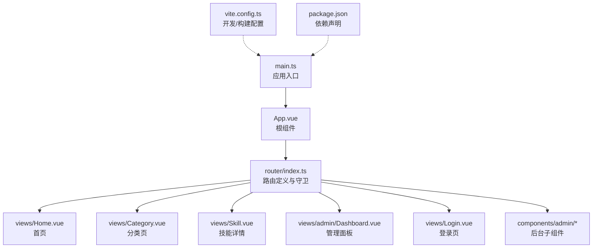
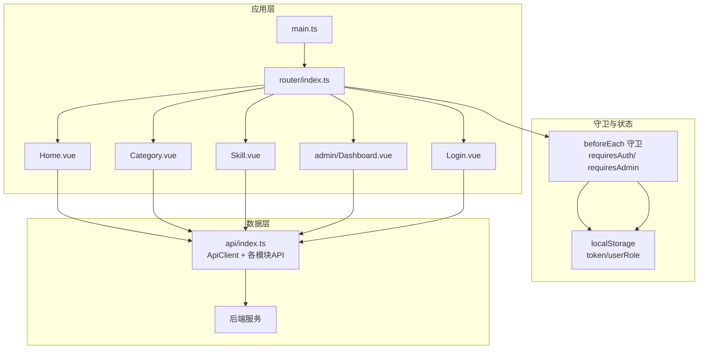
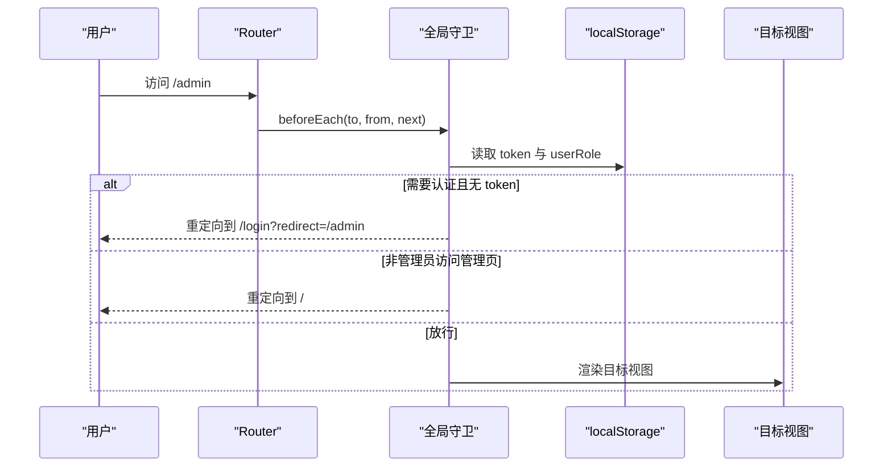
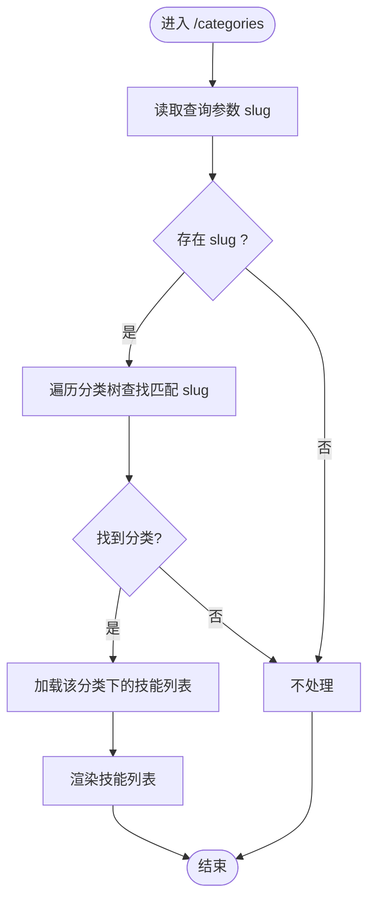
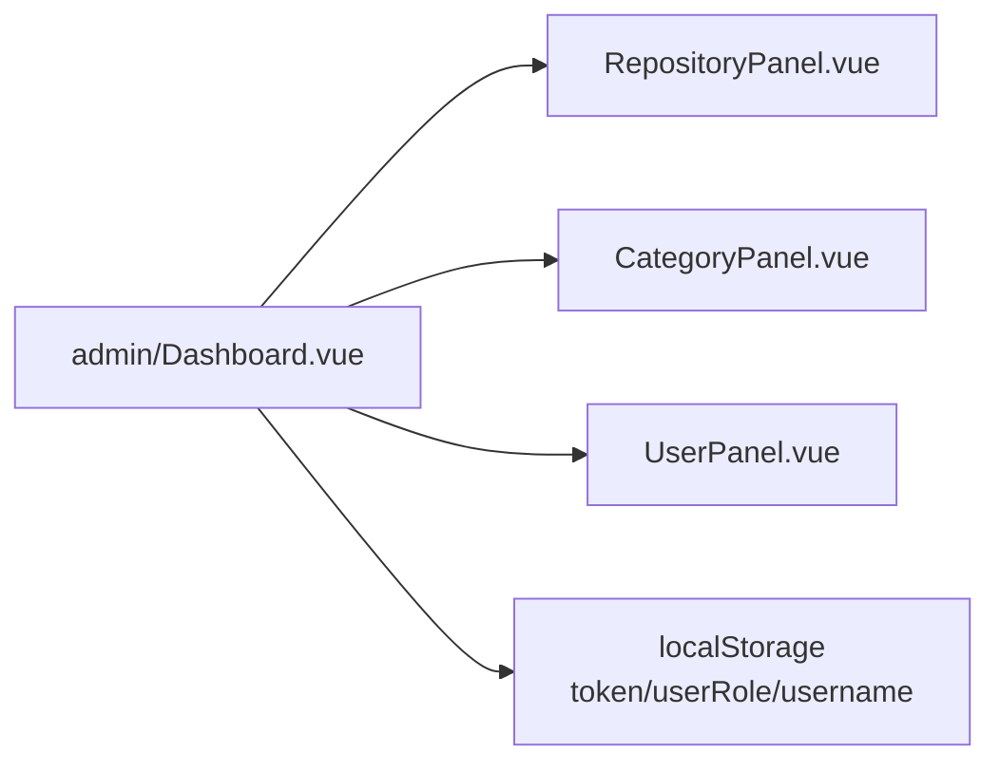
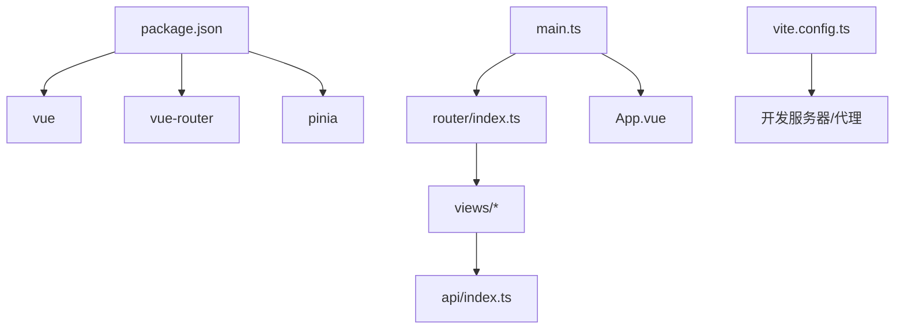

# 路由系统

<cite>
**本文引用的文件**
- [frontend/src/router/index.ts](file://frontend/src/router/index.ts)
- [frontend/src/main.ts](file://frontend/src/main.ts)
- [frontend/src/App.vue](file://frontend/src/App.vue)
- [frontend/vite.config.ts](file://frontend/vite.config.ts)
- [frontend/package.json](file://frontend/package.json)
- [frontend/src/views/Home.vue](file://frontend/src/views/Home.vue)
- [frontend/src/views/Category.vue](file://frontend/src/views/Category.vue)
- [frontend/src/views/Skill.vue](file://frontend/src/views/Skill.vue)
- [frontend/src/views/admin/Dashboard.vue](file://frontend/src/views/admin/Dashboard.vue)
- [frontend/src/views/Login.vue](file://frontend/src/views/Login.vue)
- [frontend/src/api/index.ts](file://frontend/src/api/index.ts)
- [frontend/src/components/admin/CategoryPanel.vue](file://frontend/src/components/admin/CategoryPanel.vue)
- [frontend/src/components/admin/RepositoryPanel.vue](file://frontend/src/components/admin/RepositoryPanel.vue)
- [frontend/src/components/admin/UserPanel.vue](file://frontend/src/components/admin/UserPanel.vue)
</cite>

## 目录
1. [简介](#简介)
2. [项目结构](#项目结构)
3. [核心组件](#核心组件)
4. [架构总览](#架构总览)
5. [详细组件分析](#详细组件分析)
6. [依赖关系分析](#依赖关系分析)
7. [性能考虑](#性能考虑)
8. [故障排查指南](#故障排查指南)
9. [结论](#结论)
10. [附录](#附录)

## 简介
本文件面向 Vue Router 路由系统，基于实际代码库进行深入解析。内容涵盖路由配置、导航守卫与动态路由匹配、路由懒加载、嵌套路由与元信息、权限控制与导航拦截、历史模式与 SPA 回退、静态资源托管策略、性能优化与预加载策略，以及导航最佳实践。文档同时提供可视化图表与具体配置路径，帮助开发者快速理解并优化路由体系。

## 项目结构
前端采用 Vite 构建，Vue 3 + Vue Router 4 + Pinia 状态管理。路由入口位于 router/index.ts，应用在 main.ts 中挂载路由；根组件 App.vue 通过 <router-view> 渲染当前路由视图。Vite 配置了开发服务器代理与构建输出目录。

**图表来源**
- [frontend/src/main.ts](file://frontend/src/main.ts#L1-L12)
- [frontend/src/App.vue](file://frontend/src/App.vue#L1-L31)
- [frontend/src/router/index.ts](file://frontend/src/router/index.ts#L1-L63)
- [frontend/vite.config.ts](file://frontend/vite.config.ts#L1-L24)
- [frontend/package.json](file://frontend/package.json#L1-L20)

**章节来源**
- [frontend/src/main.ts](file://frontend/src/main.ts#L1-L12)
- [frontend/src/App.vue](file://frontend/src/App.vue#L1-L31)
- [frontend/src/router/index.ts](file://frontend/src/router/index.ts#L1-L63)
- [frontend/vite.config.ts](file://frontend/vite.config.ts#L1-L24)
- [frontend/package.json](file://frontend/package.json#L1-L20)

## 核心组件
- 路由器实例与历史模式：使用 createWebHistory 创建浏览器历史模式，支持 SPA 路由跳转与回退。
- 路由表：定义首页、分类、技能详情、管理面板、登录等路由，并对管理面板设置 requiresAuth 元信息。
- 导航守卫：全局 beforeEach 守卫检查 requiresAuth 与 requiresAdmin，结合本地存储 token 与用户角色进行权限校验。
- 视图组件：Home、Category、Skill、Login、Admin Dashboard 及其子组件，负责渲染与交互。
- API 客户端：统一处理 Authorization 头、错误响应与各模块 API（认证、仓库、分类、技能、用户、同步、Webhook）。

**章节来源**
- [frontend/src/router/index.ts](file://frontend/src/router/index.ts#L1-L63)
- [frontend/src/views/Home.vue](file://frontend/src/views/Home.vue#L1-L230)
- [frontend/src/views/Category.vue](file://frontend/src/views/Category.vue#L1-L226)
- [frontend/src/views/Skill.vue](file://frontend/src/views/Skill.vue#L1-L205)
- [frontend/src/views/admin/Dashboard.vue](file://frontend/src/views/admin/Dashboard.vue#L1-L163)
- [frontend/src/views/Login.vue](file://frontend/src/views/Login.vue#L1-L185)
- [frontend/src/api/index.ts](file://frontend/src/api/index.ts#L1-L224)

## 架构总览
下图展示了路由系统在应用中的位置与交互流程：应用启动后注册路由，用户访问不同路径触发视图渲染；导航守卫根据元信息与本地状态决定放行或重定向；视图组件通过 API 客户端与后端交互。

**图表来源**
- [frontend/src/main.ts](file://frontend/src/main.ts#L1-L12)
- [frontend/src/router/index.ts](file://frontend/src/router/index.ts#L1-L63)
- [frontend/src/api/index.ts](file://frontend/src/api/index.ts#L1-L224)

## 详细组件分析

### 路由配置与导航守卫
- 路由表包含基础页面与管理页面，管理面板路由设置了 requiresAuth 元信息，确保未登录用户无法直接访问。
- 全局守卫检查 to.meta.requiresAuth 与 to.meta.requiresAdmin，结合 localStorage 中的 token 与 userRole 进行判断；若未登录则重定向至登录页并携带 redirect 参数；若非管理员访问管理页则退回首页。
- 登录成功后，从路由查询参数中读取 redirect 并跳转，实现“先登录再回到原页面”的体验。

**图表来源**
- [frontend/src/router/index.ts](file://frontend/src/router/index.ts#L4-L24)
- [frontend/src/views/Login.vue](file://frontend/src/views/Login.vue#L59-L84)

**章节来源**
- [frontend/src/router/index.ts](file://frontend/src/router/index.ts#L26-L62)
- [frontend/src/views/Login.vue](file://frontend/src/views/Login.vue#L48-L84)

### 动态路由匹配与参数传递
- 技能详情路由使用动态段 :id，组件通过 useRoute().params.id 获取参数并请求对应数据。
- 分类页支持通过查询参数 slug 实现“按分类定位”，组件在 mounted 阶段读取 route.query.slug 并展开相应节点与加载技能列表。

**图表来源**
- [frontend/src/views/Category.vue](file://frontend/src/views/Category.vue#L74-L122)

**章节来源**
- [frontend/src/router/index.ts](file://frontend/src/router/index.ts#L37-L41)
- [frontend/src/views/Category.vue](file://frontend/src/views/Category.vue#L60-L140)
- [frontend/src/views/Skill.vue](file://frontend/src/views/Skill.vue#L82-L100)

### 路由懒加载机制
- 所有页面组件均通过动态导入实现懒加载，首次访问时才加载对应模块，降低首屏体积与加载时间。
- 懒加载与守卫配合，保证权限不足时不会提前下载无用代码。

**章节来源**
- [frontend/src/router/index.ts](file://frontend/src/router/index.ts#L26-L52)

### 嵌套路由与后台面板布局
- 管理面板采用单页布局，通过标签页切换不同子面板（仓库、分类、用户），组件内部通过本地存储判断管理员身份并渲染相应内容。
- 该设计避免了多级路由嵌套，简化了导航与权限控制。

**图表来源**
- [frontend/src/views/admin/Dashboard.vue](file://frontend/src/views/admin/Dashboard.vue#L1-L163)
- [frontend/src/components/admin/RepositoryPanel.vue](file://frontend/src/components/admin/RepositoryPanel.vue#L1-L362)
- [frontend/src/components/admin/CategoryPanel.vue](file://frontend/src/components/admin/CategoryPanel.vue#L1-L283)
- [frontend/src/components/admin/UserPanel.vue](file://frontend/src/components/admin/UserPanel.vue#L1-L331)

**章节来源**
- [frontend/src/views/admin/Dashboard.vue](file://frontend/src/views/admin/Dashboard.vue#L58-L76)

### 路由元信息与权限控制
- 元信息 requiresAuth 用于标记受保护页面；requiresAdmin 用于管理员专属页面。
- 守卫根据元信息与本地存储的角色进行拦截，实现细粒度权限控制。

**章节来源**
- [frontend/src/router/index.ts](file://frontend/src/router/index.ts#L46-L46)

### 历史模式与 SPA 回退
- 使用 createWebHistory，支持标准 URL 与浏览器前进后退。
- 开发环境通过 Vite 代理将 /api 与 /webhooks 请求转发至后端，构建产物由静态服务器托管。

**章节来源**
- [frontend/src/router/index.ts](file://frontend/src/router/index.ts#L55-L58)
- [frontend/vite.config.ts](file://frontend/vite.config.ts#L6-L18)

### 静态资源托管策略
- 构建输出目录为 dist，建议在生产环境中将 dist 目录部署为静态站点或反向代理到根路径。
- 开发阶段使用 Vite 本地服务，代理后端接口，避免跨域问题。

**章节来源**
- [frontend/vite.config.ts](file://frontend/vite.config.ts#L19-L23)
- [frontend/package.json](file://frontend/package.json#L5-L9)

## 依赖关系分析
- 应用入口 main.ts 依赖 router/index.ts 与 App.vue。
- 路由依赖 Vue Router 与各视图组件。
- 视图组件依赖 api/index.ts 提供的统一 API 客户端。
- Vite 与依赖声明影响打包与开发体验。

**图表来源**
- [frontend/package.json](file://frontend/package.json#L10-L18)
- [frontend/src/main.ts](file://frontend/src/main.ts#L1-L12)
- [frontend/src/router/index.ts](file://frontend/src/router/index.ts#L1-L63)
- [frontend/src/api/index.ts](file://frontend/src/api/index.ts#L1-L224)
- [frontend/vite.config.ts](file://frontend/vite.config.ts#L1-L24)

**章节来源**
- [frontend/package.json](file://frontend/package.json#L1-L20)
- [frontend/src/main.ts](file://frontend/src/main.ts#L1-L12)

## 性能考虑
- 路由懒加载：所有页面组件均采用动态导入，减少初始包体。
- 组件内按需加载：如分类页仅在需要时加载技能列表，避免一次性拉取大量数据。
- API 层统一处理 Authorization 头与错误，减少重复逻辑与网络开销。
- 建议在生产环境启用压缩与缓存策略，结合 CDN 加速静态资源。

[本节为通用性能建议，无需特定文件引用]

## 故障排查指南
- 登录后无法返回原页面：确认登录组件正确读取并使用 redirect 查询参数进行跳转。
- 管理页访问被拦截：检查 localStorage 中 token 与 userRole 是否存在，确认路由元信息 requiresAuth/ requiresAdmin 设置。
- 分类页未按 slug 定位：确认传入的 slug 是否存在于分类树，组件会根据 slug 自动展开并加载技能。
- 技能详情 404：确认路由参数 id 是否有效，后端是否存在对应资源。

**章节来源**
- [frontend/src/views/Login.vue](file://frontend/src/views/Login.vue#L59-L84)
- [frontend/src/router/index.ts](file://frontend/src/router/index.ts#L4-L24)
- [frontend/src/views/Category.vue](file://frontend/src/views/Category.vue#L74-L122)
- [frontend/src/views/Skill.vue](file://frontend/src/views/Skill.vue#L82-L100)

## 结论
该路由系统以简洁清晰的方式实现了基础页面、受保护页面与后台管理的权限控制，结合懒加载与本地存储，兼顾了性能与用户体验。建议后续可引入路由级预加载、路由级错误边界与更完善的权限细化策略，进一步提升稳定性与可维护性。

## 附录
- 路由配置示例路径：[frontend/src/router/index.ts](file://frontend/src/router/index.ts#L26-L52)
- 导航守卫示例路径：[frontend/src/router/index.ts](file://frontend/src/router/index.ts#L4-L24)
- 动态路由与参数示例路径：[frontend/src/views/Category.vue](file://frontend/src/views/Category.vue#L60-L140)，[frontend/src/views/Skill.vue](file://frontend/src/views/Skill.vue#L82-L100)
- 后台面板与子组件示例路径：[frontend/src/views/admin/Dashboard.vue](file://frontend/src/views/admin/Dashboard.vue#L1-L163)，[frontend/src/components/admin/RepositoryPanel.vue](file://frontend/src/components/admin/RepositoryPanel.vue#L1-L362)，[frontend/src/components/admin/CategoryPanel.vue](file://frontend/src/components/admin/CategoryPanel.vue#L1-L283)，[frontend/src/components/admin/UserPanel.vue](file://frontend/src/components/admin/UserPanel.vue#L1-L331)
- API 客户端与模块接口示例路径：[frontend/src/api/index.ts](file://frontend/src/api/index.ts#L1-L224)