# API 层设计

<cite>
**本文引用的文件**
- [backend/main.py](file://backend/main.py)
- [backend/api/__init__.py](file://backend/api/__init__.py)
- [backend/api/auth.py](file://backend/api/auth.py)
- [backend/api/users.py](file://backend/api/users.py)
- [backend/api/repositories.py](file://backend/api/repositories.py)
- [backend/api/categories.py](file://backend/api/categories.py)
- [backend/api/skills.py](file://backend/api/skills.py)
- [backend/api/sync.py](file://backend/api/sync.py)
- [backend/api/webhooks.py](file://backend/api/webhooks.py)
- [backend/api/public_categories.py](file://backend/api/public_categories.py)
- [backend/middleware/auth.py](file://backend/middleware/auth.py)
- [backend/middleware/security.py](file://backend/middleware/security.py)
- [backend/core/error_handler.py](file://backend/core/error_handler.py)
- [backend/core/exceptions.py](file://backend/core/exceptions.py)
- [backend/services/auth.py](file://backend/services/auth.py)
</cite>

## 目录
1. [引言](#引言)
2. [项目结构](#项目结构)
3. [核心组件](#核心组件)
4. [架构总览](#架构总览)
5. [详细组件分析](#详细组件分析)
6. [依赖关系分析](#依赖关系分析)
7. [性能考虑](#性能考虑)
8. [故障排查指南](#故障排查指南)
9. [结论](#结论)
10. [附录](#附录)

## 引言
本文件系统性梳理 Skills Hub 的 API 层设计，围绕 RESTful 设计原则与路由组织策略展开，涵盖资源命名规范、HTTP 方法使用、状态码标准；分组说明认证、用户管理、仓库管理、技能管理、分类管理、同步与 Webhook 等 API 组；阐述路由注册机制（装饰器、依赖注入、中间件）、统一错误处理与异常体系、OpenAPI/Swagger 文档集成、版本控制策略与兼容性、使用示例、错误处理模式与性能优化建议。

## 项目结构
后端采用 FastAPI 应用入口集中管理，API 路由按功能域拆分至独立模块，通过主入口统一注册。中间件负责安全头、日志与限流；核心模块提供统一异常处理与自定义异常类型；服务层封装业务逻辑。

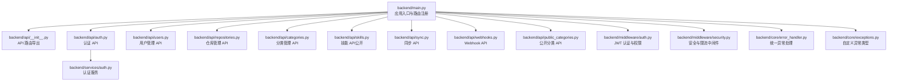

图示来源
- [backend/main.py](file://backend/main.py#L24-L84)
- [backend/api/__init__.py](file://backend/api/__init__.py#L4-L7)

章节来源
- [backend/main.py](file://backend/main.py#L1-L137)
- [backend/api/__init__.py](file://backend/api/__init__.py#L1-L8)

## 核心组件
- 应用入口与生命周期：FastAPI 实例、CORS、安全中间件、日志中间件、限流中间件、异常处理器、路由注册、健康检查端点、SPA 回退与静态文件挂载。
- 路由组织：按功能域拆分的 APIRouter，前缀与标签规范化，依赖注入与权限装饰器统一使用。
- 中间件体系：安全头、请求日志、基于内存的简单限流。
- 异常体系：统一错误响应格式，自定义异常类型覆盖常见业务场景。
- 服务层：认证服务等业务逻辑封装，供 API 层调用。

章节来源
- [backend/main.py](file://backend/main.py#L47-L125)
- [backend/middleware/security.py](file://backend/middleware/security.py#L11-L142)
- [backend/core/error_handler.py](file://backend/core/error_handler.py#L14-L102)
- [backend/core/exceptions.py](file://backend/core/exceptions.py#L7-L101)

## 架构总览
下图展示 API 层与核心组件的交互关系，以及路由注册与中间件应用流程。

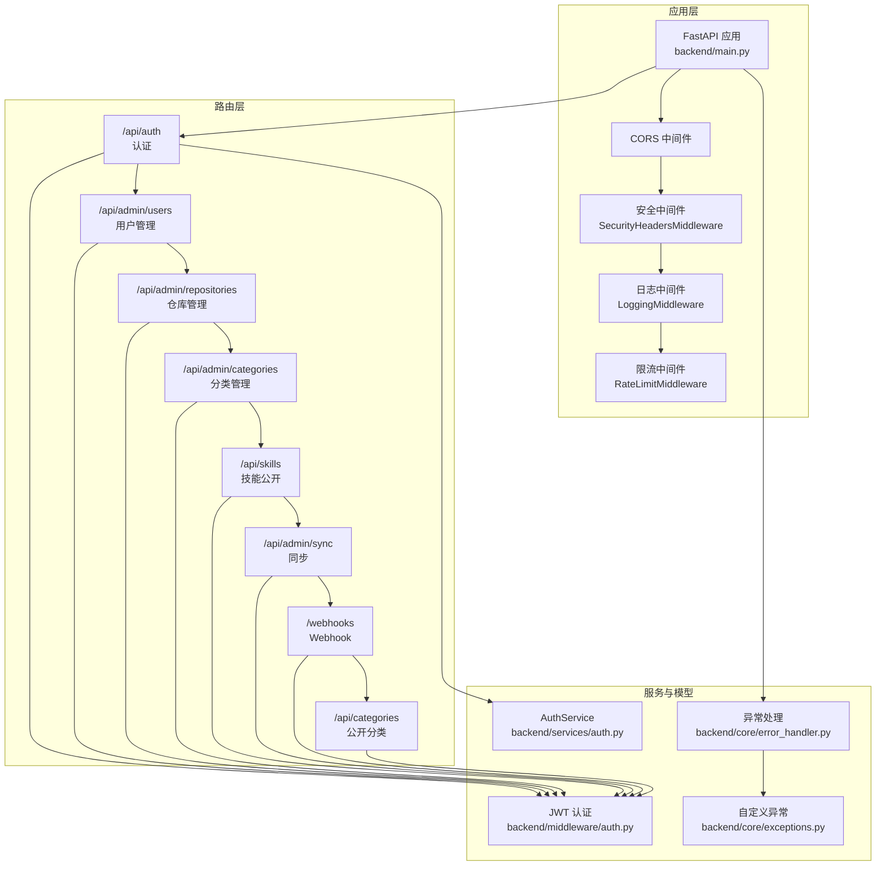

图示来源
- [backend/main.py](file://backend/main.py#L47-L84)
- [backend/api/auth.py](file://backend/api/auth.py#L21-L65)
- [backend/api/users.py](file://backend/api/users.py#L14-L111)
- [backend/api/repositories.py](file://backend/api/repositories.py#L23-L205)
- [backend/api/categories.py](file://backend/api/categories.py#L21-L294)
- [backend/api/skills.py](file://backend/api/skills.py#L15-L160)
- [backend/api/sync.py](file://backend/api/sync.py#L14-L112)
- [backend/api/webhooks.py](file://backend/api/webhooks.py#L12-L90)
- [backend/api/public_categories.py](file://backend/api/public_categories.py#L15-L129)
- [backend/services/auth.py](file://backend/services/auth.py#L19-L130)
- [backend/middleware/auth.py](file://backend/middleware/auth.py#L48-L134)
- [backend/core/error_handler.py](file://backend/core/error_handler.py#L14-L102)
- [backend/core/exceptions.py](file://backend/core/exceptions.py#L7-L101)

## 详细组件分析

### 认证 API（/api/auth）
- 资源与方法
  - POST /api/auth/login：登录，返回访问令牌与用户信息。
  - GET /api/auth/me：获取当前登录用户信息。
  - POST /api/auth/change-password：修改当前用户密码。
- 路由装饰器与依赖
  - 使用 APIRouter 前缀与标签；依赖数据库会话与认证中间件；登录生成 JWT。
- 错误处理
  - 认证失败与账户禁用通过自定义异常抛出，统一由异常处理器转换为标准错误响应。
- 安全要点
  - 使用 JWT 过期时间控制；可选用户依赖允许公开访问。

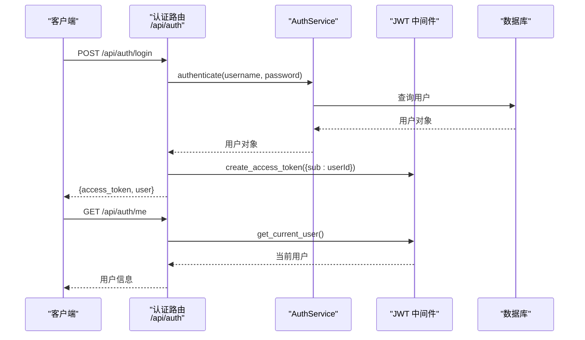

图示来源
- [backend/api/auth.py](file://backend/api/auth.py#L21-L65)
- [backend/services/auth.py](file://backend/services/auth.py#L64-L98)
- [backend/middleware/auth.py](file://backend/middleware/auth.py#L25-L96)

章节来源
- [backend/api/auth.py](file://backend/api/auth.py#L1-L65)
- [backend/services/auth.py](file://backend/services/auth.py#L1-L130)
- [backend/middleware/auth.py](file://backend/middleware/auth.py#L1-L134)

### 用户管理 API（/api/admin/users）
- 功能范围
  - 列表、创建、详情、更新、删除、重置密码（管理员）。
- 权限控制
  - 所有端点依赖 require_admin，确保仅管理员可操作。
- 数据一致性
  - 使用数据库事务提交与刷新，避免脏读。
- 错误处理
  - 不存在资源抛出 404，禁止自我删除等业务约束抛出 400。

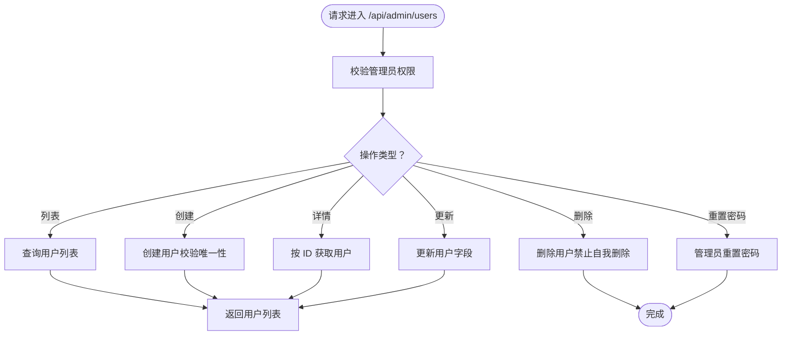

图示来源
- [backend/api/users.py](file://backend/api/users.py#L14-L111)

章节来源
- [backend/api/users.py](file://backend/api/users.py#L1-L111)

### 仓库管理 API（/api/admin/repositories）
- 功能范围
  - 列表、创建、详情、更新、删除、手动同步、Webhook 配置。
- 安全与隐私
  - 敏感信息（访问令牌、Webhook secret）加密存储。
- 性能与并发
  - 同步与 Webhook 处理放入后台任务，避免阻塞请求。
- 错误处理
  - 重复创建抛冲突，不存在资源抛 404。

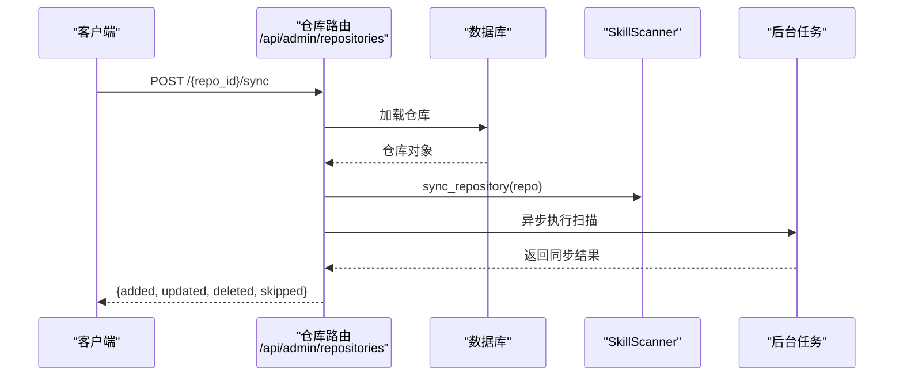

图示来源
- [backend/api/repositories.py](file://backend/api/repositories.py#L161-L177)

章节来源
- [backend/api/repositories.py](file://backend/api/repositories.py#L1-L205)

### 分类管理 API（/api/admin/categories）
- 功能范围
  - 分类树、平铺列表、创建、详情、更新、删除、分配/移除技能到分类、批量分配技能分类。
- 数据模型
  - 支持父子分类与技能关联，树形结构预加载子节点与技能数量。
- 业务约束
  - 父子关系自检，防止循环引用；slug 唯一性约束。

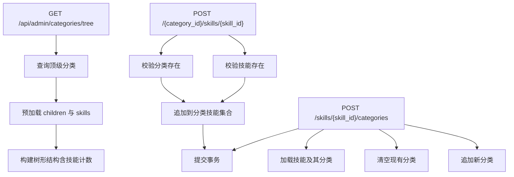

图示来源
- [backend/api/categories.py](file://backend/api/categories.py#L24-L47)
- [backend/api/categories.py](file://backend/api/categories.py#L217-L238)
- [backend/api/categories.py](file://backend/api/categories.py#L263-L294)

章节来源
- [backend/api/categories.py](file://backend/api/categories.py#L1-L294)

### 技能 API（/api/skills，公开）
- 功能范围
  - 搜索/浏览、详情、增加浏览计数、待分配分类的技能查询。
- 查询参数
  - 关键词、分类、仓库、分页、排序。
- 访问控制
  - 可选认证，未登录时 current_user 为 None。
- 性能优化
  - 预加载关联实体，减少 N+1 查询；浏览计数异步更新。

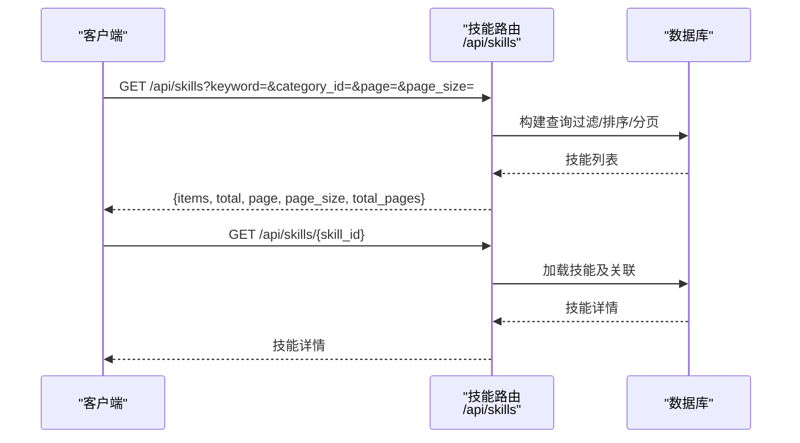

图示来源
- [backend/api/skills.py](file://backend/api/skills.py#L18-L95)
- [backend/api/skills.py](file://backend/api/skills.py#L98-L121)

章节来源
- [backend/api/skills.py](file://backend/api/skills.py#L1-L160)

### 同步 API（/api/admin/sync）
- 功能范围
  - 单仓库同步、全部启用仓库同步、同步状态统计。
- 并发与可观测性
  - 使用后台任务异步处理；聚合结果与错误日志便于监控。

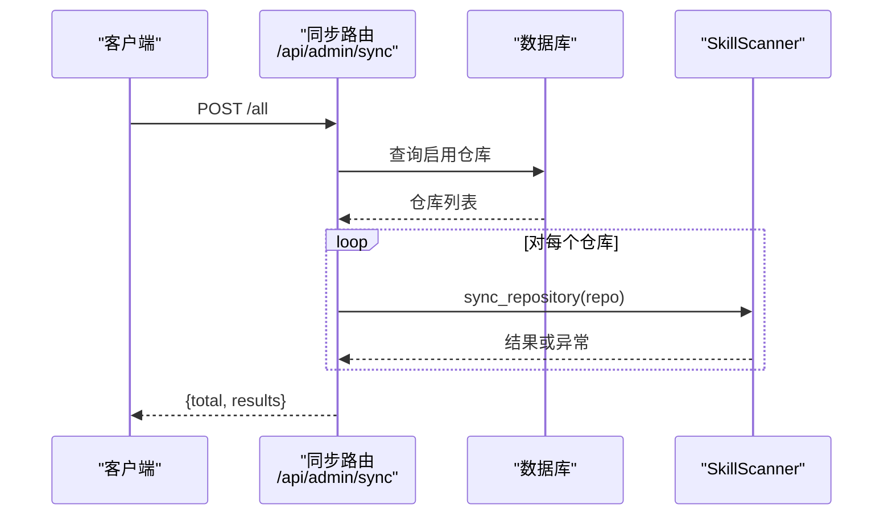

图示来源
- [backend/api/sync.py](file://backend/api/sync.py#L35-L71)

章节来源
- [backend/api/sync.py](file://backend/api/sync.py#L1-L112)

### Webhook API（/webhooks）
- 功能范围
  - GitLab Webhook 接收、事件签名校验、异步处理、日志查询。
- 安全性
  - 严格校验签名，隐藏仓库存在性细节，避免信息泄露。
- 可靠性
  - 将耗时处理放入后台任务，快速返回接收确认。

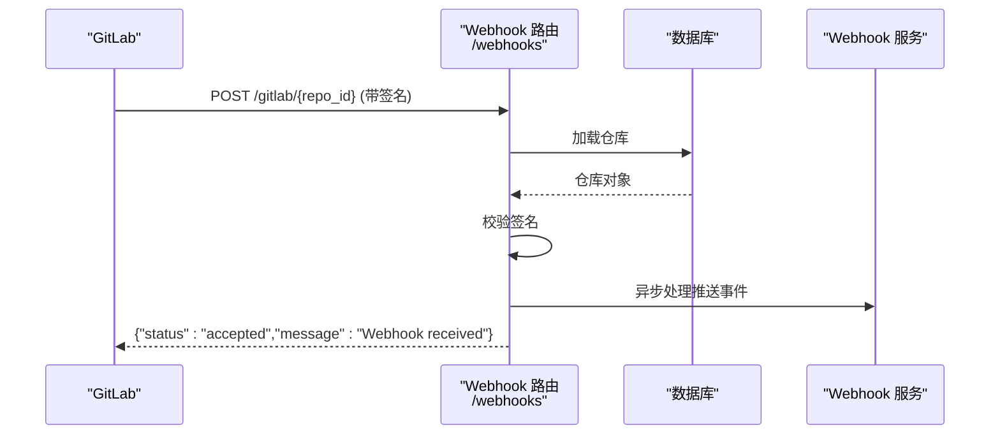

图示来源
- [backend/api/webhooks.py](file://backend/api/webhooks.py#L15-L64)

章节来源
- [backend/api/webhooks.py](file://backend/api/webhooks.py#L1-L90)

### 公开分类 API（/api/categories）
- 功能范围
  - 分类列表、分类树、分类详情、按 slug 获取分类下的技能。
- 访问控制
  - 无需认证，适合前端展示与导航。
- 数据结构
  - 支持技能计数与树形结构，便于渲染。

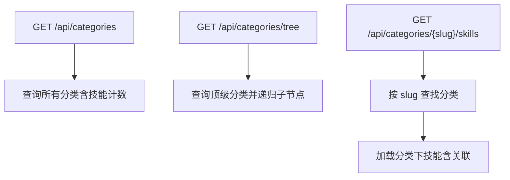

图示来源
- [backend/api/public_categories.py](file://backend/api/public_categories.py#L18-L44)
- [backend/api/public_categories.py](file://backend/api/public_categories.py#L47-L69)
- [backend/api/public_categories.py](file://backend/api/public_categories.py#L103-L129)

章节来源
- [backend/api/public_categories.py](file://backend/api/public_categories.py#L1-L129)

## 依赖关系分析
- 路由注册：主入口集中 include_router，按模块导入，形成清晰的 API 边界。
- 依赖注入：API 层广泛使用 Depends 获取数据库会话与认证上下文，降低耦合。
- 中间件链路：CORS → 安全头 → 日志 → 限流，保证安全性与可观测性。
- 异常处理：统一异常处理器映射到不同异常类型，输出结构化错误响应。

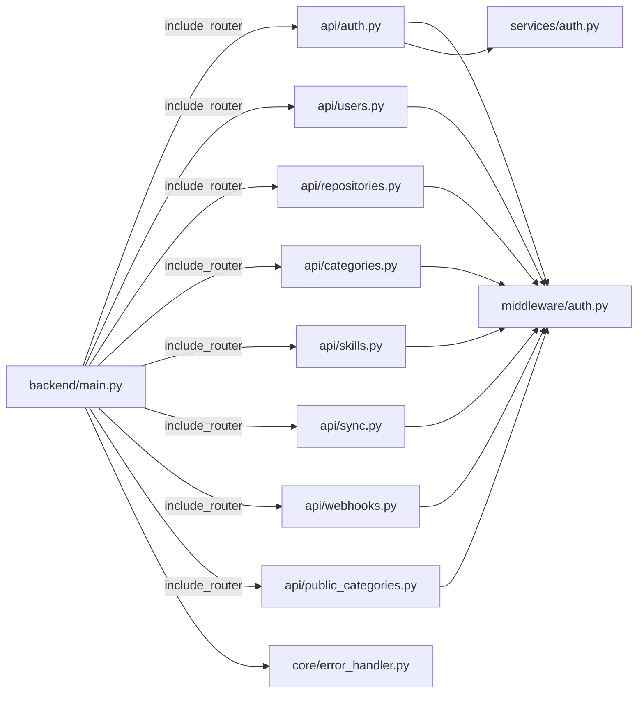

图示来源
- [backend/main.py](file://backend/main.py#L77-L84)
- [backend/api/auth.py](file://backend/api/auth.py#L17-L18)
- [backend/api/users.py](file://backend/api/users.py#L11-L12)
- [backend/api/repositories.py](file://backend/api/repositories.py#L18-L19)
- [backend/api/categories.py](file://backend/api/categories.py#L18-L19)
- [backend/api/skills.py](file://backend/api/skills.py#L12-L13)
- [backend/api/sync.py](file://backend/api/sync.py#L10-L11)
- [backend/api/webhooks.py](file://backend/api/webhooks.py#L9-L10)
- [backend/api/public_categories.py](file://backend/api/public_categories.py#L12-L13)
- [backend/core/error_handler.py](file://backend/core/error_handler.py#L10-L11)
- [backend/services/auth.py](file://backend/services/auth.py#L19-L27)

章节来源
- [backend/main.py](file://backend/main.py#L24-L84)
- [backend/middleware/auth.py](file://backend/middleware/auth.py#L48-L134)
- [backend/core/error_handler.py](file://backend/core/error_handler.py#L14-L102)

## 性能考虑
- 查询优化
  - 使用 selectinload 预加载关联实体，避免 N+1 查询。
  - 分页与排序参数化，避免一次性加载大量数据。
- 并发与异步
  - 后台任务处理耗时操作（同步、Webhook 处理），提升响应速度。
- 缓存与索引
  - 建议对高频查询字段建立索引（如 slug、sort_order、created_at）。
- 限流与降级
  - 登录接口限流，防止暴力破解；高风险接口可引入更严格限流策略。
- 日志与监控
  - 中间件记录请求耗时与状态码，结合外部监控系统追踪性能瓶颈。

## 故障排查指南
- 认证失败
  - 检查令牌是否过期、算法与密钥是否匹配、用户是否激活。
- 权限不足
  - 确认调用端是否携带有效令牌且具备管理员角色。
- 资源不存在
  - 核对 ID 或 slug 是否正确，关注 404 错误详情。
- 输入验证失败
  - 关注 422 错误中的字段定位与消息，修正请求体。
- 外部服务错误
  - 如 GitLab/GitHub 接口异常，查看服务日志与重试策略。
- Webhook 签名错误
  - 确认仓库配置的 secret 与请求头 X-Gitlab-Token 一致。

章节来源
- [backend/middleware/auth.py](file://backend/middleware/auth.py#L48-L134)
- [backend/core/exceptions.py](file://backend/core/exceptions.py#L24-L101)
- [backend/core/error_handler.py](file://backend/core/error_handler.py#L14-L102)
- [backend/api/webhooks.py](file://backend/api/webhooks.py#L37-L42)

## 结论
本 API 层遵循 RESTful 设计与模块化组织，通过明确的路由前缀与标签、统一的依赖注入与中间件链路、完善的异常处理与安全中间件，实现了高内聚低耦合的架构。公开与私有 API 明确分离，权限控制与数据一致性得到保障。建议后续完善 OpenAPI/Swagger 文档生成与版本控制策略，持续优化查询与并发处理能力。

## 附录

### RESTful 设计原则与路由组织
- 资源命名规范
  - 使用名词复数形式表示资源集合，如 /users、/repositories、/categories、/skills。
  - 使用资源标识符定位单个资源，如 /{resource_id}。
- HTTP 方法使用
  - GET：检索列表或详情；HEAD/OPTIONS 可用于元信息与预检。
  - POST：创建资源或触发动作（如同步、重置密码）。
  - PUT/PATCH：更新资源。
  - DELETE：删除资源。
- 状态码标准
  - 200：成功获取资源或更新成功。
  - 201：创建成功（POST 新资源）。
  - 204：删除成功无返回体。
  - 400：业务错误（如自我删除、密码错误）。
  - 401：未认证或令牌无效。
  - 403：权限不足。
  - 404：资源不存在。
  - 409：冲突（如重复创建）。
  - 422：输入验证失败。
  - 429：请求过于频繁。
  - 500：服务器内部错误。

### API 组功能划分
- 认证 API：登录、获取当前用户、修改密码。
- 用户管理 API：用户 CRUD、重置密码（管理员）。
- 仓库管理 API：仓库 CRUD、手动同步、Webhook 配置。
- 分类管理 API：分类 CRUD、树形结构、技能分配。
- 技能 API：搜索/浏览、详情、浏览计数、待分配技能查询。
- 同步 API：单仓库与全量同步、同步状态统计。
- Webhook API：GitLab 推送事件接收与处理、日志查询。
- 公开分类 API：分类列表、树形结构、按 slug 获取技能。

### 路由注册机制
- 装饰器与前缀
  - 每个 API 模块定义 APIRouter，并设置 prefix 与 tags，统一在主入口注册。
- 依赖注入
  - 通过 Depends 获取数据库会话与认证上下文，实现跨模块复用。
- 中间件应用
  - CORS、安全头、日志、限流中间件在应用级别统一注册，作用于所有路由。

章节来源
- [backend/main.py](file://backend/main.py#L77-L84)
- [backend/api/auth.py](file://backend/api/auth.py#L21-L21)
- [backend/api/users.py](file://backend/api/users.py#L14-L14)
- [backend/api/repositories.py](file://backend/api/repositories.py#L23-L23)
- [backend/api/categories.py](file://backend/api/categories.py#L21-L21)
- [backend/api/skills.py](file://backend/api/skills.py#L15-L15)
- [backend/api/sync.py](file://backend/api/sync.py#L14-L14)
- [backend/api/webhooks.py](file://backend/api/webhooks.py#L12-L12)
- [backend/api/public_categories.py](file://backend/api/public_categories.py#L15-L15)

### API 文档生成与版本控制
- 文档生成
  - 应用启动时启用 Swagger UI 与 ReDoc，默认路径 /api/docs 与 /api/redoc。
- 版本控制策略
  - 建议采用 URL 前缀版本化（如 /api/v1/...），并在应用元数据中声明版本号。
  - 保持向后兼容：新增字段使用可选参数，变更字段提供迁移指引。
  - 废弃处理：提前在文档中标注 deprecation 时间线，提供替代方案。

章节来源
- [backend/main.py](file://backend/main.py#L47-L54)

### 使用示例与最佳实践
- 认证流程
  - 先 POST /api/auth/login 获取令牌，再在后续请求头中携带 Authorization: Bearer。
- 管理员操作
  - 确保调用者具备管理员角色，否则返回 403。
- 查询优化
  - 合理使用分页与排序参数，避免一次性拉取过多数据。
- 错误处理
  - 统一解析错误响应中的 code、message、details 字段，便于前端提示与日志追踪。
- 性能优化
  - 对高频接口开启缓存（如分类树），对写密集接口合并事务提交。