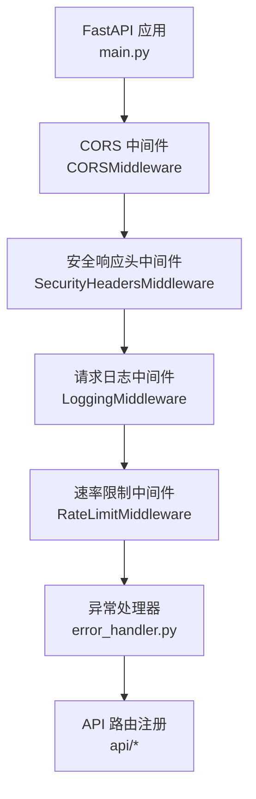
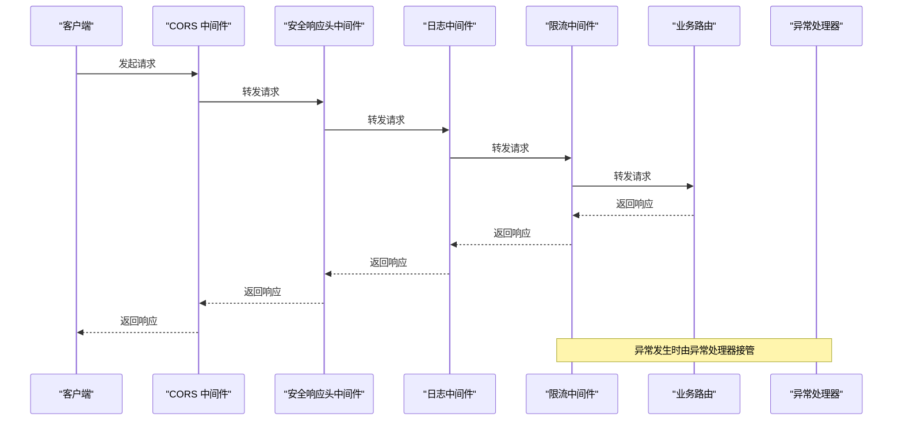
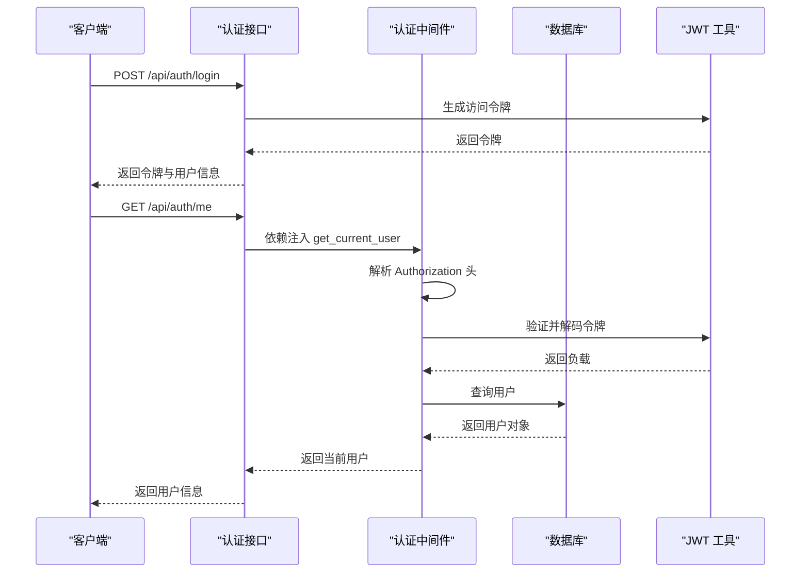
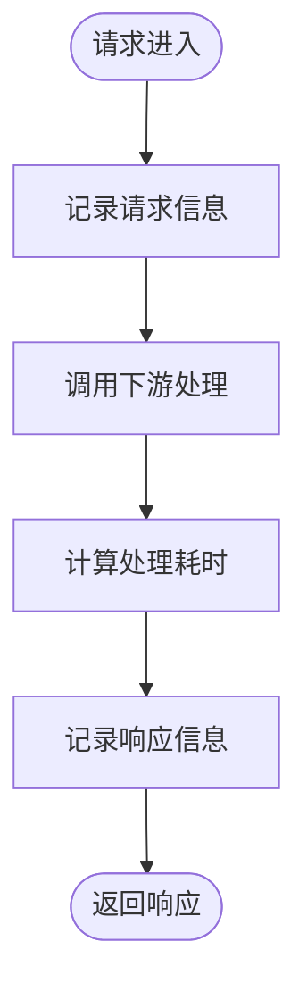
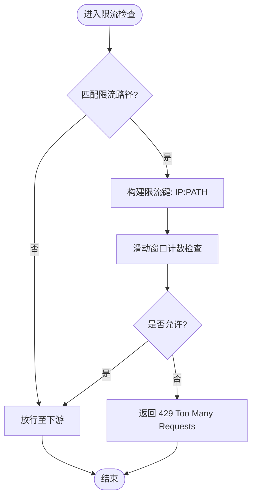
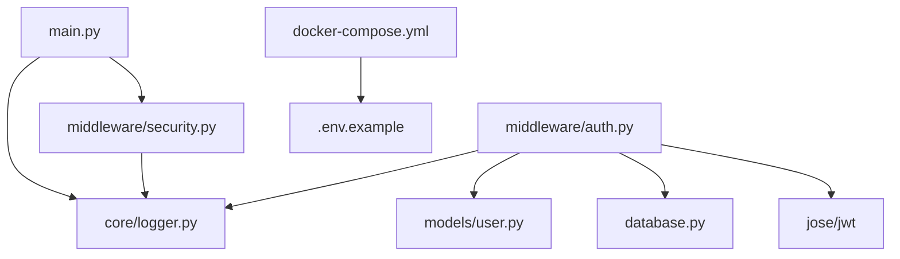

# 中间件系统

<cite>
**本文档引用的文件**
- [main.py](file://backend/main.py)
- [security.py](file://backend/middleware/security.py)
- [auth.py](file://backend/middleware/auth.py)
- [logger.py](file://backend/core/logger.py)
- [security.py](file://backend/core/security.py)
- [.env.example](file://backend/.env.example)
- [docker-compose.yml](file://docker-compose.yml)
- [auth.py](file://backend/api/auth.py)
- [user.py](file://backend/models/user.py)
</cite>

## 目录
1. [简介](#简介)
2. [项目结构](#项目结构)
3. [核心组件](#核心组件)
4. [架构总览](#架构总览)
5. [详细组件分析](#详细组件分析)
6. [依赖关系分析](#依赖关系分析)
7. [性能考虑](#性能考虑)
8. [故障排除指南](#故障排除指南)
9. [结论](#结论)
10. [附录](#附录)

## 简介
本文件系统性地解析 Skills Hub 的中间件体系，重点涵盖以下方面：
- 中间件执行顺序与生命周期管理
- CORS 中间件的配置与跨域策略
- 安全中间件：安全头设置、XSS 防护与 CSRF 保护现状
- 认证中间件：JWT 令牌验证、权限检查与用户上下文注入
- 日志中间件：请求/响应日志记录、性能监控与调试信息收集
- 限流中间件：速率限制算法、IP 白名单与动态调整策略
- 中间件配置最佳实践与性能优化建议

## 项目结构
后端采用 FastAPI 架构，中间件通过主应用注册顺序串联，形成请求处理流水线。CORS 中间件位于最前，随后是自定义安全中间件（安全头、日志、限流），最后是异常处理与路由注册。

图表来源
- [main.py](file://backend/main.py#L56-L68)

章节来源
- [main.py](file://backend/main.py#L46-L84)

## 核心组件
- CORS 中间件：负责跨域资源共享控制，支持通配符配置，生产环境需限制具体来源。
- 安全响应头中间件：统一注入安全响应头，移除服务器标识，提升安全性。
- 请求日志中间件：记录请求与响应信息，包含耗时统计，便于性能监控与问题定位。
- 速率限制中间件：基于内存的滑动窗口计数算法，针对特定路径进行限流。
- 认证中间件：基于 JWT 的认证与授权，提供用户上下文注入与管理员权限校验。

章节来源
- [main.py](file://backend/main.py#L56-L68)
- [security.py](file://backend/middleware/security.py#L11-L28)
- [security.py](file://backend/middleware/security.py#L31-L59)
- [security.py](file://backend/middleware/security.py#L107-L141)
- [auth.py](file://backend/middleware/auth.py#L25-L95)

## 架构总览
下图展示了中间件在请求生命周期中的调用顺序与职责边界。

图表来源
- [main.py](file://backend/main.py#L56-L74)
- [security.py](file://backend/middleware/security.py#L11-L28)
- [security.py](file://backend/middleware/security.py#L31-L59)
- [security.py](file://backend/middleware/security.py#L107-L141)

## 详细组件分析

### CORS 中间件
- 配置要点
  - 允许来源：当前为通配符，生产环境应限定为具体域名。
  - 凭据允许：开启以支持携带 Cookie。
  - 方法与头部：当前为通配符，建议按需收紧。
- 生命周期
  - 在请求进入业务逻辑之前处理预检请求与跨域头注入。
- 最佳实践
  - 生产环境将 allow_origins 设置为白名单域名数组。
  - 明确 allow_methods 与 allow_headers，避免使用通配符。
  - 对于敏感操作，考虑分离 API 与静态资源的跨域策略。

章节来源
- [main.py](file://backend/main.py#L56-L63)

### 安全响应头中间件
- 功能概述
  - 注入安全响应头：X-Content-Type-Options、X-Frame-Options、X-XSS-Protection、Strict-Transport-Security、Content-Security-Policy。
  - 移除服务器标识，降低指纹暴露风险。
- XSS 防护现状
  - 通过 X-XSS-Protection 与 CSP 提供基础防护；建议结合前端内容安全策略与输入输出过滤进一步强化。
- CSRF 保护现状
  - 当前未实现 CSRF 令牌机制或 SameSite Cookie 策略。建议引入 CSRF 中间件或在认证流程中加入 CSRF 令牌校验。

章节来源
- [security.py](file://backend/middleware/security.py#L11-L28)

### 认证中间件（JWT）
- JWT 配置
  - 算法：HS256
  - 过期时间：默认 24 小时
  - 密钥：当前示例值，生产环境应从环境变量读取
- 用户上下文注入
  - get_current_user：从 Authorization 头提取 Bearer Token，解码并查询用户，校验账户状态。
  - require_admin：在 get_current_user 基础上校验管理员角色。
  - get_optional_user：可选认证，返回 None 而非抛出异常。
- 与 API 集成
  - 登录接口使用 create_access_token 生成令牌；用户信息接口依赖 get_current_user 注入当前用户。

图表来源
- [auth.py](file://backend/middleware/auth.py#L25-L95)
- [auth.py](file://backend/api/auth.py#L24-L48)
- [user.py](file://backend/models/user.py#L18-L51)

章节来源
- [auth.py](file://backend/middleware/auth.py#L17-L21)
- [auth.py](file://backend/middleware/auth.py#L48-L95)
- [auth.py](file://backend/api/auth.py#L24-L48)
- [user.py](file://backend/models/user.py#L18-L51)

### 日志中间件
- 记录内容
  - 请求：方法、路径、客户端 IP
  - 响应：状态码、处理耗时
- 性能监控
  - 计算请求处理时间，便于识别慢接口。
- 日志持久化
  - 控制台、按大小轮转文件与按时间轮转错误日志三通道输出。

图表来源
- [security.py](file://backend/middleware/security.py#L31-L59)
- [logger.py](file://backend/core/logger.py#L11-L66)

章节来源
- [security.py](file://backend/middleware/security.py#L31-L59)
- [logger.py](file://backend/core/logger.py#L11-L66)

### 限流中间件
- 速率限制算法
  - 内存滑动窗口计数：以 (客户端 IP + 路径) 为键，统计时间窗口内的请求数。
- 默认策略
  - 登录接口：每分钟最多 5 次尝试。
- IP 白名单与动态调整
  - 当前未实现白名单与动态阈值调整；可通过扩展 limits 配置与外部存储实现。
- 429 响应
  - 超限时返回标准错误体与 HTTP 429。

图表来源
- [security.py](file://backend/middleware/security.py#L107-L141)

章节来源
- [security.py](file://backend/middleware/security.py#L66-L101)
- [security.py](file://backend/middleware/security.py#L107-L141)

## 依赖关系分析
- 中间件依赖
  - main.py 依赖 middleware.security 与 core.logger 实现安全头、日志与限流。
  - 认证中间件依赖数据库会话与用户模型。
- 环境变量
  - JWT_SECRET_KEY：认证中间件密钥来源。
  - ENCRYPTION_KEY：敏感数据加密密钥来源。
- Docker 环境
  - 通过环境变量注入密钥与数据库连接信息，支持生产部署。

图表来源
- [main.py](file://backend/main.py#L20-L21)
- [auth.py](file://backend/middleware/auth.py#L13-L14)
- [user.py](file://backend/models/user.py#L18-L30)
- [.env.example](file://backend/.env.example#L1-L17)
- [docker-compose.yml](file://docker-compose.yml#L7-L11)

章节来源
- [main.py](file://backend/main.py#L20-L21)
- [auth.py](file://backend/middleware/auth.py#L13-L14)
- [user.py](file://backend/models/user.py#L18-L30)
- [.env.example](file://backend/.env.example#L1-L17)
- [docker-compose.yml](file://docker-compose.yml#L7-L11)

## 性能考虑
- 中间件顺序
  - CORS 放在首位，避免不必要的后续处理。
  - 安全头与日志在下游处理前注入，确保覆盖所有响应。
- 限流策略
  - 优先对高风险路径（如登录）启用限流。
  - 使用更高效的存储（如 Redis）替代内存计数，支持多实例共享状态。
- 日志开销
  - 控制台与文件写入可能成为瓶颈，建议在生产环境降低日志级别或异步写入。
- 认证性能
  - JWT 解码与数据库查询应尽量缓存用户信息，减少重复查询。

## 故障排除指南
- 认证失败
  - 检查 Authorization 头格式与令牌签名算法是否匹配。
  - 确认 SECRET_KEY 与环境变量一致。
- 用户不存在或禁用
  - get_current_user 会在用户不存在或非激活状态下抛出 401。
- 429 限流
  - 检查限流键是否正确（IP + 路径），确认时间窗口与阈值配置。
- CORS 问题
  - 生产环境 allow_origins 未正确配置会导致跨域失败。
- 日志缺失
  - 确认日志目录存在且具备写权限，检查日志级别与处理器配置。

章节来源
- [auth.py](file://backend/middleware/auth.py#L56-L95)
- [security.py](file://backend/middleware/security.py#L115-L139)
- [main.py](file://backend/main.py#L56-L63)
- [logger.py](file://backend/core/logger.py#L39-L64)

## 结论
Skills Hub 的中间件体系以 FastAPI 中间件链为核心，实现了跨域、安全头、日志与限流的基础能力。认证中间件基于 JWT，提供用户上下文与角色校验。当前在 XSS 与 CSRF 防护方面尚有改进空间，建议引入 CSRF 令牌与更严格的 CSP 策略。限流策略可扩展为基于 Redis 的分布式实现，并增加 IP 白名单与动态阈值调整能力。生产部署时务必收紧 CORS 配置与密钥管理。

## 附录
- 环境变量配置示例
  - JWT_SECRET_KEY：用于 JWT 签名与验证
  - ENCRYPTION_KEY：用于敏感数据加解密
- Docker 环境变量注入
  - 通过 docker-compose.yml 将密钥注入容器，确保与 .env.example 保持一致

章节来源
- [.env.example](file://backend/.env.example#L1-L17)
- [docker-compose.yml](file://docker-compose.yml#L7-L11)