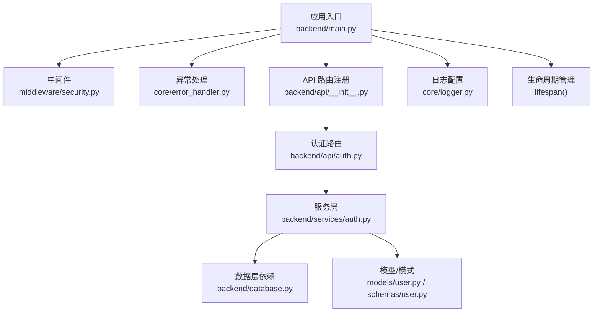
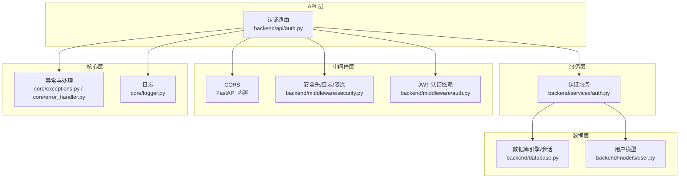
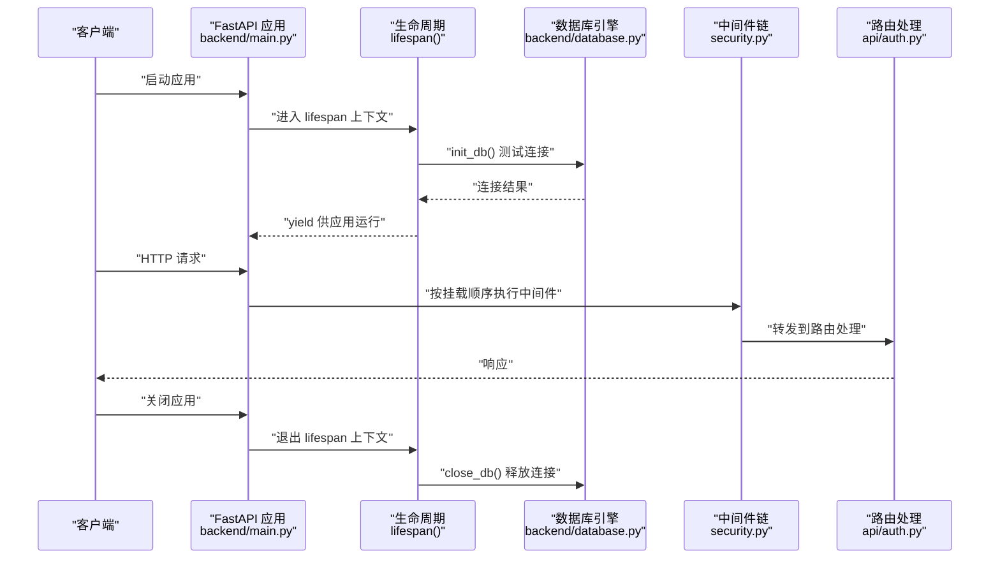
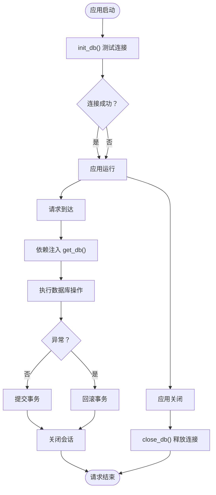
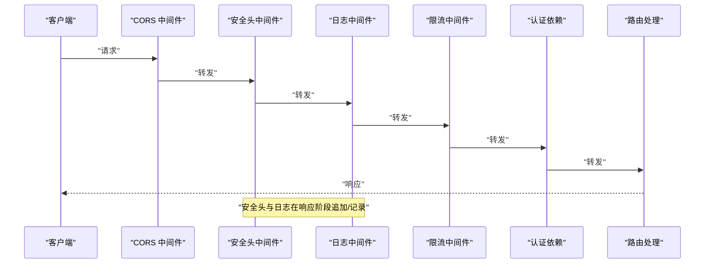
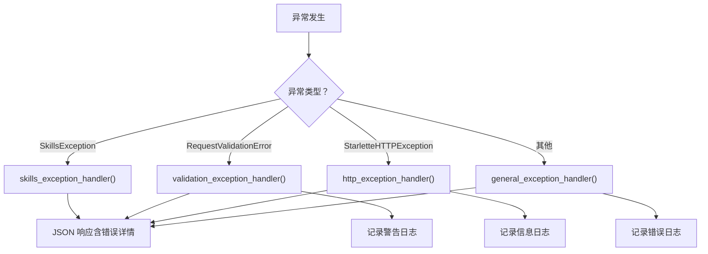
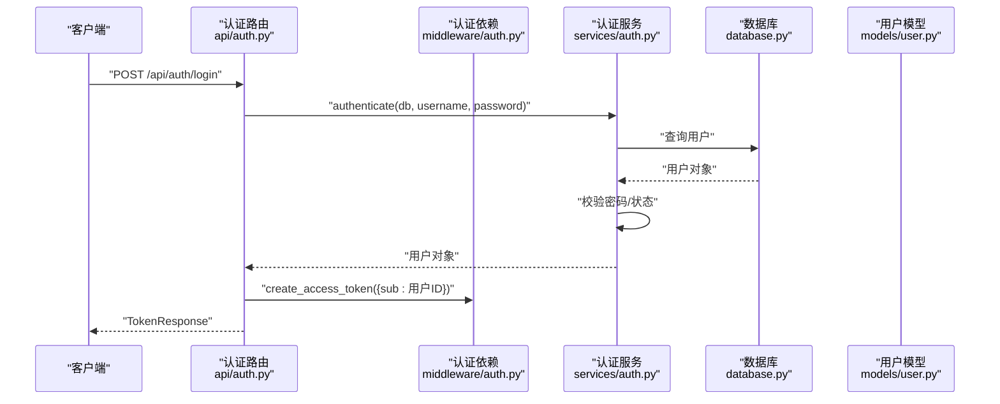
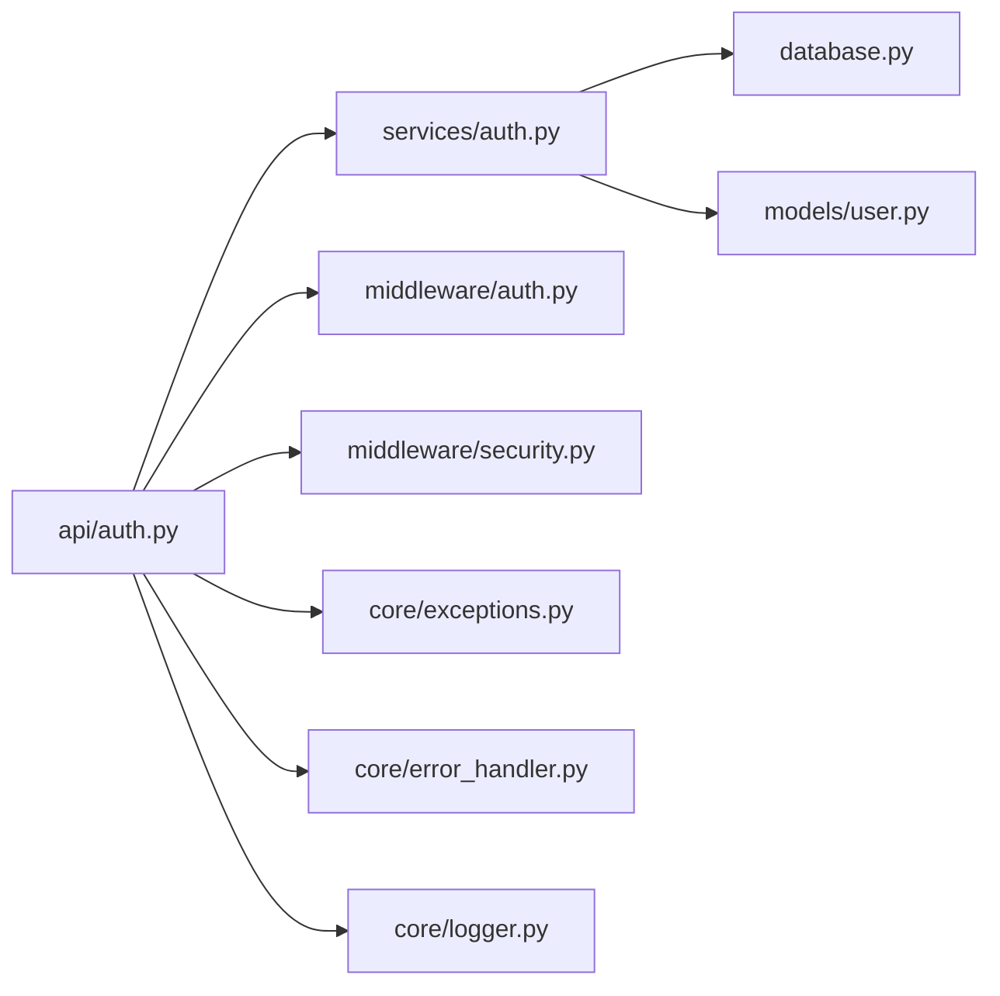

# 后端架构

<cite>
**本文引用的文件**
- [backend/main.py](file://backend/main.py)
- [backend/database.py](file://backend/database.py)
- [backend/core/error_handler.py](file://backend/core/error_handler.py)
- [backend/core/exceptions.py](file://backend/core/exceptions.py)
- [backend/middleware/security.py](file://backend/middleware/security.py)
- [backend/middleware/auth.py](file://backend/middleware/auth.py)
- [backend/core/logger.py](file://backend/core/logger.py)
- [backend/api/__init__.py](file://backend/api/__init__.py)
- [backend/api/auth.py](file://backend/api/auth.py)
- [backend/services/auth.py](file://backend/services/auth.py)
- [backend/models/user.py](file://backend/models/user.py)
- [backend/schemas/user.py](file://backend/schemas/user.py)
- [backend/.env.example](file://backend/.env.example)
</cite>

## 目录
1. [引言](#引言)
2. [项目结构](#项目结构)
3. [核心组件](#核心组件)
4. [架构总览](#架构总览)
5. [详细组件分析](#详细组件分析)
6. [依赖关系分析](#依赖关系分析)
7. [性能考虑](#性能考虑)
8. [故障排查指南](#故障排查指南)
9. [结论](#结论)
10. [附录](#附录)

## 引言
本文件系统性梳理 Skills Hub 后端的 FastAPI 架构与实现，重点覆盖以下方面：
- 分层架构：API 层、服务层、数据层的职责分离与协作方式
- 依赖注入机制：数据库会话注入、认证依赖注入、路由注册与中间件装配
- 数据库连接与生命周期管理：异步引擎、会话工厂、连接池、启动/关闭流程
- 中间件体系：CORS、安全头、日志、限流中间件的职责与执行顺序
- 异常处理与错误响应策略：统一错误响应格式与分级处理
- 应用生命周期管理：FastAPI lifespan 的启动/关闭钩子
- 路由组织与中间件执行顺序：API 路由注册与中间件挂载顺序
- 最佳实践与排障建议

## 项目结构
后端采用“按层+按功能”的混合组织方式：
- 根应用入口与生命周期：backend/main.py
- 数据层：backend/database.py（异步引擎、会话工厂、依赖注入）
- 核心能力：core/logger.py（日志）、core/exceptions.py（异常）、core/error_handler.py（异常处理）
- 中间件：middleware/security.py（安全头/日志/限流）、middleware/auth.py（JWT 认证）
- API 层：backend/api/*（路由模块化，按功能划分）
- 服务层：backend/services/*（业务逻辑封装）
- 模型与模式：models/*（SQLAlchemy ORM）、schemas/*（Pydantic 模式）

图表来源
- [backend/main.py](file://backend/main.py#L47-L84)
- [backend/api/__init__.py](file://backend/api/__init__.py#L4-L7)
- [backend/api/auth.py](file://backend/api/auth.py#L1-L65)
- [backend/services/auth.py](file://backend/services/auth.py#L1-L130)
- [backend/database.py](file://backend/database.py#L42-L56)
- [backend/middleware/security.py](file://backend/middleware/security.py#L11-L29)
- [backend/core/error_handler.py](file://backend/core/error_handler.py#L14-L101)
- [backend/core/logger.py](file://backend/core/logger.py#L11-L70)

章节来源
- [backend/main.py](file://backend/main.py#L1-L137)
- [backend/api/__init__.py](file://backend/api/__init__.py#L1-L8)

## 核心组件
- 应用入口与生命周期：FastAPI 应用创建、CORS、自定义中间件、异常处理器、路由注册、健康检查、SPA 回退、静态文件挂载、lifespan 启停流程
- 数据层与依赖注入：异步引擎、会话工厂、依赖注入函数、连接池参数、启动时连接测试、关闭时释放连接
- 异常体系与处理：自定义 SkillsException 及其子类、统一异常处理器、验证错误、HTTP 异常、通用异常
- 中间件体系：安全响应头、请求日志、简单内存限流、JWT 认证依赖注入
- API 与服务：认证 API 路由、认证服务、用户模型与模式

章节来源
- [backend/main.py](file://backend/main.py#L27-L137)
- [backend/database.py](file://backend/database.py#L42-L75)
- [backend/core/exceptions.py](file://backend/core/exceptions.py#L7-L101)
- [backend/core/error_handler.py](file://backend/core/error_handler.py#L14-L101)
- [backend/middleware/security.py](file://backend/middleware/security.py#L11-L142)
- [backend/middleware/auth.py](file://backend/middleware/auth.py#L25-L134)
- [backend/api/auth.py](file://backend/api/auth.py#L1-L65)
- [backend/services/auth.py](file://backend/services/auth.py#L19-L130)
- [backend/models/user.py](file://backend/models/user.py#L12-L52)
- [backend/schemas/user.py](file://backend/schemas/user.py#L8-L96)

## 架构总览
Skills Hub 后端采用三层架构与中间件增强的组合：
- API 层：负责路由定义、请求参数绑定、调用服务层、返回响应
- 服务层：封装业务规则、事务控制、领域异常抛出
- 数据层：提供异步数据库会话、ORM 模型与查询
- 中间件层：横切关注点（CORS、安全头、日志、限流）
- 核心层：异常体系与统一错误响应、日志配置

图表来源
- [backend/api/auth.py](file://backend/api/auth.py#L21-L65)
- [backend/services/auth.py](file://backend/services/auth.py#L19-L130)
- [backend/database.py](file://backend/database.py#L21-L56)
- [backend/models/user.py](file://backend/models/user.py#L18-L52)
- [backend/middleware/security.py](file://backend/middleware/security.py#L11-L142)
- [backend/middleware/auth.py](file://backend/middleware/auth.py#L48-L96)
- [backend/core/exceptions.py](file://backend/core/exceptions.py#L7-L101)
- [backend/core/error_handler.py](file://backend/core/error_handler.py#L14-L101)
- [backend/core/logger.py](file://backend/core/logger.py#L11-L70)

## 详细组件分析

### 应用入口与生命周期管理
- 应用创建与文档端点：标题、描述、版本、OpenAPI 文档端点
- 生命周期：lifespan 在启动时初始化数据库并在关闭时释放连接
- 中间件：CORS、安全头、日志、限流的挂载顺序
- 异常处理：SkillsException、RequestValidationError、StarletteHTTPException、通用异常
- 路由注册：认证、用户、公开分类、仓库、分类、技能、Webhook、同步等
- 健康检查：数据库连通性检测
- SPA 回退与静态文件挂载：对非 API 请求返回前端入口页，并在生产环境挂载静态文件

图表来源
- [backend/main.py](file://backend/main.py#L27-L104)
- [backend/database.py](file://backend/database.py#L58-L75)
- [backend/middleware/security.py](file://backend/middleware/security.py#L11-L29)

章节来源
- [backend/main.py](file://backend/main.py#L27-L137)

### 数据层与依赖注入
- 异步引擎与连接池：基于 SQLAlchemy 与 aiomysql，启用 pre_ping、设置 pool_size 与 overflow
- 会话工厂：AsyncSession 工厂，expire_on_commit、autocommit、autoflush 参数
- 依赖注入函数：get_db 提供异步会话，自动提交/回滚/关闭
- 启动时连接测试：init_db 在 lifespan 启动阶段进行
- 连接关闭：lifespan 结束时 dispose engine

图表来源
- [backend/database.py](file://backend/database.py#L42-L75)
- [backend/main.py](file://backend/main.py#L34-L43)

章节来源
- [backend/database.py](file://backend/database.py#L14-L75)

### 中间件系统
- CORS：允许任意源、方法与头，生产环境应限制具体域名
- 安全头中间件：添加 X-Content-Type-Options、X-Frame-Options、Strict-Transport-Security、Content-Security-Policy，并移除 Server 头
- 日志中间件：记录请求与响应，包含处理耗时
- 限流中间件：基于内存的简单限流器，支持按路径与客户端 IP 的限流策略
- 认证中间件：JWT 解析、用户解析、管理员权限校验、可选认证

图表来源
- [backend/main.py](file://backend/main.py#L56-L68)
- [backend/middleware/security.py](file://backend/middleware/security.py#L11-L142)
- [backend/middleware/auth.py](file://backend/middleware/auth.py#L48-L96)

章节来源
- [backend/middleware/security.py](file://backend/middleware/security.py#L11-L142)
- [backend/middleware/auth.py](file://backend/middleware/auth.py#L17-L134)

### 异常处理与错误响应
- 自定义异常：SkillsException 及其子类（未找到、验证、认证、授权、冲突、外部服务）
- 统一异常处理器：
  - SkillsException：返回带 code/message/details/path/timestamp 的 JSON
  - RequestValidationError：返回标准化的字段级错误列表
  - StarletteHTTPException：返回带 HTTP_* code 的 JSON
  - Exception：返回通用 500 错误
- 日志记录：不同级别异常对应不同日志级别，便于追踪

图表来源
- [backend/core/exceptions.py](file://backend/core/exceptions.py#L7-L101)
- [backend/core/error_handler.py](file://backend/core/error_handler.py#L14-L101)
- [backend/core/logger.py](file://backend/core/logger.py#L11-L70)

章节来源
- [backend/core/exceptions.py](file://backend/core/exceptions.py#L7-L101)
- [backend/core/error_handler.py](file://backend/core/error_handler.py#L14-L101)
- [backend/core/logger.py](file://backend/core/logger.py#L11-L70)

### API 层与服务层协作
- 认证 API：登录、获取当前用户、修改密码
- 服务层：认证服务封装业务逻辑，包括用户注册、认证、改密、重置密码
- 依赖注入：API 层通过 Depends 获取数据库会话与当前用户；服务层执行数据库操作
- 模式与模型：Pydantic 模式用于输入/输出校验与序列化；SQLAlchemy 模型映射数据库表

图表来源
- [backend/api/auth.py](file://backend/api/auth.py#L24-L41)
- [backend/middleware/auth.py](file://backend/middleware/auth.py#L25-L34)
- [backend/services/auth.py](file://backend/services/auth.py#L64-L98)
- [backend/database.py](file://backend/database.py#L42-L56)
- [backend/models/user.py](file://backend/models/user.py#L18-L52)

章节来源
- [backend/api/auth.py](file://backend/api/auth.py#L1-L65)
- [backend/services/auth.py](file://backend/services/auth.py#L19-L130)
- [backend/middleware/auth.py](file://backend/middleware/auth.py#L48-L96)
- [backend/models/user.py](file://backend/models/user.py#L18-L52)
- [backend/schemas/user.py](file://backend/schemas/user.py#L8-L96)

### 路由组织与中间件执行顺序
- 路由注册顺序：认证、用户、公开分类、仓库、分类、技能、Webhook、同步
- 中间件挂载顺序：CORS → 安全头 → 日志 → 限流
- SPA 回退：对 /admin、/categories、/skills 等路径回退到前端入口页
- 静态文件挂载：必须在所有路由之后，避免覆盖 API 路由

章节来源
- [backend/main.py](file://backend/main.py#L76-L125)
- [backend/middleware/security.py](file://backend/middleware/security.py#L11-L29)

## 依赖关系分析
- API 层依赖服务层与中间件；服务层依赖数据层与核心异常/日志
- 认证依赖注入贯穿 API 与服务层，确保权限控制一致性
- 中间件之间无直接耦合，通过 FastAPI 中间件链顺序执行

图表来源
- [backend/api/auth.py](file://backend/api/auth.py#L1-L65)
- [backend/services/auth.py](file://backend/services/auth.py#L1-L130)
- [backend/middleware/auth.py](file://backend/middleware/auth.py#L1-L134)
- [backend/middleware/security.py](file://backend/middleware/security.py#L1-L142)
- [backend/database.py](file://backend/database.py#L1-L75)
- [backend/models/user.py](file://backend/models/user.py#L1-L52)
- [backend/core/exceptions.py](file://backend/core/exceptions.py#L1-L101)
- [backend/core/error_handler.py](file://backend/core/error_handler.py#L1-L102)
- [backend/core/logger.py](file://backend/core/logger.py#L1-L95)

## 性能考虑
- 异步数据库：使用 SQLAlchemy 异步引擎与连接池，减少阻塞
- 连接池参数：合理设置 pool_size 与 max_overflow，结合 pre_ping 提升稳定性
- 限流策略：当前为内存级简单限流，适合开发/小规模场景；生产建议使用 Redis 或专用限流组件
- 中间件顺序：日志与限流在响应阶段记录耗时，有助于定位慢请求
- 静态文件：生产环境挂载静态文件需谨慎，避免与 API 路由冲突

## 故障排查指南
- 健康检查失败：确认数据库连接串与可达性；查看 init_db 返回值
- 认证失败：检查 JWT 密钥、签名算法、过期时间；核对用户状态
- 验证错误：查看 RequestValidationError 的字段级错误列表，定位输入问题
- 未捕获异常：查看通用异常处理器返回的错误信息与日志
- 日志定位：利用日志上下文与额外字段快速定位请求来源与处理耗时

章节来源
- [backend/main.py](file://backend/main.py#L88-L104)
- [backend/middleware/auth.py](file://backend/middleware/auth.py#L48-L96)
- [backend/core/error_handler.py](file://backend/core/error_handler.py#L33-L101)
- [backend/core/logger.py](file://backend/core/logger.py#L73-L95)

## 结论
Skills Hub 后端以 FastAPI 为核心，采用清晰的分层与中间件增强方案：
- API 层专注路由与依赖注入，服务层承载业务规则，数据层提供异步数据库能力
- 生命周期管理完善，异常与日志体系统一，中间件链路明确
- 建议在生产环境中强化安全与性能：限制 CORS 域名、替换内存限流为分布式限流、完善监控与告警

## 附录
- 环境变量示例：JWT 密钥、数据库连接串、环境与端口等
- 最佳实践要点：
  - 生产环境禁用 CORS 星号，限定可信域
  - 将 SECRET_KEY 从 .env 读取，避免硬编码
  - 使用 Redis/令牌存储替代内存限流
  - 对关键接口增加速率限制与熔断保护
  - 完善 OpenAPI 文档与错误码规范

章节来源
- [backend/.env.example](file://backend/.env.example#L1-L17)