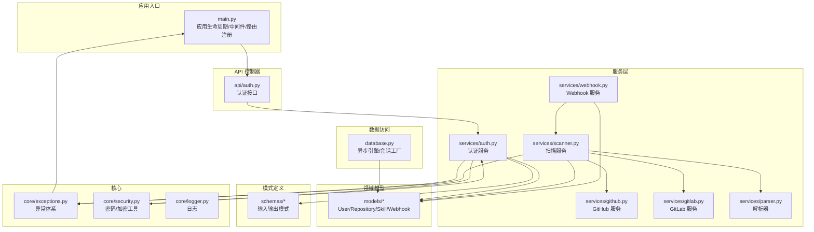
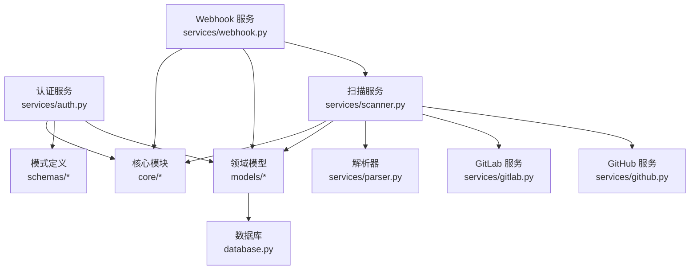
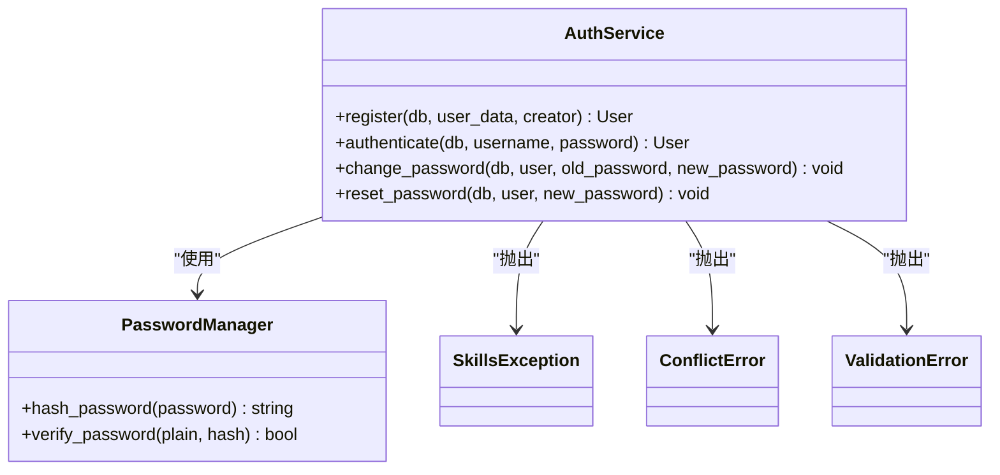
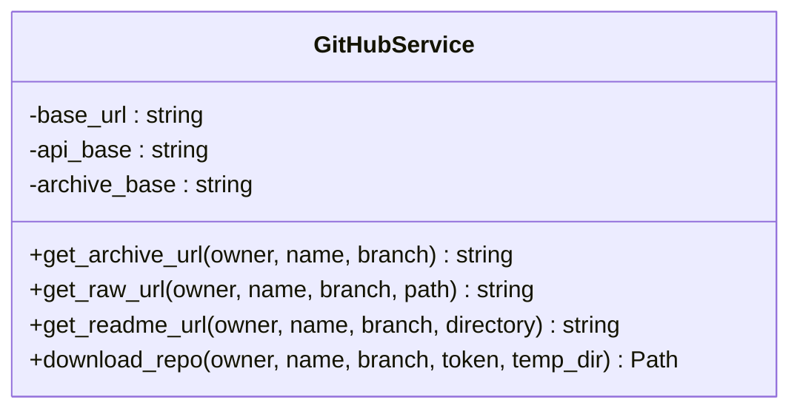
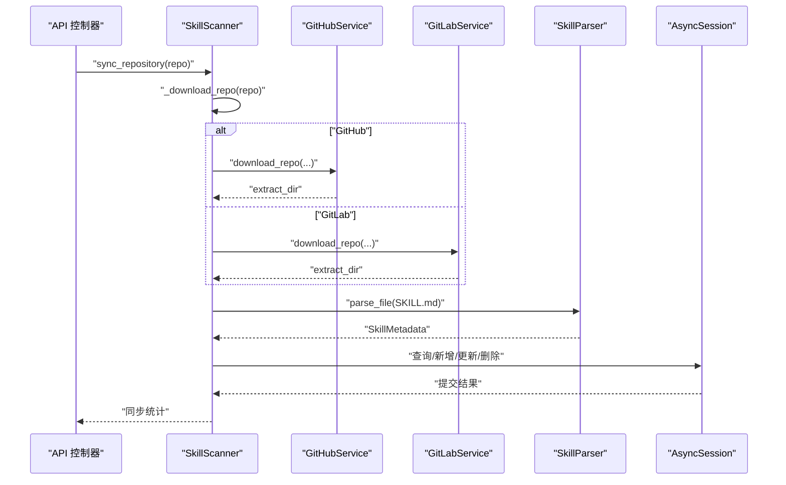
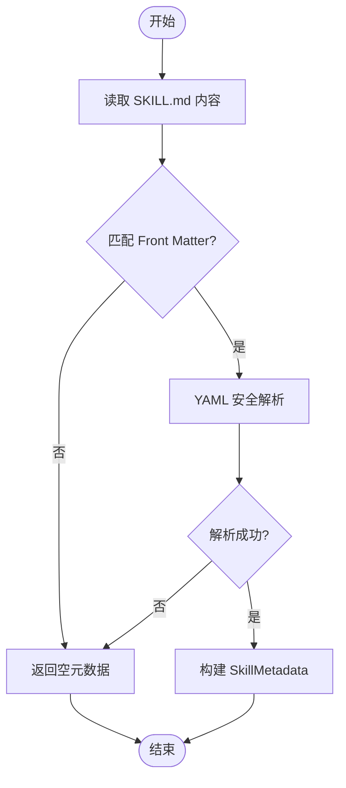
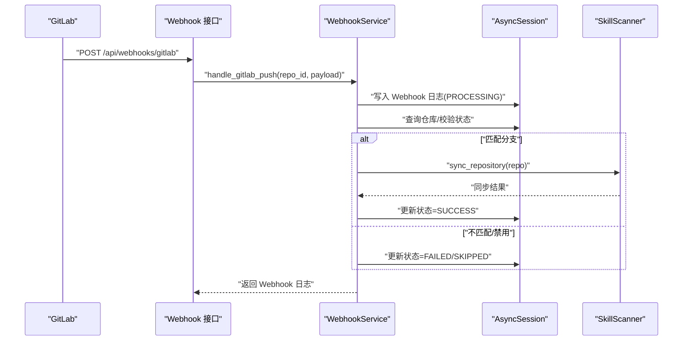
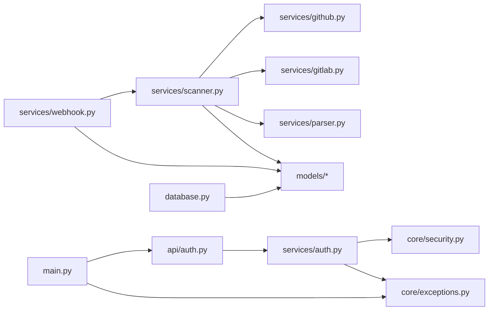

# 服务层架构

<cite>
**本文引用的文件**
- [backend/main.py](file://backend/main.py)
- [backend/database.py](file://backend/database.py)
- [backend/core/__init__.py](file://backend/core/__init__.py)
- [backend/core/exceptions.py](file://backend/core/exceptions.py)
- [backend/core/security.py](file://backend/core/security.py)
- [backend/models/__init__.py](file://backend/models/__init__.py)
- [backend/schemas/__init__.py](file://backend/schemas/__init__.py)
- [backend/api/auth.py](file://backend/api/auth.py)
- [backend/services/auth.py](file://backend/services/auth.py)
- [backend/services/github.py](file://backend/services/github.py)
- [backend/services/gitlab.py](file://backend/services/gitlab.py)
- [backend/services/parser.py](file://backend/services/parser.py)
- [backend/services/scanner.py](file://backend/services/scanner.py)
- [backend/services/webhook.py](file://backend/services/webhook.py)
</cite>

## 目录
1. [引言](#引言)
2. [项目结构](#项目结构)
3. [核心组件](#核心组件)
4. [架构总览](#架构总览)
5. [详细组件分析](#详细组件分析)
6. [依赖关系分析](#依赖关系分析)
7. [性能考虑](#性能考虑)
8. [故障排查指南](#故障排查指南)
9. [结论](#结论)
10. [附录](#附录)

## 引言
本文件系统性梳理 Skills Hub 的服务层架构，聚焦服务层设计模式与职责分离原则，涵盖业务逻辑封装、数据访问抽象、领域模型隔离；详解各服务模块功能实现，包括认证服务的凭据校验与密码管理、用户权限控制；GitHub/GitLab 集成服务的 API 调用与归档下载；技能扫描服务的文件遍历与内容提取；内容解析服务的 YAML/Markdown Front Matter 解析与元数据提取；Webhook 处理服务的事件监听与异步处理。同时阐述服务间的依赖关系与通信机制（服务注册、依赖注入、错误传播），解释异步编程模式（并发处理、任务队列与性能优化），并给出服务测试策略与集成测试方法。

## 项目结构
后端采用分层与按职责划分的组织方式：
- 核心层（core）：异常体系、安全工具、日志等横切关注点
- 模型层（models）：领域实体与枚举
- 模式层（schemas）：输入输出数据结构
- 服务层（services）：业务服务编排与外部集成
- API 层（api）：FastAPI 路由与控制器
- 数据库层（database）：异步连接与会话管理
- 应用入口（main）：生命周期、中间件、异常处理器与路由注册



图表来源
- [backend/main.py](file://backend/main.py#L1-L137)
- [backend/database.py](file://backend/database.py#L1-L75)
- [backend/core/exceptions.py](file://backend/core/exceptions.py#L1-L101)
- [backend/core/security.py](file://backend/core/security.py#L1-L64)
- [backend/models/__init__.py](file://backend/models/__init__.py#L1-L20)
- [backend/schemas/__init__.py](file://backend/schemas/__init__.py#L1-L57)
- [backend/api/auth.py](file://backend/api/auth.py#L1-L65)
- [backend/services/auth.py](file://backend/services/auth.py#L1-L130)
- [backend/services/github.py](file://backend/services/github.py#L1-L105)
- [backend/services/gitlab.py](file://backend/services/gitlab.py#L1-L170)
- [backend/services/parser.py](file://backend/services/parser.py#L1-L86)
- [backend/services/scanner.py](file://backend/services/scanner.py#L1-L197)
- [backend/services/webhook.py](file://backend/services/webhook.py#L1-L124)

章节来源
- [backend/main.py](file://backend/main.py#L1-L137)
- [backend/database.py](file://backend/database.py#L1-L75)

## 核心组件
- 异常体系：统一的 SkillsException 基类及 NotFoundError、ValidationError、AuthenticationError、AuthorizationError、ConflictError、ExternalServiceError，确保错误语义一致与状态码规范
- 安全工具：PasswordManager（Argon2 密码哈希）、Encryption（Fernet 敏感数据加解密）、加密密钥生成与加载
- 数据库会话：异步引擎与会话工厂，提供依赖注入 get_db，支持连接池与事务管理
- 服务注册与依赖注入：FastAPI 路由通过 Depends(get_db) 注入 AsyncSession；服务实例在模块级初始化或通过工厂函数获取
- 错误传播：服务层抛出领域异常，由全局异常处理器转换为标准响应

章节来源
- [backend/core/exceptions.py](file://backend/core/exceptions.py#L1-L101)
- [backend/core/security.py](file://backend/core/security.py#L1-L64)
- [backend/database.py](file://backend/database.py#L1-L75)
- [backend/core/__init__.py](file://backend/core/__init__.py#L1-L30)

## 架构总览
服务层围绕“业务编排 + 外部集成 + 领域持久化”三层职责展开：
- 业务编排：认证服务、扫描服务、Webhook 服务负责协调领域模型与外部服务
- 外部集成：GitHubService、GitLabService 提供归档下载与 URL 构造
- 领域持久化：通过 AsyncSession 与 ORM 模型交互，保证事务一致性



图表来源
- [backend/services/auth.py](file://backend/services/auth.py#L1-L130)
- [backend/services/github.py](file://backend/services/github.py#L1-L105)
- [backend/services/gitlab.py](file://backend/services/gitlab.py#L1-L170)
- [backend/services/parser.py](file://backend/services/parser.py#L1-L86)
- [backend/services/scanner.py](file://backend/services/scanner.py#L1-L197)
- [backend/services/webhook.py](file://backend/services/webhook.py#L1-L124)
- [backend/models/__init__.py](file://backend/models/__init__.py#L1-L20)
- [backend/schemas/__init__.py](file://backend/schemas/__init__.py#L1-L57)
- [backend/core/__init__.py](file://backend/core/__init__.py#L1-L30)
- [backend/database.py](file://backend/database.py#L1-L75)

## 详细组件分析

### 认证服务（AuthService）
职责分离与设计要点：
- 用户注册：检查唯一性、管理员权限校验、密码哈希、写入数据库
- 用户认证：查询用户、账户状态校验、密码验证、记录日志
- 密码管理：修改密码（旧密码校验）、管理员重置密码
- 与核心模块协作：使用密码管理器、异常体系、日志记录



图表来源
- [backend/services/auth.py](file://backend/services/auth.py#L1-L130)
- [backend/core/security.py](file://backend/core/security.py#L1-L64)
- [backend/core/exceptions.py](file://backend/core/exceptions.py#L1-L101)

章节来源
- [backend/services/auth.py](file://backend/services/auth.py#L1-L130)
- [backend/api/auth.py](file://backend/api/auth.py#L1-L65)

### GitHub 集成服务（GitHubService）
职责分离与设计要点：
- URL 构造：归档 URL、原始文件 URL、README URL
- 归档下载：异步 HTTP 客户端、ZIP 保存、解压、清理
- 错误处理：外部服务错误封装、日志记录



图表来源
- [backend/services/github.py](file://backend/services/github.py#L1-L105)

章节来源
- [backend/services/github.py](file://backend/services/github.py#L1-L105)

### GitLab 集成服务（GitLabService）
职责分离与设计要点：
- URL 构造：归档 ZIP、归档 TAR.GZ、原始文件、README
- 归档下载：优先 ZIP，失败回退 TAR.GZ，异步下载、解压、清理
- 工厂函数：根据实例地址构造服务实例

```mermaid
classDiagram
class GitLabService {
-base_url : string
-api_base : string
+get_archive_url(owner, name, branch) string
+get_archive_zip_url(owner, name, branch) string
+get_raw_url(owner, name, branch, path) string
+get_readme_url(owner, name, branch, directory) string
+download_repo(owner, name, branch, token, temp_dir) Path
-_download_tarball(owner, name, branch, token, temp_dir) Path
}
class get_gitlab_service(gitlab_url) GitLabService
```

图表来源
- [backend/services/gitlab.py](file://backend/services/gitlab.py#L1-L170)

章节来源
- [backend/services/gitlab.py](file://backend/services/gitlab.py#L1-L170)

### 技能扫描服务（SkillScanner）
职责分离与设计要点：
- 仓库扫描：下载归档 → 遍历目录 → 匹配 SKILL.md → 解析元数据
- 同步更新：对比数据库现有技能，计算新增/更新/不变/删除，批量提交
- URL 构建：根据仓库类型构建 README 与原始内容 URL
- 依赖注入：通过构造函数注入 AsyncSession；依赖 GitHub/GitLab 服务与解析器



图表来源
- [backend/services/scanner.py](file://backend/services/scanner.py#L1-L197)
- [backend/services/github.py](file://backend/services/github.py#L1-L105)
- [backend/services/gitlab.py](file://backend/services/gitlab.py#L1-L170)
- [backend/services/parser.py](file://backend/services/parser.py#L1-L86)

章节来源
- [backend/services/scanner.py](file://backend/services/scanner.py#L1-L197)

### 内容解析服务（SkillParser）
职责分离与设计要点：
- Front Matter 解析：正则匹配 YAML 片段，YAML 安全解析
- 元数据提取：名称、描述、标签
- 容错处理：无 Front Matter 或解析失败时返回空元数据并记录警告



图表来源
- [backend/services/parser.py](file://backend/services/parser.py#L1-L86)

章节来源
- [backend/services/parser.py](file://backend/services/parser.py#L1-L86)

### Webhook 处理服务（WebhookService）
职责分离与设计要点：
- GitLab Push 事件处理：签名校验、仓库存在性与启用状态检查、分支匹配过滤
- 异步触发：记录 Webhook 日志、触发扫描服务同步、最终状态更新
- 日志审计：记录触发时间、处理状态、错误信息



图表来源
- [backend/services/webhook.py](file://backend/services/webhook.py#L1-L124)
- [backend/services/scanner.py](file://backend/services/scanner.py#L1-L197)

章节来源
- [backend/services/webhook.py](file://backend/services/webhook.py#L1-L124)

## 依赖关系分析
- 服务注册与依赖注入
  - FastAPI 路由通过 Depends(get_db) 注入 AsyncSession
  - 服务实例在模块级初始化或通过工厂函数获取
- 服务间耦合
  - SkillScanner 依赖 GitHubService/GitLabService 与 SkillParser
  - WebhookService 依赖 SkillScanner 并持久化 Webhook 日志
  - 认证服务依赖密码管理器与异常体系
- 外部依赖
  - httpx 异步 HTTP 客户端
  - aiofiles 异步文件操作
  - cryptography/Passlib 安全工具
- 错误传播
  - 服务层抛出领域异常，由全局异常处理器统一转换为响应



图表来源
- [backend/api/auth.py](file://backend/api/auth.py#L1-L65)
- [backend/services/auth.py](file://backend/services/auth.py#L1-L130)
- [backend/services/scanner.py](file://backend/services/scanner.py#L1-L197)
- [backend/services/github.py](file://backend/services/github.py#L1-L105)
- [backend/services/gitlab.py](file://backend/services/gitlab.py#L1-L170)
- [backend/services/parser.py](file://backend/services/parser.py#L1-L86)
- [backend/services/webhook.py](file://backend/services/webhook.py#L1-L124)
- [backend/main.py](file://backend/main.py#L1-L137)
- [backend/database.py](file://backend/database.py#L1-L75)
- [backend/core/exceptions.py](file://backend/core/exceptions.py#L1-L101)
- [backend/core/security.py](file://backend/core/security.py#L1-L64)
- [backend/models/__init__.py](file://backend/models/__init__.py#L1-L20)

章节来源
- [backend/main.py](file://backend/main.py#L1-L137)
- [backend/database.py](file://backend/database.py#L1-L75)
- [backend/core/__init__.py](file://backend/core/__init__.py#L1-L30)

## 性能考虑
- 异步 I/O：httpx 异步客户端、aiofiles 异步文件写入，降低阻塞
- 连接池：数据库连接池参数调优，减少连接建立开销
- 缓存与去重：扫描阶段对目录进行集合去重，减少重复处理
- 归档下载策略：GitLab 优先 ZIP，失败回退 TAR.GZ，提升成功率
- 事务批处理：同步更新中批量提交，减少多次往返
- 超时与重试：外部服务调用设置超时，异常时快速失败并记录

## 故障排查指南
- 认证失败
  - 检查用户名是否存在、账户是否激活、密码是否正确
  - 查看日志定位具体失败原因
- 外部服务错误
  - GitHub/GitLab 下载失败：确认访问令牌、网络连通性、URL 正确性
  - ZIP/TAR.GZ 解压失败：检查文件完整性与磁盘空间
- Webhook 处理异常
  - 签名验证失败：核对 GitLab 密钥配置
  - 分支不匹配：确认仓库配置的分支与推送事件一致
  - 同步失败：查看 Webhook 日志与错误信息
- 数据库问题
  - 连接失败：检查 DATABASE_URL、连接池参数与数据库状态
  - 事务异常：捕获异常后回滚并重试

章节来源
- [backend/core/exceptions.py](file://backend/core/exceptions.py#L1-L101)
- [backend/services/github.py](file://backend/services/github.py#L1-L105)
- [backend/services/gitlab.py](file://backend/services/gitlab.py#L1-L170)
- [backend/services/webhook.py](file://backend/services/webhook.py#L1-L124)
- [backend/database.py](file://backend/database.py#L1-L75)

## 结论
服务层通过清晰的职责分离与依赖注入，实现了业务编排、外部集成与领域持久化的解耦。认证服务、扫描服务、Webhook 服务分别承担身份验证、内容发现与自动化同步的关键职责；GitHub/GitLab 服务提供稳定的外部集成能力；解析器与扫描器完成内容提取与元数据管理；异常体系与安全工具保障了系统的可靠性与安全性。整体架构具备良好的扩展性与可维护性，适合持续演进。

## 附录
- 服务测试策略
  - 单元测试：针对 AuthService、SkillParser、GitHubService/GitLabService 的边界条件与异常路径
  - Mock 对象：使用 httpx.AsyncClient 与 aiofiles 的异步上下文进行替换，模拟外部服务响应与文件系统行为
  - 集成测试：通过 FastAPI TestClient 与真实数据库连接，验证路由、依赖注入与服务链路
- 依赖注入最佳实践
  - 在路由层使用 Depends(get_db) 注入 AsyncSession
  - 服务实例在模块级初始化或通过工厂函数获取，避免在路由中直接构造
- 错误处理最佳实践
  - 统一抛出领域异常，交由全局异常处理器转换为标准响应
  - 记录关键日志，便于追踪与审计