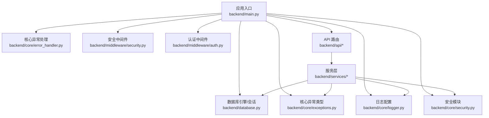
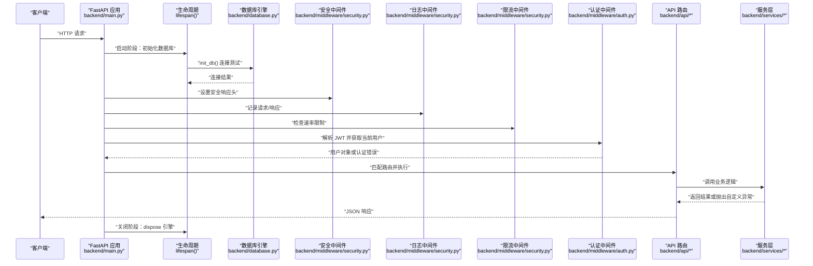
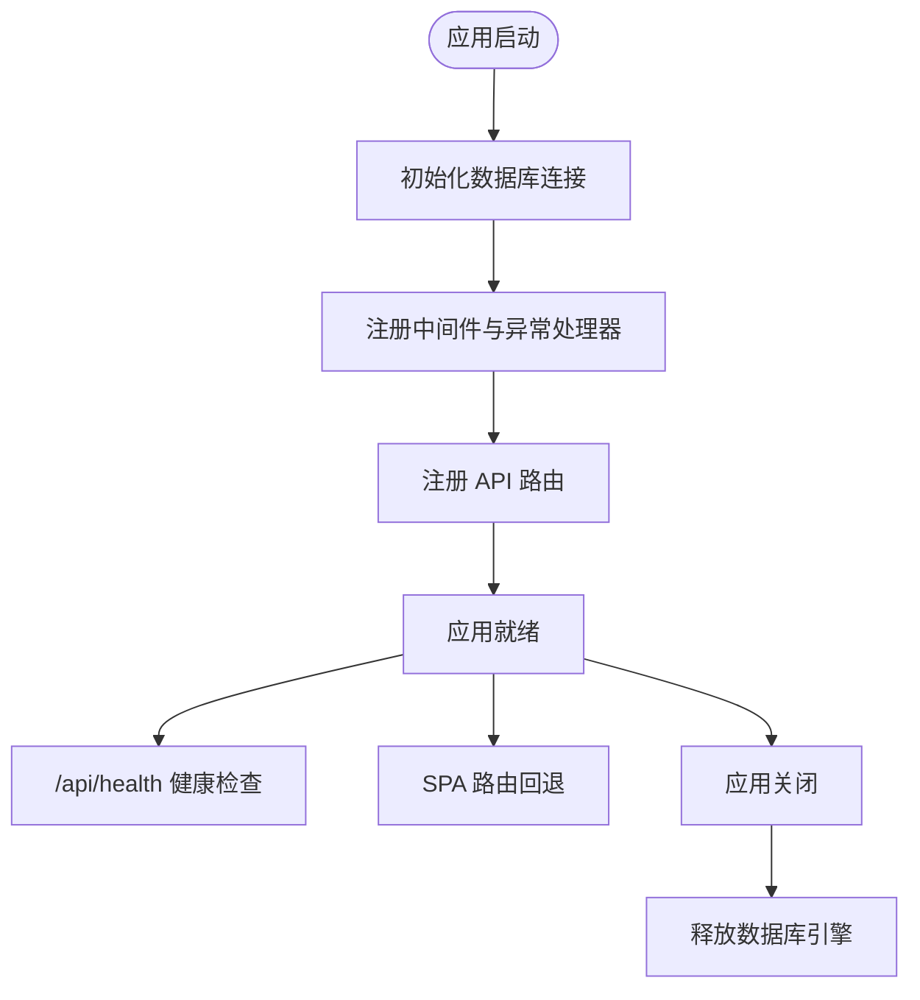
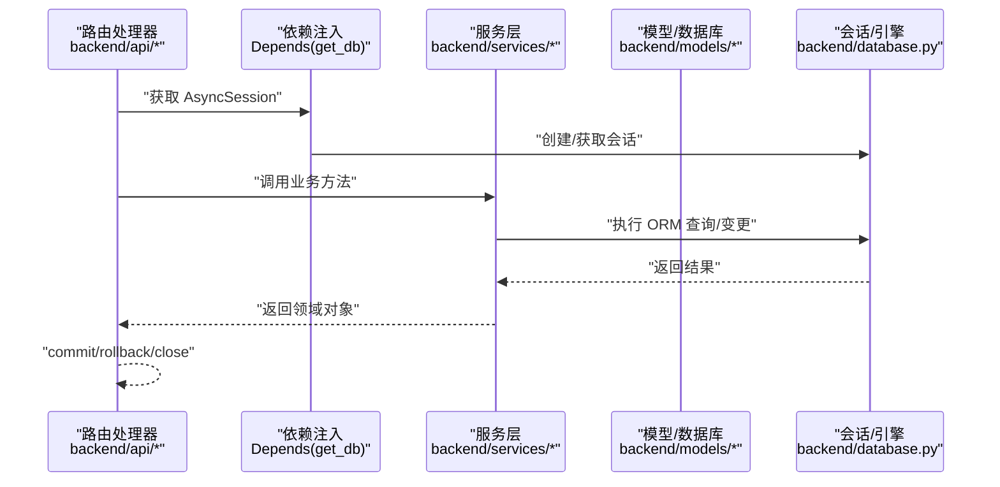
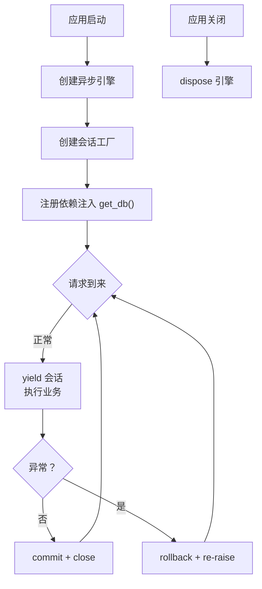
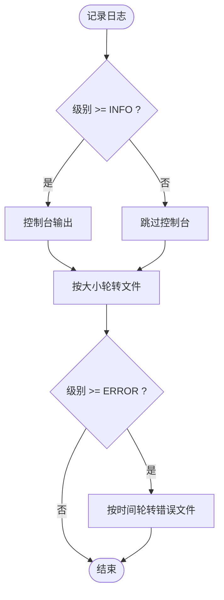
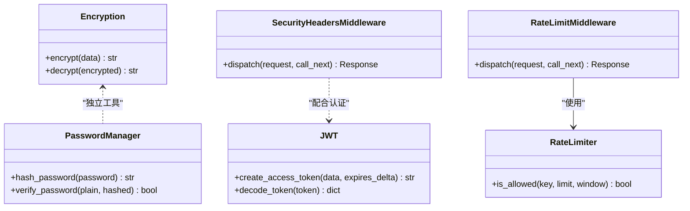
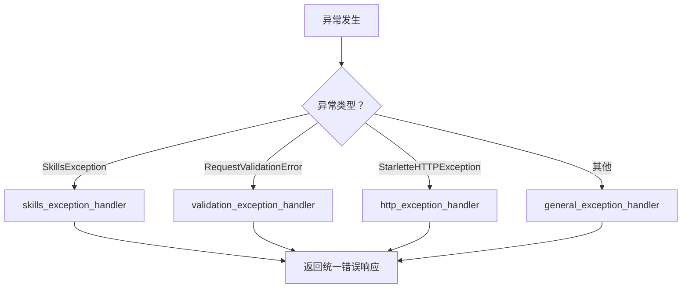
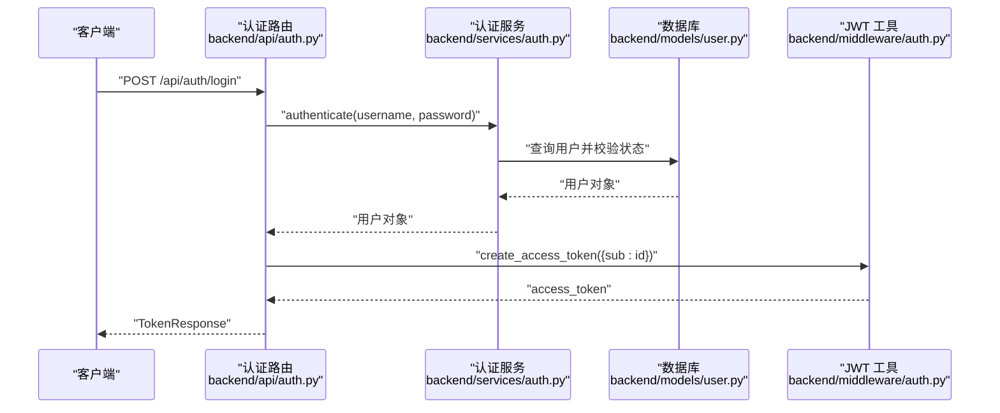
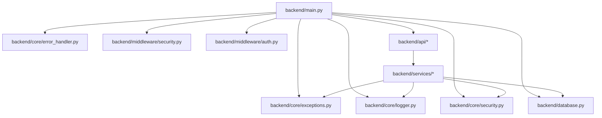

# 核心模块

<cite>
**本文引用的文件**
- [backend/main.py](file://backend/main.py)
- [backend/database.py](file://backend/database.py)
- [backend/core/logger.py](file://backend/core/logger.py)
- [backend/core/security.py](file://backend/core/security.py)
- [backend/core/error_handler.py](file://backend/core/error_handler.py)
- [backend/core/exceptions.py](file://backend/core/exceptions.py)
- [backend/middleware/security.py](file://backend/middleware/security.py)
- [backend/middleware/auth.py](file://backend/middleware/auth.py)
- [backend/api/auth.py](file://backend/api/auth.py)
- [backend/api/users.py](file://backend/api/users.py)
- [backend/models/user.py](file://backend/models/user.py)
- [backend/services/auth.py](file://backend/services/auth.py)
- [backend/schema.sql](file://backend/schema.sql)
- [backend/.env.example](file://backend/.env.example)
- [backend/requirements.txt](file://backend/requirements.txt)
</cite>

## 目录
1. [简介](#简介)
2. [项目结构](#项目结构)
3. [核心组件](#核心组件)
4. [架构总览](#架构总览)
5. [组件详解](#组件详解)
6. [依赖关系分析](#依赖关系分析)
7. [性能考量](#性能考量)
8. [故障排查指南](#故障排查指南)
9. [结论](#结论)
10. [附录](#附录)

## 简介
本文件聚焦 Skills Hub 的核心模块，围绕 FastAPI 应用主入口、数据库连接管理、日志系统、安全模块、异常处理机制进行深入解析，并提供路由组织、依赖注入、生命周期管理、错误响应格式等关键实现细节与最佳实践说明。

## 项目结构
后端采用分层与功能域结合的组织方式：
- 应用入口与生命周期：backend/main.py
- 数据库与会话：backend/database.py
- 核心能力（日志、安全、异常）：backend/core/*
- 中间件（安全、日志、限流）：backend/middleware/*
- API 路由：backend/api/*
- 业务服务：backend/services/*
- 数据模型：backend/models/*
- 数据库初始化脚本：backend/schema.sql
- 环境变量示例：backend/.env.example
- 依赖清单：backend/requirements.txt

图表来源
- [backend/main.py](file://backend/main.py#L47-L84)
- [backend/database.py](file://backend/database.py#L20-L36)
- [backend/core/error_handler.py](file://backend/core/error_handler.py#L14-L101)
- [backend/core/exceptions.py](file://backend/core/exceptions.py#L7-L100)
- [backend/core/logger.py](file://backend/core/logger.py#L11-L66)
- [backend/core/security.py](file://backend/core/security.py#L12-L58)
- [backend/middleware/security.py](file://backend/middleware/security.py#L11-L141)
- [backend/middleware/auth.py](file://backend/middleware/auth.py#L25-L95)

章节来源
- [backend/main.py](file://backend/main.py#L47-L84)
- [backend/database.py](file://backend/database.py#L20-L36)
- [backend/core/logger.py](file://backend/core/logger.py#L11-L66)
- [backend/core/security.py](file://backend/core/security.py#L12-L58)
- [backend/core/error_handler.py](file://backend/core/error_handler.py#L14-L101)
- [backend/core/exceptions.py](file://backend/core/exceptions.py#L7-L100)
- [backend/middleware/security.py](file://backend/middleware/security.py#L11-L141)
- [backend/middleware/auth.py](file://backend/middleware/auth.py#L25-L95)

## 核心组件
- 应用生命周期与依赖注入：通过 lifespan 管理启动/关闭阶段；通过 get_db 提供异步会话依赖。
- 数据库连接池：基于 SQLAlchemy 异步引擎与 aiomysql，支持 pre_ping、池大小与溢出配置。
- 日志系统：控制台与文件轮转（大小/时间），统一格式与上下文扩展。
- 安全模块：密码加密（argon2）、敏感数据加密（Fernet）、JWT 令牌签发与校验、安全响应头与速率限制。
- 异常处理：统一错误响应格式，覆盖自定义异常、验证错误、HTTP 异常与通用异常。

章节来源
- [backend/main.py](file://backend/main.py#L27-L44)
- [backend/database.py](file://backend/database.py#L42-L75)
- [backend/core/logger.py](file://backend/core/logger.py#L11-L66)
- [backend/core/security.py](file://backend/core/security.py#L12-L58)
- [backend/core/error_handler.py](file://backend/core/error_handler.py#L14-L101)

## 架构总览
下图展示应用启动、路由注册、中间件链路、依赖注入与异常处理的整体流程。

图表来源
- [backend/main.py](file://backend/main.py#L27-L44)
- [backend/database.py](file://backend/database.py#L58-L75)
- [backend/middleware/security.py](file://backend/middleware/security.py#L11-L141)
- [backend/middleware/auth.py](file://backend/middleware/auth.py#L48-L95)
- [backend/api/auth.py](file://backend/api/auth.py#L24-L40)
- [backend/services/auth.py](file://backend/services/auth.py#L64-L98)

## 组件详解

### 应用主入口与生命周期管理
- 生命周期：使用 lifespan 管理启动与关闭阶段，启动时初始化数据库连接，关闭时释放引擎。
- 中间件：CORS、安全响应头、日志、限流。
- 异常处理器：SkillsException、RequestValidationError、StarletteHTTPException、通用异常。
- 路由组织：include_router 注册认证、用户、仓库、分类、技能、Webhook、同步等路由。
- 健康检查：/api/health 对数据库执行简单查询，返回健康状态。
- SPA 回退：非 API 路由返回前端 index.html，生产环境需挂载静态文件。

图表来源
- [backend/main.py](file://backend/main.py#L27-L44)
- [backend/main.py](file://backend/main.py#L56-L84)
- [backend/main.py](file://backend/main.py#L88-L104)
- [backend/main.py](file://backend/main.py#L107-L125)

章节来源
- [backend/main.py](file://backend/main.py#L27-L44)
- [backend/main.py](file://backend/main.py#L56-L84)
- [backend/main.py](file://backend/main.py#L88-L104)
- [backend/main.py](file://backend/main.py#L107-L125)

### 依赖注入机制
- 数据库会话依赖：get_db 提供异步会话，自动 commit/rollback/关闭，确保事务一致性。
- 认证依赖：get_current_user 从 Authorization 头解析 JWT，校验并加载用户，支持 require_admin。
- 可选认证：get_optional_user 在无令牌或无效时返回 None，便于公开接口。
- 服务层依赖：服务类通过 AsyncSession 与核心模块协作，保持职责分离。

图表来源
- [backend/database.py](file://backend/database.py#L42-L56)
- [backend/middleware/auth.py](file://backend/middleware/auth.py#L48-L95)
- [backend/api/auth.py](file://backend/api/auth.py#L24-L40)
- [backend/services/auth.py](file://backend/services/auth.py#L64-L98)

章节来源
- [backend/database.py](file://backend/database.py#L42-L56)
- [backend/middleware/auth.py](file://backend/middleware/auth.py#L48-L95)
- [backend/api/auth.py](file://backend/api/auth.py#L24-L40)
- [backend/services/auth.py](file://backend/services/auth.py#L64-L98)

### 数据库连接管理
- 引擎配置：异步引擎、aiomysql、pool_pre_ping、pool_size、max_overflow。
- 会话工厂：AsyncSession、expire_on_commit、autocommit、autoflush。
- 依赖注入：get_db 提供 try/except/finally 确保异常回滚与关闭。
- 初始化与关闭：init_db 测试连接；close_db dispose 引擎。

图表来源
- [backend/database.py](file://backend/database.py#L20-L36)
- [backend/database.py](file://backend/database.py#L42-L56)
- [backend/database.py](file://backend/database.py#L58-L75)

章节来源
- [backend/database.py](file://backend/database.py#L20-L36)
- [backend/database.py](file://backend/database.py#L42-L56)
- [backend/database.py](file://backend/database.py#L58-L75)

### 日志系统设计
- 输出目标：控制台 INFO、按大小轮转的日志文件、按时间轮转的错误日志文件。
- 格式化：包含时间戳、级别、模块名、行号与消息。
- 上下文扩展：LogContext 通过自定义 makeRecord 扩展日志记录字段。
- 性能考虑：INFO 与 ERROR 分离输出，避免错误日志过大；轮转策略减少单文件体积。

图表来源
- [backend/core/logger.py](file://backend/core/logger.py#L11-L66)
- [backend/core/logger.py](file://backend/core/logger.py#L73-L95)

章节来源
- [backend/core/logger.py](file://backend/core/logger.py#L11-L66)
- [backend/core/logger.py](file://backend/core/logger.py#L73-L95)

### 安全模块
- 密码加密：使用 argon2，支持 hash 与 verify。
- 敏感数据加密：Fernet 对称加密，支持生成密钥与环境变量读取。
- JWT 令牌：签发与解码，含过期与签名错误处理。
- 安全响应头：X-Content-Type-Options、X-Frame-Options、Strict-Transport-Security、Content-Security-Policy 等。
- 速率限制：基于内存的滑动窗口计数，支持路径级配置。

图表来源
- [backend/core/security.py](file://backend/core/security.py#L12-L58)
- [backend/middleware/security.py](file://backend/middleware/security.py#L11-L141)
- [backend/middleware/auth.py](file://backend/middleware/auth.py#L25-L46)

章节来源
- [backend/core/security.py](file://backend/core/security.py#L12-L58)
- [backend/middleware/security.py](file://backend/middleware/security.py#L11-L141)
- [backend/middleware/auth.py](file://backend/middleware/auth.py#L25-L46)

### 异常处理机制
- 自定义异常：SkillsException 及其子类（NotFound、Validation、Authentication、Authorization、Conflict、ExternalService）。
- 统一响应：四种异常处理器分别处理自定义异常、验证错误、HTTP 异常与通用异常，统一返回包含 code/message/details/path/timestamp 的结构。
- 错误日志：记录异常栈与上下文，便于追踪。

图表来源
- [backend/core/error_handler.py](file://backend/core/error_handler.py#L14-L101)
- [backend/core/exceptions.py](file://backend/core/exceptions.py#L7-L100)

章节来源
- [backend/core/error_handler.py](file://backend/core/error_handler.py#L14-L101)
- [backend/core/exceptions.py](file://backend/core/exceptions.py#L7-L100)

### 路由组织与认证流程
- 路由前缀与标签：认证、用户、仓库、分类、技能、Webhook、同步等。
- 认证流程：登录成功后签发 JWT；后续接口通过 get_current_user 获取当前用户；require_admin 限制管理员操作。
- 用户模型：角色枚举、激活状态、创建者外键等。

图表来源
- [backend/api/auth.py](file://backend/api/auth.py#L24-L40)
- [backend/services/auth.py](file://backend/services/auth.py#L64-L98)
- [backend/middleware/auth.py](file://backend/middleware/auth.py#L25-L33)
- [backend/models/user.py](file://backend/models/user.py#L18-L52)

章节来源
- [backend/api/auth.py](file://backend/api/auth.py#L24-L40)
- [backend/api/users.py](file://backend/api/users.py#L17-L36)
- [backend/services/auth.py](file://backend/services/auth.py#L64-L98)
- [backend/middleware/auth.py](file://backend/middleware/auth.py#L48-L95)
- [backend/models/user.py](file://backend/models/user.py#L18-L52)

## 依赖关系分析
- 应用入口依赖：核心异常处理、异常类型、日志、安全模块、数据库、中间件与各 API 路由。
- 服务层依赖：数据库会话、密码管理、日志、异常类型。
- 认证中间件依赖：JWT 解析、数据库会话、用户模型。
- 中间件依赖：日志记录器。

图表来源
- [backend/main.py](file://backend/main.py#L10-L21)
- [backend/main.py](file://backend/main.py#L76-L84)
- [backend/services/auth.py](file://backend/services/auth.py#L10-L16)

章节来源
- [backend/main.py](file://backend/main.py#L10-L21)
- [backend/main.py](file://backend/main.py#L76-L84)
- [backend/services/auth.py](file://backend/services/auth.py#L10-L16)

## 性能考量
- 数据库连接池：合理设置 pool_size 与 max_overflow，结合 pool_pre_ping 提升连接稳定性。
- 日志输出：INFO 与 ERROR 分离，避免错误日志过大；控制台输出建议在生产环境降低冗余。
- 中间件顺序：安全头与限流在日志之前，确保日志中包含最终响应头与限流结果。
- 异常处理：统一响应格式减少客户端解析成本，错误日志保留必要上下文。

## 故障排查指南
- 数据库连接失败：检查 DATABASE_URL 与网络连通性；查看 init_db 返回值与日志。
- JWT 无效或过期：确认 SECRET_KEY 一致、算法正确、签名有效；检查令牌过期时间。
- 速率限制触发：检查限流键（IP+路径）与窗口配置；查看日志中的警告信息。
- 自定义异常未被捕获：确认异常类型与处理器映射；检查异常是否被上层捕获。
- 健康检查失败：/api/health 返回数据库断开时，优先排查连接池与网络。

章节来源
- [backend/database.py](file://backend/database.py#L58-L75)
- [backend/middleware/auth.py](file://backend/middleware/auth.py#L36-L46)
- [backend/middleware/security.py](file://backend/middleware/security.py#L115-L141)
- [backend/core/error_handler.py](file://backend/core/error_handler.py#L80-L101)
- [backend/main.py](file://backend/main.py#L88-L104)

## 结论
本核心模块通过清晰的分层与中间件体系，实现了健壮的应用生命周期管理、可靠的数据库连接与依赖注入、完善的日志与安全机制以及统一的异常处理。配合明确的路由组织与认证流程，为 Skills Hub 提供了可维护、可扩展且安全的后端基础。

## 附录

### 环境变量与配置要点
- JWT 密钥：JWT_SECRET_KEY（生产环境必须替换）
- 加密密钥：ENCRYPTION_KEY（用于敏感数据加密）
- 数据库连接：DATABASE_URL（默认 mysql+aiomysql）
- 环境与调试：ENVIRONMENT、DEBUG
- 服务端口：PORT

章节来源
- [backend/.env.example](file://backend/.env.example#L1-L17)

### 数据库初始化脚本摘要
- 用户表：用户名唯一、角色枚举、激活状态、创建者外键。
- 仓库表：类型、所有者、名称、分支、访问令牌、Webhook 配置。
- 分类表：父子关系、排序、唯一 slug。
- 技能表：全文检索索引、仓库关联。
- Webhook 表：事件类型、状态、错误信息。
- 初始管理员：admin 账户（部署后务必修改密码）。

章节来源
- [backend/schema.sql](file://backend/schema.sql#L7-L105)

### 依赖清单要点
- FastAPI、Uvicorn、SQLAlchemy、aiomysql、passlib(argon2)、cryptography、python-jose、slowapi 等。

章节来源
- [backend/requirements.txt](file://backend/requirements.txt#L1-L34)