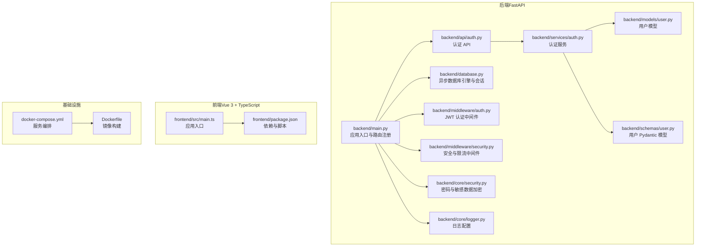
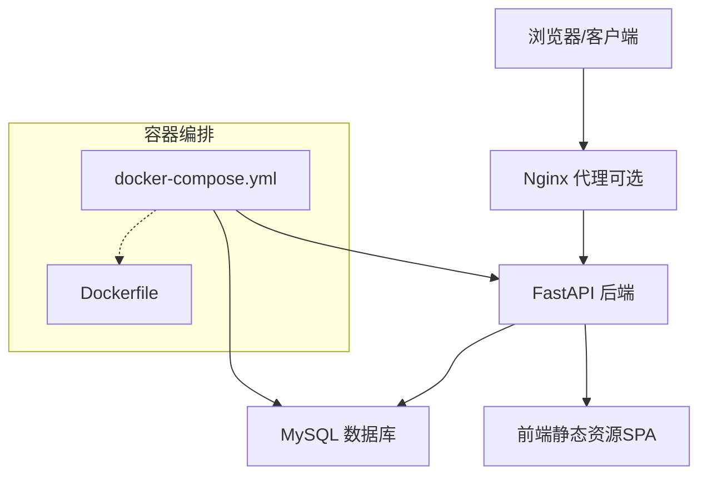
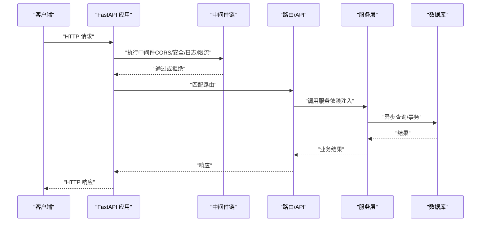
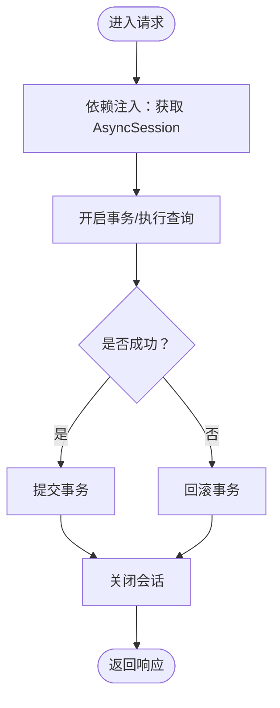
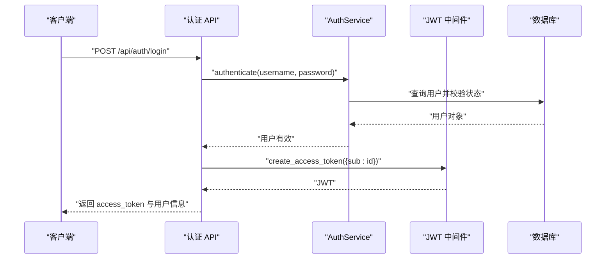
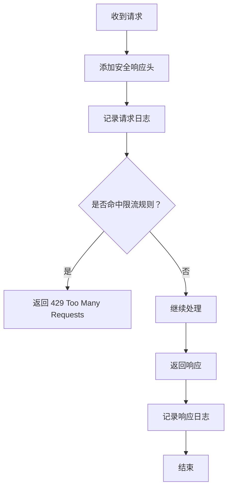
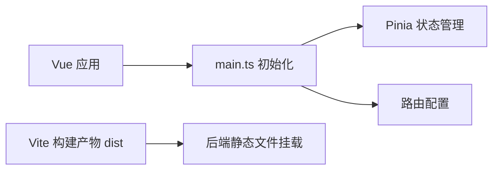
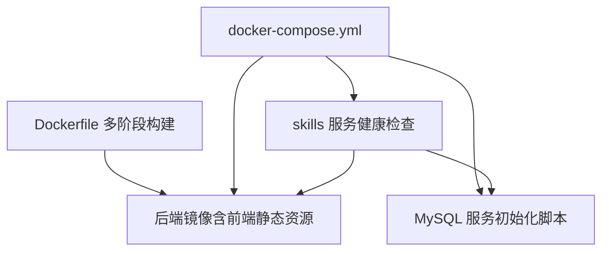
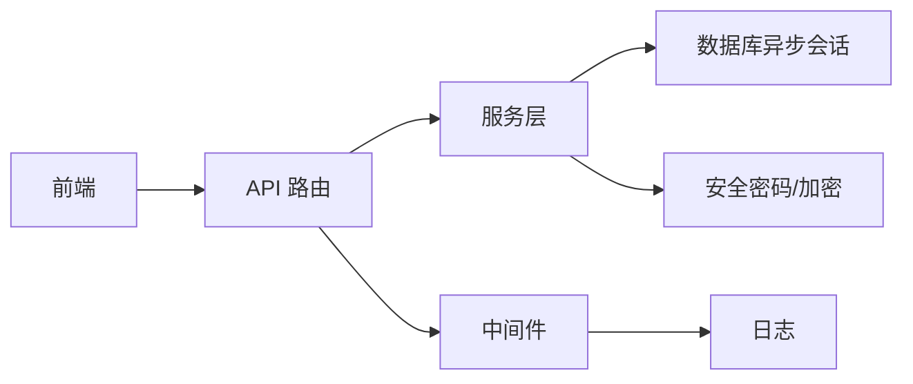

# 整体设计

<cite>
**本文引用的文件**
- [README.md](file://README.md)
- [backend/main.py](file://backend/main.py)
- [backend/database.py](file://backend/database.py)
- [backend/middleware/auth.py](file://backend/middleware/auth.py)
- [backend/middleware/security.py](file://backend/middleware/security.py)
- [backend/services/auth.py](file://backend/services/auth.py)
- [backend/models/user.py](file://backend/models/user.py)
- [backend/schemas/user.py](file://backend/schemas/user.py)
- [backend/api/auth.py](file://backend/api/auth.py)
- [backend/core/logger.py](file://backend/core/logger.py)
- [backend/core/security.py](file://backend/core/security.py)
- [docker-compose.yml](file://docker-compose.yml)
- [Dockerfile](file://Dockerfile)
- [frontend/package.json](file://frontend/package.json)
- [frontend/src/main.ts](file://frontend/src/main.ts)
</cite>

## 目录
1. [引言](#引言)
2. [项目结构](#项目结构)
3. [核心组件](#核心组件)
4. [架构总览](#架构总览)
5. [详细组件分析](#详细组件分析)
6. [依赖分析](#依赖分析)
7. [性能考量](#性能考量)
8. [故障排查指南](#故障排查指南)
9. [结论](#结论)
10. [附录](#附录)

## 引言
本设计文档面向 Skills Hub 平台的整体架构，聚焦于前后端分离、微服务化部署与容器化的协同方案；系统采用 FastAPI 后端、Vue.js 前端、MySQL 数据库与 Nginx 代理的组合，并通过异步编程、依赖注入与中间件体系实现高可用、可扩展与安全可控的运行架构。本文将系统性阐述技术栈选择、组件交互、数据流与异常处理，并提供可扩展性、性能优化与安全设计建议。

## 项目结构
项目采用前后端分离的目录布局，后端以 FastAPI 为核心，前端以 Vue 3 + TypeScript 构建，配合 Docker Compose 实现本地与生产环境的一致化编排。

图表来源
- [backend/main.py](file://backend/main.py#L46-L137)
- [backend/database.py](file://backend/database.py#L20-L56)
- [backend/middleware/auth.py](file://backend/middleware/auth.py#L24-L96)
- [backend/middleware/security.py](file://backend/middleware/security.py#L11-L142)
- [backend/services/auth.py](file://backend/services/auth.py#L19-L130)
- [backend/models/user.py](file://backend/models/user.py#L18-L52)
- [backend/schemas/user.py](file://backend/schemas/user.py#L8-L96)
- [backend/api/auth.py](file://backend/api/auth.py#L21-L65)
- [backend/core/security.py](file://backend/core/security.py#L12-L64)
- [backend/core/logger.py](file://backend/core/logger.py#L11-L71)
- [frontend/src/main.ts](file://frontend/src/main.ts#L1-L12)
- [frontend/package.json](file://frontend/package.json#L1-L20)
- [docker-compose.yml](file://docker-compose.yml#L1-L56)
- [Dockerfile](file://Dockerfile#L1-L48)

章节来源
- [README.md](file://README.md#L20-L47)
- [backend/main.py](file://backend/main.py#L46-L137)
- [docker-compose.yml](file://docker-compose.yml#L1-L56)
- [Dockerfile](file://Dockerfile#L1-L48)
- [frontend/package.json](file://frontend/package.json#L1-L20)
- [frontend/src/main.ts](file://frontend/src/main.ts#L1-L12)

## 核心组件
- 后端应用（FastAPI）
  - 应用生命周期管理、CORS、自定义中间件、异常处理与路由注册
  - 健康检查端点与 SPA 回退
- 数据库层（SQLAlchemy + aiomysql）
  - 异步连接池、会话工厂与依赖注入
- 认证与授权
  - JWT 令牌签发与校验、可选认证与管理员权限依赖注入
- 安全中间件
  - 安全响应头、请求日志与简单内存限流
- 日志与加密
  - 多通道日志、密码哈希（argon2）、敏感数据对称加密
- 前端应用（Vue 3 + TypeScript）
  - 应用初始化、路由与状态管理
- 容器化与编排
  - 多阶段构建、后端与前端静态资源合并、服务编排与健康检查

章节来源
- [backend/main.py](file://backend/main.py#L27-L137)
- [backend/database.py](file://backend/database.py#L42-L75)
- [backend/middleware/auth.py](file://backend/middleware/auth.py#L24-L134)
- [backend/middleware/security.py](file://backend/middleware/security.py#L11-L142)
- [backend/core/security.py](file://backend/core/security.py#L12-L64)
- [backend/core/logger.py](file://backend/core/logger.py#L11-L71)
- [frontend/src/main.ts](file://frontend/src/main.ts#L1-L12)

## 架构总览
系统采用前后端分离与容器化部署策略，后端提供 REST API 与 SPA 回退，前端通过静态资源提供管理与浏览页面。数据库与后端服务通过 Docker Compose 编排，Nginx 可选作为反向代理与静态资源服务（在容器化部署中可由 Nginx 提供统一入口与 SSL 终止）。

图表来源
- [docker-compose.yml](file://docker-compose.yml#L1-L56)
- [Dockerfile](file://Dockerfile#L1-L48)
- [backend/main.py](file://backend/main.py#L107-L125)

## 详细组件分析

### 后端应用与路由注册
- 生命周期管理：应用启动时初始化数据库连接，关闭时释放连接
- 中间件链路：CORS、安全响应头、日志、限流
- 异常处理：统一异常映射到标准化响应
- 路由注册：认证、用户、仓库、分类、技能、Webhook、同步等模块化路由
- 健康检查：数据库连通性检测
- SPA 回退：非 API 路由返回前端 index.html，生产环境挂载静态资源

图表来源
- [backend/main.py](file://backend/main.py#L46-L137)
- [backend/middleware/security.py](file://backend/middleware/security.py#L11-L142)
- [backend/api/auth.py](file://backend/api/auth.py#L21-L65)
- [backend/services/auth.py](file://backend/services/auth.py#L19-L130)
- [backend/database.py](file://backend/database.py#L42-L56)

章节来源
- [backend/main.py](file://backend/main.py#L27-L137)

### 数据库与依赖注入
- 异步引擎与连接池：aiomysql + SQLAlchemy 异步会话
- 会话工厂与依赖注入：get_db 提供异步会话，自动提交/回滚/关闭
- 初始化与关闭：启动时健康检查，关闭时释放连接

图表来源
- [backend/database.py](file://backend/database.py#L42-L56)

章节来源
- [backend/database.py](file://backend/database.py#L20-L75)

### 认证与授权（JWT）
- 密钥与算法：从环境变量读取密钥，HS256 签发与校验
- 令牌生成：包含用户标识与过期时间
- 令牌解析：过期与无效处理
- 当前用户解析：从请求头提取 Bearer Token，解析并加载用户
- 管理员权限：依赖注入要求 admin 角色
- 可选认证：允许未登录访问，返回空值

图表来源
- [backend/api/auth.py](file://backend/api/auth.py#L24-L41)
- [backend/services/auth.py](file://backend/services/auth.py#L64-L99)
- [backend/middleware/auth.py](file://backend/middleware/auth.py#L25-L96)
- [backend/models/user.py](file://backend/models/user.py#L18-L52)

章节来源
- [backend/middleware/auth.py](file://backend/middleware/auth.py#L24-L134)
- [backend/services/auth.py](file://backend/services/auth.py#L19-L130)
- [backend/models/user.py](file://backend/models/user.py#L12-L52)
- [backend/schemas/user.py](file://backend/schemas/user.py#L32-L96)

### 安全中间件与日志
- 安全响应头：X-Content-Type-Options、X-Frame-Options、X-XSS-Protection、HSTS、CSP
- 请求日志：记录方法、路径、客户端 IP、响应码与耗时
- 速率限制：基于内存的滑动窗口限流，默认对登录接口限流
- 日志配置：控制台、按大小轮转与按天轮转的错误日志

图表来源
- [backend/middleware/security.py](file://backend/middleware/security.py#L11-L142)
- [backend/core/logger.py](file://backend/core/logger.py#L11-L71)

章节来源
- [backend/middleware/security.py](file://backend/middleware/security.py#L11-L142)
- [backend/core/logger.py](file://backend/core/logger.py#L11-L71)

### 前端应用与构建
- 应用入口：创建 Vue 应用、安装 Pinia 与路由
- 依赖与脚本：Vue 3、Vue Router、Pinia、Vite 开发与构建
- 生产部署：后端镜像内置前端 dist，通过静态文件挂载提供 SPA

图表来源
- [frontend/src/main.ts](file://frontend/src/main.ts#L1-L12)
- [frontend/package.json](file://frontend/package.json#L1-L20)
- [backend/main.py](file://backend/main.py#L119-L125)

章节来源
- [frontend/src/main.ts](file://frontend/src/main.ts#L1-L12)
- [frontend/package.json](file://frontend/package.json#L1-L20)
- [backend/main.py](file://backend/main.py#L119-L125)

### 容器化与部署
- 多阶段构建：前端构建产物复制至后端镜像，暴露 8000 端口
- 编排：skills 服务依赖 db 健康，挂载日志目录，健康检查指向 /api/health
- 数据库：MySQL 8.0，初始化脚本挂载，持久化存储卷

图表来源
- [Dockerfile](file://Dockerfile#L1-L48)
- [docker-compose.yml](file://docker-compose.yml#L1-L56)

章节来源
- [Dockerfile](file://Dockerfile#L1-L48)
- [docker-compose.yml](file://docker-compose.yml#L1-L56)

## 依赖分析
- 组件耦合与内聚
  - API 层仅依赖服务层与依赖注入，内聚度高
  - 服务层依赖模型与核心工具（密码/加密/日志），职责清晰
  - 中间件独立于业务逻辑，横切关注点明确
- 直接与间接依赖
  - API → 服务 → 数据库（异步会话）
  - 中间件 → 应用 → 路由
  - 前端 → 后端 API（REST）
- 外部依赖与集成点
  - 数据库：SQLAlchemy 异步引擎
  - 认证：PyJWT、passlib（argon2）
  - 加密：Fernet（cryptography）
  - 日志：标准库 logging 与 handlers
  - 容器：Docker Compose、Uvicorn

图表来源
- [backend/api/auth.py](file://backend/api/auth.py#L21-L65)
- [backend/services/auth.py](file://backend/services/auth.py#L19-L130)
- [backend/database.py](file://backend/database.py#L42-L56)
- [backend/middleware/security.py](file://backend/middleware/security.py#L11-L142)
- [backend/core/security.py](file://backend/core/security.py#L12-L64)
- [backend/core/logger.py](file://backend/core/logger.py#L11-L71)

章节来源
- [backend/api/auth.py](file://backend/api/auth.py#L21-L65)
- [backend/services/auth.py](file://backend/services/auth.py#L19-L130)
- [backend/database.py](file://backend/database.py#L20-L75)
- [backend/middleware/security.py](file://backend/middleware/security.py#L11-L142)
- [backend/core/security.py](file://backend/core/security.py#L12-L64)
- [backend/core/logger.py](file://backend/core/logger.py#L11-L71)

## 性能考量
- 异步数据库访问：使用 aiomysql 与 SQLAlchemy 异步会话，降低阻塞，提升并发吞吐
- 连接池参数：预检查、池大小与溢出连接数，结合实际负载调整
- 中间件顺序：将限流与日志置于上游，减少无效处理
- 前端静态资源：后端镜像内置 dist，减少 Nginx 层转发开销
- 健康检查：容器层面健康检查与应用层面 /api/health 双重保障
- 缓存与索引：在业务层合理使用数据库索引与查询优化（建议）

## 故障排查指南
- 健康检查失败
  - 检查 /api/health 返回状态与数据库连通性
  - 查看容器健康检查配置与日志
- 认证问题
  - 确认 JWT 密钥配置与算法
  - 检查用户状态与令牌过期
- 限流触发
  - 检查限流规则与客户端 IP
  - 适当提高阈值或使用分布式限流
- 日志定位
  - 关注 INFO 与 ERROR 日志文件，结合请求/响应日志定位问题
- 数据库连接
  - 检查连接池参数与网络连通性
  - 关注异常处理与回滚逻辑

章节来源
- [backend/main.py](file://backend/main.py#L88-L105)
- [backend/middleware/security.py](file://backend/middleware/security.py#L107-L142)
- [backend/core/logger.py](file://backend/core/logger.py#L11-L71)
- [backend/database.py](file://backend/database.py#L62-L75)

## 结论
Skills Hub 采用前后端分离与容器化部署，后端以 FastAPI 为核心，结合异步数据库、中间件与依赖注入机制，形成高内聚、低耦合的模块化架构。通过 JWT 认证、安全响应头与日志体系，系统在功能完备的同时兼顾了安全性与可观测性。建议在生产环境中引入 Nginx 作为统一入口与 SSL 终止，并根据流量特征优化限流策略与数据库连接池参数，以进一步提升稳定性与性能。

## 附录
- 环境变量与默认值
  - 数据库连接字符串、JWT 密钥、加密密钥
- API 端点概览
  - 认证、用户、仓库、分类、技能、Webhook、同步等
- GitLab Webhook 配置要点
  - URL、Secret Token、触发事件

章节来源
- [README.md](file://README.md#L112-L155)
- [backend/main.py](file://backend/main.py#L88-L105)
- [backend/api/auth.py](file://backend/api/auth.py#L21-L65)