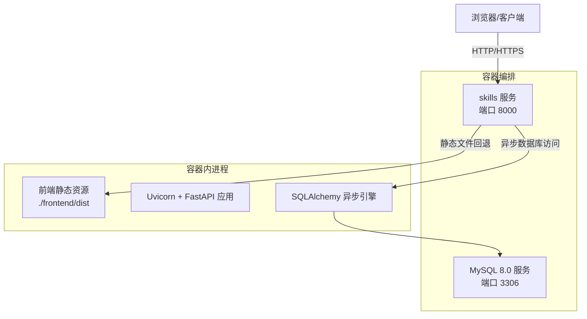
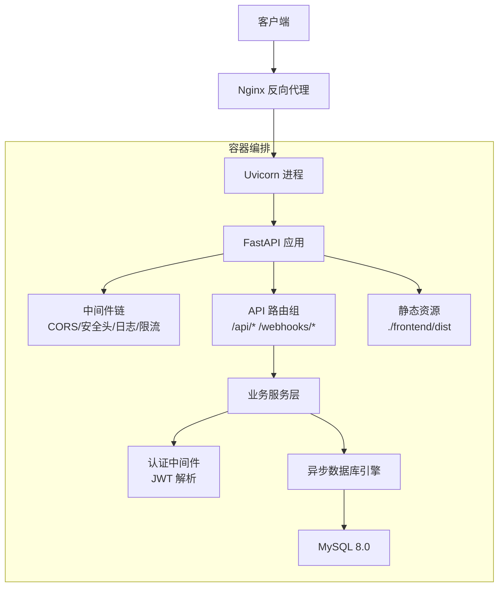
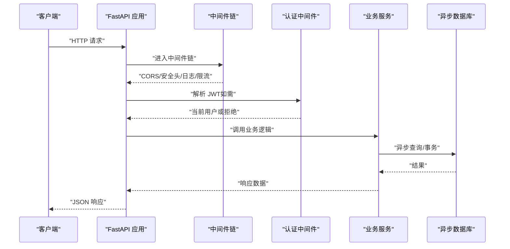
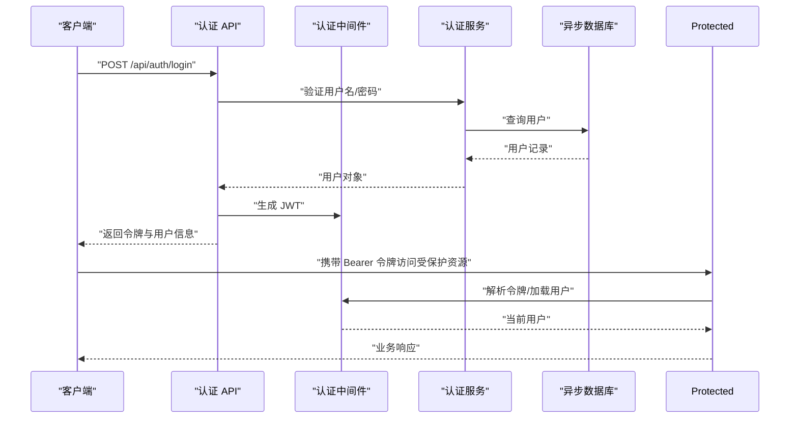
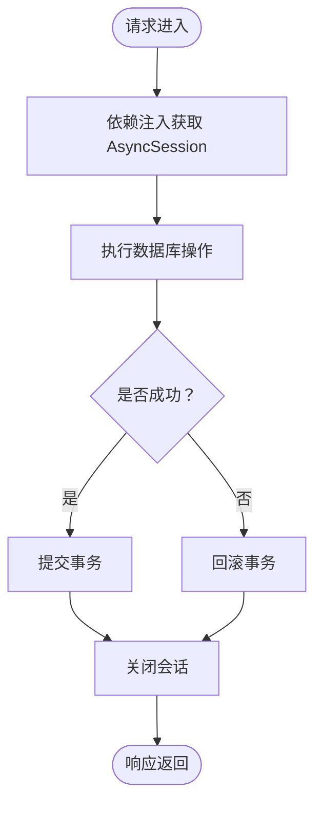
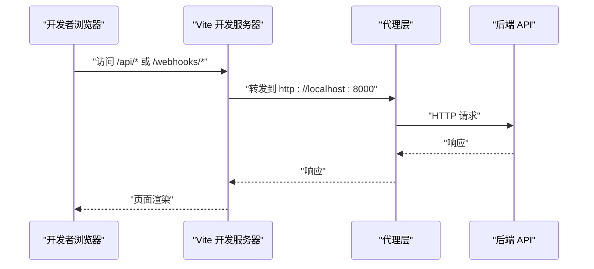
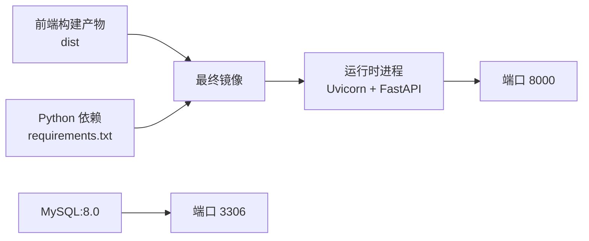
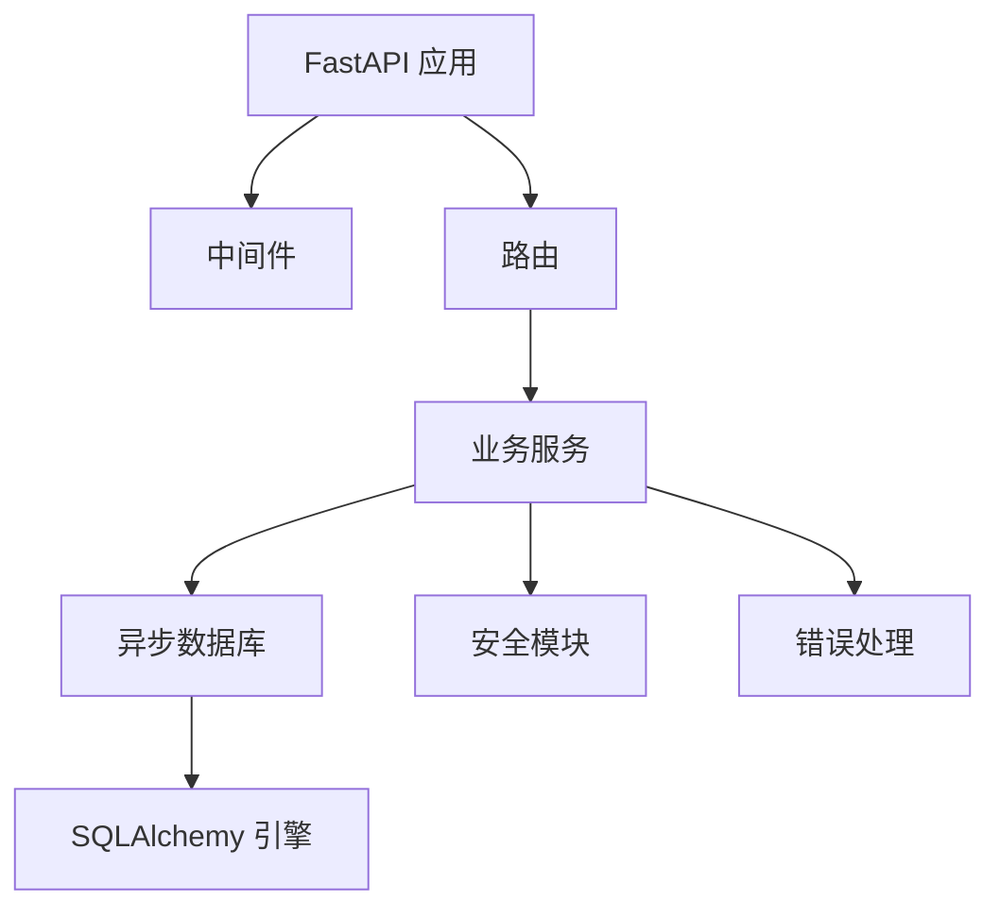

# 系统架构

<cite>
**本文引用的文件**
- [README.md](file://README.md)
- [docker-compose.yml](file://docker-compose.yml)
- [Dockerfile](file://Dockerfile)
- [backend/main.py](file://backend/main.py)
- [backend/database.py](file://backend/database.py)
- [backend/requirements.txt](file://backend/requirements.txt)
- [backend/middleware/auth.py](file://backend/middleware/auth.py)
- [backend/middleware/security.py](file://backend/middleware/security.py)
- [backend/core/security.py](file://backend/core/security.py)
- [backend/core/error_handler.py](file://backend/core/error_handler.py)
- [backend/api/auth.py](file://backend/api/auth.py)
- [backend/services/auth.py](file://backend/services/auth.py)
- [backend/models/user.py](file://backend/models/user.py)
- [frontend/vite.config.ts](file://frontend/vite.config.ts)
- [frontend/src/main.ts](file://frontend/src/main.ts)
</cite>

## 目录
1. [引言](#引言)
2. [项目结构](#项目结构)
3. [核心组件](#核心组件)
4. [架构总览](#架构总览)
5. [详细组件分析](#详细组件分析)
6. [依赖分析](#依赖分析)
7. [性能考虑](#性能考虑)
8. [故障排查指南](#故障排查指南)
9. [结论](#结论)
10. [附录](#附录)

## 引言
本文件为 Skills Hub 平台的系统架构文档，面向技术与非技术读者，系统性阐述前后端分离架构、微服务部署模式与容器化策略；详解 FastAPI 后端服务、Vue.js 前端应用、MySQL 数据库与 Nginx 代理的协作关系；深入解析异步编程模式、依赖注入机制与中间件体系的架构优势；并给出可扩展性、性能优化与安全设计建议。

## 项目结构
Skills Hub 采用前后端分离的单体容器化部署方案：
- 后端：FastAPI 提供 REST API 与 SPA 回退路由，内置静态资源托管，支持健康检查与中间件链路。
- 前端：Vue 3 + TypeScript，Vite 开发服务器，开发时通过代理转发 /api 与 /webhooks 到后端。
- 数据库：MySQL 8.0，使用 SQLAlchemy 异步 ORM 进行连接与事务管理。
- 编排：Dockerfile 多阶段构建，docker-compose 编排后端与数据库服务，暴露 8000 端口。

图表来源
- [docker-compose.yml](file://docker-compose.yml#L1-L56)
- [Dockerfile](file://Dockerfile#L1-L48)
- [backend/main.py](file://backend/main.py#L107-L125)
- [backend/database.py](file://backend/database.py#L20-L36)

章节来源
- [README.md](file://README.md#L13-L46)
- [docker-compose.yml](file://docker-compose.yml#L1-L56)
- [Dockerfile](file://Dockerfile#L1-L48)

## 核心组件
- FastAPI 应用与生命周期管理：通过 lifespan 管理数据库初始化与关闭；注册 CORS、安全头、日志与限流中间件；统一异常处理；挂载前端静态资源；提供 /api/health 健康检查。
- 数据库层：异步 SQLAlchemy 引擎 + 会话工厂，连接池配置，依赖注入 get_db；提供 init_db 与 close_db。
- 中间件体系：安全响应头、请求日志、速率限制；认证中间件提供 JWT 解析与用户解析。
- 安全模块：密码加密（Argon2）、敏感数据对称加密（Fernet）。
- 错误处理：SkillsException、校验错误、HTTP 异常与通用异常的统一响应格式。
- 前端：Vue 3 应用，Pinia 状态管理，Vite 代理到后端 API/Webhook。

章节来源
- [backend/main.py](file://backend/main.py#L27-L125)
- [backend/database.py](file://backend/database.py#L42-L75)
- [backend/middleware/security.py](file://backend/middleware/security.py#L11-L142)
- [backend/middleware/auth.py](file://backend/middleware/auth.py#L25-L96)
- [backend/core/security.py](file://backend/core/security.py#L12-L64)
- [backend/core/error_handler.py](file://backend/core/error_handler.py#L14-L102)
- [frontend/vite.config.ts](file://frontend/vite.config.ts#L8-L17)
- [frontend/src/main.ts](file://frontend/src/main.ts#L1-L12)

## 架构总览
系统采用“容器内单体服务”的微服务理念：后端服务同时承载 API、静态资源与健康检查，通过中间件实现横切关注点；数据库独立容器；前端通过 Vite 代理在开发态访问后端；生产态由后端直接提供静态资源。

图表来源
- [backend/main.py](file://backend/main.py#L47-L84)
- [backend/middleware/security.py](file://backend/middleware/security.py#L11-L142)
- [backend/middleware/auth.py](file://backend/middleware/auth.py#L48-L96)
- [backend/database.py](file://backend/database.py#L20-L36)
- [docker-compose.yml](file://docker-compose.yml#L1-L56)

## 详细组件分析

### 后端应用与中间件体系
- 生命周期与健康检查：lifespan 在启动时初始化数据库并在关闭时释放连接；/api/health 通过异步连接测试数据库连通性。
- 中间件链：CORS 允许跨域；安全头中间件统一注入安全响应头并移除服务器标识；日志中间件记录请求与耗时；限流中间件按路径与客户端 IP 限流。
- 异常处理：统一包装 SkillsException、校验错误、HTTP 异常与通用异常，保证一致的错误响应结构。
- 路由与静态资源：include_router 注册认证、用户、仓库、分类、技能、Webhook、同步等路由；SPA 回退与静态文件挂载。

图表来源
- [backend/main.py](file://backend/main.py#L56-L84)
- [backend/middleware/security.py](file://backend/middleware/security.py#L11-L142)
- [backend/middleware/auth.py](file://backend/middleware/auth.py#L48-L96)
- [backend/core/error_handler.py](file://backend/core/error_handler.py#L14-L102)

章节来源
- [backend/main.py](file://backend/main.py#L27-L125)
- [backend/middleware/security.py](file://backend/middleware/security.py#L11-L142)
- [backend/core/error_handler.py](file://backend/core/error_handler.py#L14-L102)

### 认证与授权流程
- JWT 令牌签发：登录成功后根据用户 ID 生成带过期时间的访问令牌。
- 当前用户解析：从 Authorization Bearer 头部提取令牌，解码并加载用户对象，校验激活状态。
- 管理员权限：require_admin 依赖注入要求用户具备 admin 角色。
- 密码与敏感数据：使用 Argon2 哈希密码；敏感数据使用 Fernet 对称加密。

图表来源
- [backend/api/auth.py](file://backend/api/auth.py#L24-L48)
- [backend/middleware/auth.py](file://backend/middleware/auth.py#L25-L96)
- [backend/services/auth.py](file://backend/services/auth.py#L64-L98)
- [backend/models/user.py](file://backend/models/user.py#L18-L52)
- [backend/core/security.py](file://backend/core/security.py#L12-L64)

章节来源
- [backend/api/auth.py](file://backend/api/auth.py#L1-L65)
- [backend/middleware/auth.py](file://backend/middleware/auth.py#L1-L134)
- [backend/services/auth.py](file://backend/services/auth.py#L1-L130)
- [backend/models/user.py](file://backend/models/user.py#L1-L52)
- [backend/core/security.py](file://backend/core/security.py#L1-L64)

### 数据库与依赖注入
- 异步引擎：基于 aiomysql 的异步 SQLAlchemy 引擎，启用 pre_ping 与连接池参数。
- 会话工厂：AsyncSession + async_session_maker，支持自动提交/回滚与关闭。
- 依赖注入：get_db 提供异步上下文，确保每个请求一个会话；init_db 用于启动时连通性测试；close_db 释放连接。
- 模型与关系：用户模型包含角色与创建者外键，便于审计与权限控制。

图表来源
- [backend/database.py](file://backend/database.py#L42-L75)
- [backend/models/user.py](file://backend/models/user.py#L18-L52)

章节来源
- [backend/database.py](file://backend/database.py#L1-L75)
- [backend/models/user.py](file://backend/models/user.py#L1-L52)

### 前后端协作与代理
- 开发代理：Vite 将 /api 与 /webhooks 代理至后端 8000 端口，避免跨域问题。
- 生产回退：后端挂载前端 dist 目录为静态资源，并对非 API 路径返回 index.html，实现 SPA 路由回退。
- 端口与运行：后端监听 8000；前端开发服务器 5173；docker-compose 暴露 8000 供外部访问。

图表来源
- [frontend/vite.config.ts](file://frontend/vite.config.ts#L8-L17)
- [backend/main.py](file://backend/main.py#L107-L125)

章节来源
- [frontend/vite.config.ts](file://frontend/vite.config.ts#L1-L24)
- [backend/main.py](file://backend/main.py#L107-L125)

### 容器化与部署策略
- 多阶段构建：前端构建产物复制到后端镜像，最终仅保留运行时所需依赖。
- 编排服务：skills 服务依赖 db 健康；db 使用卷持久化；健康检查确保服务可用性。
- 环境变量：数据库连接串、JWT 密钥、加密密钥通过环境变量注入。

图表来源
- [Dockerfile](file://Dockerfile#L1-L48)
- [docker-compose.yml](file://docker-compose.yml#L1-L56)

章节来源
- [Dockerfile](file://Dockerfile#L1-L48)
- [docker-compose.yml](file://docker-compose.yml#L1-L56)

## 依赖分析
- 技术栈选择动机：
  - FastAPI：高性能异步框架，自动生成 OpenAPI 文档，类型安全与依赖注入成熟。
  - SQLAlchemy + aiomysql：异步 ORM，适合高并发数据库访问。
  - Vue 3 + TypeScript：现代前端生态，类型安全与组件化开发体验。
  - Docker：单体镜像简化部署，便于 CI/CD 与横向扩展。
- 组件耦合与内聚：
  - 中间件与路由解耦，通过依赖注入降低耦合度。
  - 业务服务与模型解耦，便于单元测试与演进。
  - 数据库引擎与业务服务解耦，通过会话工厂统一管理。
- 外部依赖：
  - MySQL 8.0；JWT 与 Argon2/Cryptography；SlowAPI 速率限制；dotenv 环境变量。

图表来源
- [backend/main.py](file://backend/main.py#L47-L84)
- [backend/database.py](file://backend/database.py#L20-L36)
- [backend/core/security.py](file://backend/core/security.py#L12-L64)
- [backend/core/error_handler.py](file://backend/core/error_handler.py#L14-L102)

章节来源
- [backend/requirements.txt](file://backend/requirements.txt#L1-L34)
- [backend/main.py](file://backend/main.py#L47-L84)

## 性能考虑
- 异步 I/O：后端使用异步数据库引擎与会话工厂，减少阻塞，提升并发吞吐。
- 连接池优化：合理设置 pool_size 与 max_overflow，结合 pre_ping 保持连接健康。
- 中间件顺序：将限流与日志置于靠前位置，避免后续处理无谓开销。
- 前端静态资源：生产态由后端直接提供静态文件，减少额外代理层级。
- 缓存策略：可在业务层引入 Redis 缓存热点数据（建议项）。
- 数据库索引：为常用查询字段建立索引（如用户表 username、技能表 slug 等，建议项）。

## 故障排查指南
- 健康检查失败：查看 /api/health 返回的数据库状态；确认数据库容器健康与网络连通。
- 认证失败：检查 JWT_SECRET_KEY 是否正确；确认用户状态为激活；核对令牌签名算法与过期时间。
- 速率限制：登录接口默认每分钟最多 5 次，超过将返回 429；调整限流阈值或等待窗口。
- 数据库连接：若 init_db 失败，检查 DATABASE_URL 与网络；确认数据库已初始化 schema。
- 未捕获异常：统一错误处理器会记录详细堆栈，定位具体路径与方法。

章节来源
- [backend/main.py](file://backend/main.py#L88-L104)
- [backend/middleware/security.py](file://backend/middleware/security.py#L107-L142)
- [backend/core/error_handler.py](file://backend/core/error_handler.py#L80-L102)
- [backend/database.py](file://backend/database.py#L58-L75)

## 结论
Skills Hub 采用“容器内单体服务”架构，后端承担 API、中间件与静态资源回退，前端通过代理与后端协同工作。异步编程与依赖注入提升了可维护性与性能；中间件体系强化了安全性与可观测性；容器化与编排简化了部署与运维。未来可进一步引入缓存、数据库索引优化与 Nginx 反向代理以增强可扩展性与稳定性。

## 附录
- 环境变量清单（摘自 README）：
  - DATABASE_URL：MySQL 连接串
  - JWT_SECRET_KEY：JWT 签名密钥
  - ENCRYPTION_KEY：敏感数据加密密钥
- API 接口概览（摘自 README）：
  - 认证：登录、获取当前用户、修改密码
  - 仓库管理：列表、新增、更新、删除、手动同步
  - 分类管理：树形结构、创建、更新、删除
  - 技能：搜索/浏览、详情、分类下的技能
  - Webhook：GitLab Push 事件接收

章节来源
- [README.md](file://README.md#L112-L154)