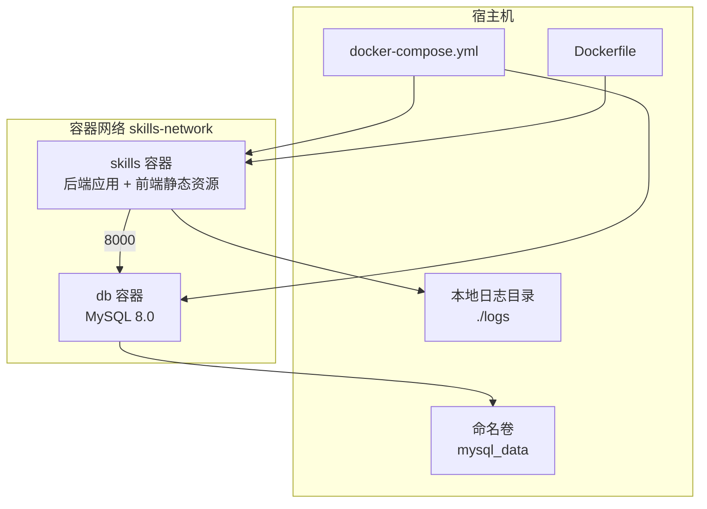
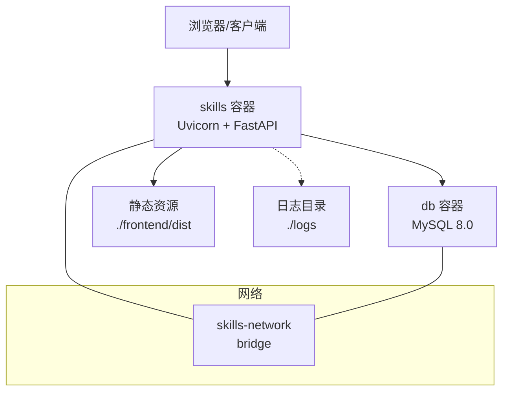
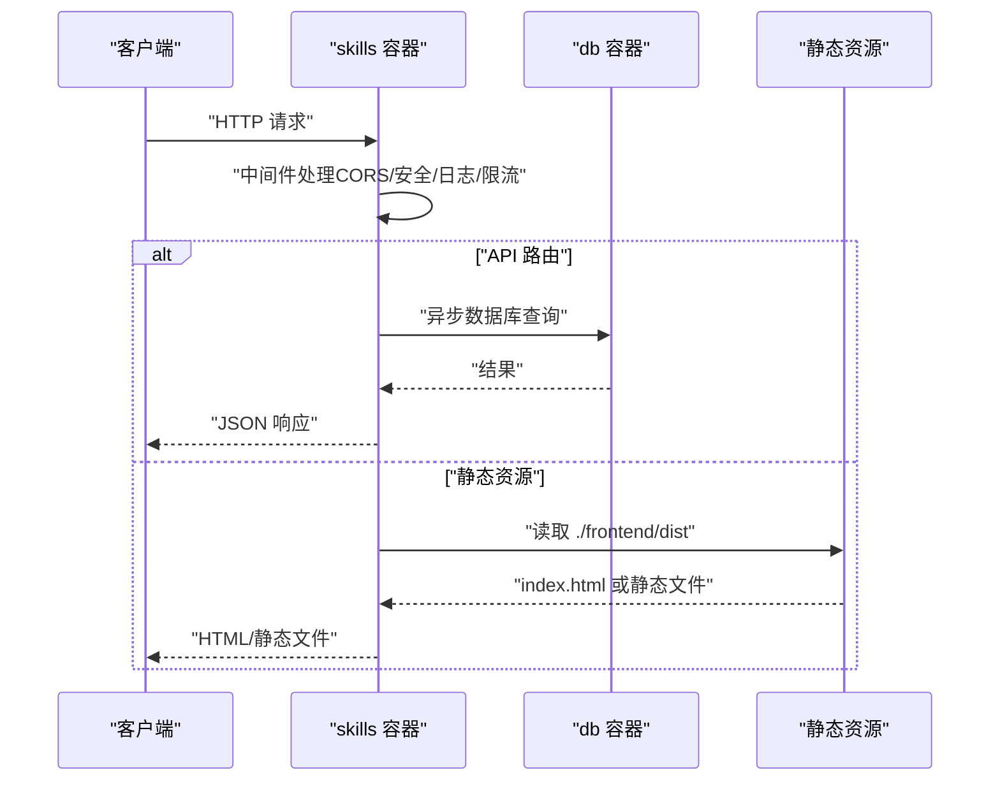
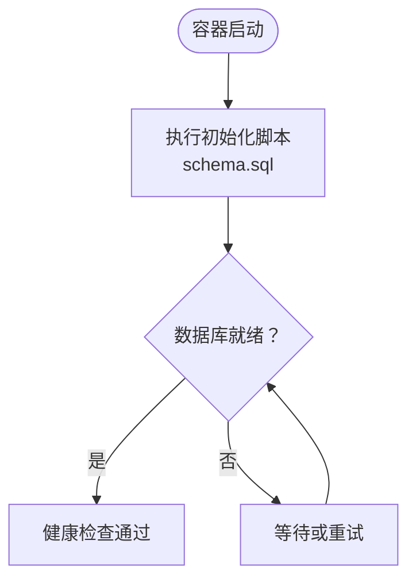
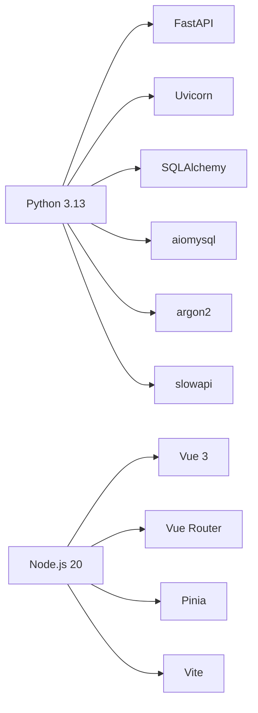

# 部署架构

<cite>
**本文引用的文件**
- [docker-compose.yml](file://docker-compose.yml)
- [Dockerfile](file://Dockerfile)
- [README.md](file://README.md)
- [backend/main.py](file://backend/main.py)
- [backend/database.py](file://backend/database.py)
- [backend/schema.sql](file://backend/schema.sql)
- [backend/.env.example](file://backend/.env.example)
- [backend/requirements.txt](file://backend/requirements.txt)
- [frontend/vite.config.ts](file://frontend/vite.config.ts)
- [frontend/package.json](file://frontend/package.json)
- [backend/api/auth.py](file://backend/api/auth.py)
- [backend/services/auth.py](file://backend/services/auth.py)
- [backend/middleware/security.py](file://backend/middleware/security.py)
</cite>

## 目录
1. [简介](#简介)
2. [项目结构](#项目结构)
3. [核心组件](#核心组件)
4. [架构总览](#架构总览)
5. [详细组件分析](#详细组件分析)
6. [依赖关系分析](#依赖关系分析)
7. [性能考量](#性能考量)
8. [故障排除指南](#故障排除指南)
9. [结论](#结论)
10. [附录](#附录)

## 简介
本文件面向 Skills Hub 的部署工程师与运维人员，系统性阐述基于 Docker 的单服务部署架构与容器编排策略。内容涵盖：
- 单服务部署架构与容器编排
- docker-compose 服务定义与参数说明（后端应用、数据库、网络与存储）
- 环境变量管理、配置文件组织与敏感信息保护
- 网络配置、端口映射与数据持久化
- 生产环境部署指南、监控与日志策略
- 具体部署命令、配置示例与故障排除

## 项目结构
Skills Hub 采用“后端 + 前端”的双层结构，并通过 Dockerfile 实现多阶段构建，最终在一个容器中同时运行后端服务与静态前端资源。docker-compose 将后端应用与 MySQL 数据库编排在同一自定义桥接网络中，实现服务间的内网互通与健康检查。

图表来源
- [docker-compose.yml](file://docker-compose.yml#L1-L56)
- [Dockerfile](file://Dockerfile#L1-L48)

章节来源
- [docker-compose.yml](file://docker-compose.yml#L1-L56)
- [Dockerfile](file://Dockerfile#L1-L48)
- [README.md](file://README.md#L18-L103)

## 核心组件
- 后端应用（skills 容器）
  - 基于 Uvicorn 运行 FastAPI 应用，监听 8000 端口
  - 内置健康检查端点 /api/health，支持 docker-compose 健康检查
  - 挂载本地 logs 目录用于持久化日志
  - 依赖 MySQL 数据库，通过 DATABASE_URL 连接
- 数据库（db 容器）
  - MySQL 8.0，使用命名卷 mysql_data 持久化数据
  - 通过只读挂载初始化脚本 backend/schema.sql 完成表结构与初始数据
  - 健康检查通过 mysqladmin ping 验证
- 网络与存储
  - 自定义 bridge 网络 skills-network，实现服务间 DNS 解析与隔离
  - 端口映射：后端 8000，数据库 3306

章节来源
- [docker-compose.yml](file://docker-compose.yml#L2-L25)
- [docker-compose.yml](file://docker-compose.yml#L27-L48)
- [backend/main.py](file://backend/main.py#L87-L104)
- [backend/database.py](file://backend/database.py#L14-L27)

## 架构总览
下图展示容器化部署的整体交互：浏览器访问后端 API；后端通过异步 ORM 访问 MySQL；前端静态资源由后端统一托管；容器间通过自定义网络通信。

图表来源
- [backend/main.py](file://backend/main.py#L119-L125)
- [backend/database.py](file://backend/database.py#L20-L36)
- [docker-compose.yml](file://docker-compose.yml#L18-L19)
- [docker-compose.yml](file://docker-compose.yml#L47-L48)

## 详细组件分析

### 后端应用（skills 容器）
- 构建与运行
  - 多阶段构建：前端构建产物复制到后端镜像，最终镜像暴露 8000 端口
  - 健康检查：通过 curl 访问 /api/health
  - 启动命令：uvicorn 运行 main:app，绑定 0.0.0.0:8000
- 配置与依赖
  - 依赖文件 backend/requirements.txt，包含 FastAPI、SQLAlchemy、Uvicorn、速率限制等
  - 数据库连接通过 DATABASE_URL 环境变量配置，使用异步驱动
- 路由与静态资源
  - API 文档：/api/docs、/api/redoc
  - 健康检查：/api/health
  - SPA 回退：对非 API 路径返回前端 index.html
  - 生产模式挂载静态资源目录 ./frontend/dist

图表来源
- [backend/main.py](file://backend/main.py#L47-L84)
- [backend/main.py](file://backend/main.py#L107-L125)
- [backend/database.py](file://backend/database.py#L42-L56)
- [backend/middleware/security.py](file://backend/middleware/security.py#L11-L28)

章节来源
- [Dockerfile](file://Dockerfile#L1-L48)
- [backend/main.py](file://backend/main.py#L47-L125)
- [backend/requirements.txt](file://backend/requirements.txt#L1-L34)
- [backend/database.py](file://backend/database.py#L14-L56)

### 数据库（db 容器）
- 镜像与初始化
  - 使用官方 MySQL 8.0 镜像
  - 通过只读挂载 backend/schema.sql 完成初始化（数据库、表、索引、初始用户）
- 存储与持久化
  - 使用命名卷 mysql_data 持久化 /var/lib/mysql
  - 支持重启后数据不丢失
- 连接与健康检查
  - 通过 DATABASE_URL 指定连接参数（用户名、密码、主机、端口、数据库）
  - 健康检查使用 mysqladmin ping

图表来源
- [docker-compose.yml](file://docker-compose.yml#L37-L40)
- [backend/schema.sql](file://backend/schema.sql#L1-L106)
- [docker-compose.yml](file://docker-compose.yml#L40-L45)

章节来源
- [docker-compose.yml](file://docker-compose.yml#L27-L48)
- [backend/schema.sql](file://backend/schema.sql#L1-L106)

### 网络与端口映射
- 网络
  - 自定义 bridge 网络 skills-network，容器间通过服务名互访
- 端口映射
  - skills 容器：8000:8000（宿主:容器）
  - db 容器：3306:3306（宿主:容器）
- 健康检查
  - skills：/api/health
  - db：mysqladmin ping

章节来源
- [docker-compose.yml](file://docker-compose.yml#L5-L6)
- [docker-compose.yml](file://docker-compose.yml#L35-L36)
- [docker-compose.yml](file://docker-compose.yml#L20-L25)
- [docker-compose.yml](file://docker-compose.yml#L40-L45)

### 环境变量与配置管理
- 后端环境变量
  - DATABASE_URL：数据库连接串
  - JWT_SECRET_KEY：JWT 签名密钥（生产需替换）
  - ENCRYPTION_KEY：敏感数据加密密钥（可选）
  - ENVIRONMENT：运行环境标识
- 示例与默认值
  - backend/.env.example 提供默认示例，建议在生产环境使用独立 .env 文件或外部密钥管理
- 前端开发代理
  - 前端开发服务器端口 5173，代理 /api 与 /webhooks 到后端 8000 端口

章节来源
- [docker-compose.yml](file://docker-compose.yml#L7-L11)
- [backend/.env.example](file://backend/.env.example#L1-L17)
- [frontend/vite.config.ts](file://frontend/vite.config.ts#L6-L18)

### 敏感信息保护策略
- 密钥管理
  - JWT_SECRET_KEY、ENCRYPTION_KEY 应在生产环境使用强随机值并妥善保管
  - 建议使用外部密钥管理服务（如 KMS、Vault）或 Docker secrets
- 数据库凭据
  - 使用容器环境变量而非明文写入配置文件
- 最小权限原则
  - 仅授予数据库所需的最小权限账户
- 安全中间件
  - 添加安全响应头、移除服务器信息、速率限制等

章节来源
- [backend/middleware/security.py](file://backend/middleware/security.py#L11-L28)
- [backend/middleware/security.py](file://backend/middleware/security.py#L107-L141)

### 数据持久化方案
- 后端日志
  - 通过卷挂载 ./logs 到容器内日志目录，便于宿主收集与轮转
- 数据库
  - 命名卷 mysql_data 持久化 MySQL 数据目录
- 初始化脚本
  - 只读挂载 backend/schema.sql，确保每次启动都执行初始化逻辑

章节来源
- [docker-compose.yml](file://docker-compose.yml#L16-L17)
- [docker-compose.yml](file://docker-compose.yml#L37-L40)

## 依赖关系分析
- 后端依赖
  - FastAPI、Uvicorn、SQLAlchemy（异步）、aiomysql、argon2、slowapi 等
- 前端依赖
  - Vue 3、Vue Router、Pinia、Vite 开发工具链
- 运行时依赖
  - Python 3.13、Node.js 20、系统库（gcc、libmysqlclient、curl）

图表来源
- [backend/requirements.txt](file://backend/requirements.txt#L1-L34)
- [frontend/package.json](file://frontend/package.json#L10-L19)

章节来源
- [backend/requirements.txt](file://backend/requirements.txt#L1-L34)
- [frontend/package.json](file://frontend/package.json#L1-L20)

## 性能考量
- 连接池与异步
  - 使用异步 SQLAlchemy 引擎与连接池，提升并发性能
- 健康检查与重启策略
  - 健康检查间隔与超时合理配置，避免误判
  - 重启策略 unless-stopped，保证服务可用性
- 静态资源托管
  - 生产模式下由后端统一托管前端静态资源，减少额外反向代理复杂度
- 速率限制
  - 对高频接口（如登录）进行限流，防止暴力破解

章节来源
- [backend/database.py](file://backend/database.py#L20-L36)
- [backend/middleware/security.py](file://backend/middleware/security.py#L107-L141)
- [docker-compose.yml](file://docker-compose.yml#L20-L25)

## 故障排除指南
- 健康检查失败
  - 检查 /api/health 是否可达，确认数据库连接参数正确
  - 查看容器日志：docker-compose logs -f skills
- 数据库无法连接
  - 确认 db 容器健康且 mysqladmin ping 成功
  - 检查 DATABASE_URL、网络连通性与端口映射
- 初始化脚本未生效
  - 确认只读挂载 backend/schema.sql 正常，且数据库初始化逻辑无语法错误
- 前端无法访问
  - 确认后端已挂载 ./frontend/dist 并在生产模式下启用静态资源托管
- 端口冲突
  - 若宿主 8000/3306 已被占用，调整 docker-compose 端口映射

章节来源
- [backend/main.py](file://backend/main.py#L87-L104)
- [backend/database.py](file://backend/database.py#L63-L69)
- [docker-compose.yml](file://docker-compose.yml#L37-L40)

## 结论
Skills Hub 的部署架构以 Docker 单服务为核心，结合 docker-compose 实现后端与数据库的一键编排。通过多阶段构建将前端产物集成进后端镜像，简化了部署流程。生产环境中应重点关注密钥管理、网络隔离、健康检查与日志持久化，确保服务稳定与安全。

## 附录

### 部署命令与步骤
- 构建并启动
  - docker-compose up -d
- 查看日志
  - docker-compose logs -f skills
- 停止服务
  - docker-compose down

章节来源
- [README.md](file://README.md#L92-L103)

### 环境变量清单
- DATABASE_URL：数据库连接串
- JWT_SECRET_KEY：JWT 签名密钥（生产必改）
- ENCRYPTION_KEY：敏感数据加密密钥（可选）
- ENVIRONMENT：运行环境（如 production）

章节来源
- [docker-compose.yml](file://docker-compose.yml#L7-L11)
- [backend/.env.example](file://backend/.env.example#L1-L17)

### API 与认证要点
- 认证接口
  - POST /api/auth/login：登录获取令牌
  - GET /api/auth/me：获取当前用户
  - POST /api/auth/change-password：修改密码
- 安全中间件
  - 安全响应头、请求日志、速率限制（如登录接口）

章节来源
- [backend/api/auth.py](file://backend/api/auth.py#L24-L65)
- [backend/services/auth.py](file://backend/services/auth.py#L64-L98)
- [backend/middleware/security.py](file://backend/middleware/security.py#L11-L28)
- [backend/middleware/security.py](file://backend/middleware/security.py#L107-L141)