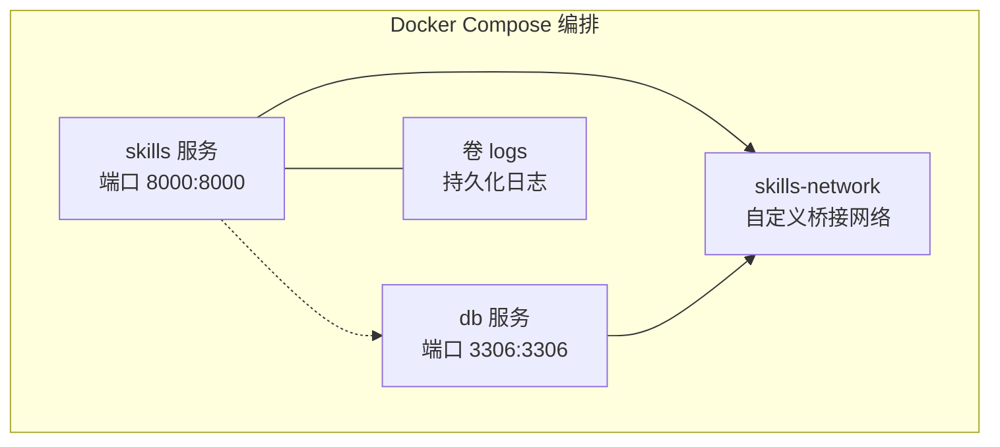
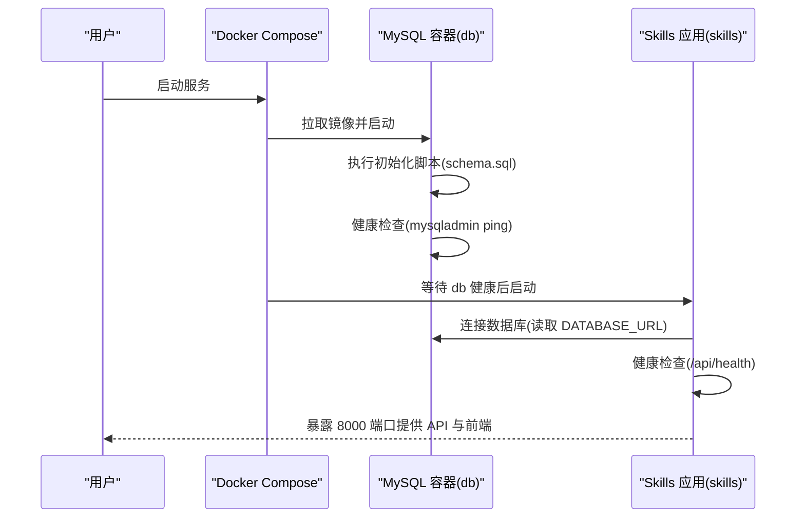
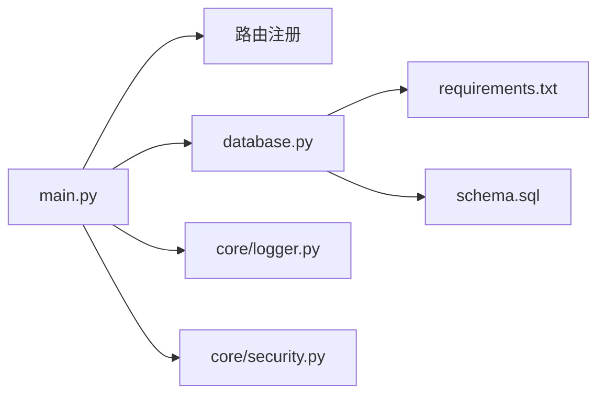
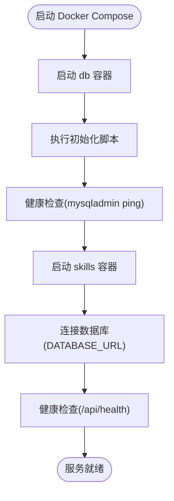

# Docker 部署

<cite>
**本文引用的文件**
- [Dockerfile](file://Dockerfile)
- [docker-compose.yml](file://docker-compose.yml)
- [backend/main.py](file://backend/main.py)
- [backend/database.py](file://backend/database.py)
- [backend/core/logger.py](file://backend/core/logger.py)
- [backend/core/security.py](file://backend/core/security.py)
- [backend/requirements.txt](file://backend/requirements.txt)
- [backend/schema.sql](file://backend/schema.sql)
- [backend/.env.example](file://backend/.env.example)
- [README.md](file://README.md)
</cite>

## 目录
1. [简介](#简介)
2. [项目结构](#项目结构)
3. [核心组件](#核心组件)
4. [架构总览](#架构总览)
5. [详细组件分析](#详细组件分析)
6. [依赖关系分析](#依赖关系分析)
7. [性能考虑](#性能考虑)
8. [故障排查指南](#故障排查指南)
9. [结论](#结论)
10. [附录](#附录)

## 简介
本文件面向 Skills Hub 的 Docker 单服务部署场景，系统性阐述以下内容：
- 单服务 Docker 架构设计与多阶段构建优化
- Dockerfile 构建配置、镜像层管理与健康检查
- docker-compose.yml 服务编排、网络与卷挂载、重启策略与健康检查
- 环境变量配置指南（数据库连接、JWT 密钥、加密密钥）
- 容器启动流程、端口映射与日志管理
- 依赖关系与启动顺序、重启策略与健康检查机制
- 生产环境最佳实践与安全配置建议

## 项目结构
Skills Hub 采用“单服务镜像 + 多容器编排”的部署方式：
- 前端构建产物通过多阶段构建复制到后端镜像中，统一暴露 8000 端口
- 后端使用 Uvicorn 运行 FastAPI 应用，并挂载前端静态资源
- 数据库使用独立的 MySQL 8.0 容器，初始化脚本在首次启动时执行
- compose 将两个服务置于同一自定义桥接网络，便于服务间通信

图表来源
- [docker-compose.yml](file://docker-compose.yml#L1-L56)

章节来源
- [README.md](file://README.md#L18-L18)
- [docker-compose.yml](file://docker-compose.yml#L1-L56)

## 核心组件
- 单服务镜像（skills）
  - 多阶段构建：前端构建 + 后端打包，最终镜像包含已构建的前端静态资源
  - 暴露端口 8000，内置健康检查
  - 启动命令使用 Uvicorn 运行 FastAPI 应用
- 数据库服务（db）
  - 基于官方 MySQL 8.0 镜像
  - 初始化脚本挂载至只读路径，确保首次启动自动创建数据库与表结构
  - 健康检查使用 mysqladmin ping
- 网络与卷
  - 自定义 bridge 网络 skills-network
  - logs 卷挂载用于持久化日志

章节来源
- [Dockerfile](file://Dockerfile#L1-L48)
- [docker-compose.yml](file://docker-compose.yml#L1-L56)

## 架构总览
下图展示容器启动与服务交互的关键流程，包括健康检查、依赖等待与端口映射。

图表来源
- [docker-compose.yml](file://docker-compose.yml#L12-L14)
- [docker-compose.yml](file://docker-compose.yml#L40-L44)
- [backend/main.py](file://backend/main.py#L87-L104)
- [backend/database.py](file://backend/database.py#L14-L18)

## 详细组件分析

### Dockerfile 多阶段构建与镜像层优化
- 前端构建阶段（node:20-slim）
  - 复制 package.json 并安装依赖，再构建前端产物
  - 该阶段不包含后端代码，有利于缓存复用与分层隔离
- 后端构建阶段（python:3.13-slim）
  - 安装系统依赖（编译工具链与 MySQL 客户端）
  - 安装 Python 依赖（requirements.txt）
  - 复制后端源码与前端构建产物
  - 创建日志目录，暴露 8000 端口
  - 健康检查使用 curl 访问 /api/health
  - 启动命令使用 Uvicorn 运行 FastAPI 应用
- 层管理要点
  - 将变更频繁的前端构建与后端代码分离，提升缓存命中率
  - 使用 --no-cache-dir 安装 pip 依赖，减少镜像体积
  - apt 清理与最小化安装，降低镜像体积与攻击面

章节来源
- [Dockerfile](file://Dockerfile#L1-L48)
- [backend/requirements.txt](file://backend/requirements.txt#L1-L34)

### docker-compose.yml 服务编排配置
- skills 服务
  - build: 从当前目录构建镜像
  - container_name: skills-platform
  - 端口映射: 8000:8000
  - 环境变量:
    - DATABASE_URL: 指向 db 容器中的 MySQL
    - JWT_SECRET_KEY: 用于 JWT 签名（建议生产环境强制覆盖）
    - ENCRYPTION_KEY: 用于敏感数据加密（建议生产环境强制覆盖）
    - ENVIRONMENT: production
  - depends_on: 等待 db 达到健康状态后再启动
  - restart: unless-stopped
  - volumes: 挂载本地 logs 目录到 /app/logs
  - networks: skills-network
  - 健康检查: curl 访问 /api/health，间隔 30s，超时 10s，重试 3 次，启动期 40s
- db 服务
  - image: mysql:8.0
  - container_name: skills-mysql
  - 环境变量:
    - MYSQL_ROOT_PASSWORD: root 密码
    - MYSQL_DATABASE: skills
    - MYSQL_USER: skills
    - MYSQL_PASSWORD: skills_password
  - 端口映射: 3306:3306
  - volumes:
    - mysql_data: 持久化 MySQL 数据
    - ./backend/schema.sql:/docker-entrypoint-initdb.d/schema.sql:ro: 首次启动执行初始化脚本
  - healthcheck: mysqladmin ping，间隔 10s，超时 5s，重试 5 次，启动期 30s
  - restart: unless-stopped
  - networks: skills-network
- 网络与卷
  - skills-network: 自定义 bridge 网络
  - mysql_data: 命名卷，持久化数据库数据

章节来源
- [docker-compose.yml](file://docker-compose.yml#L1-L56)
- [backend/schema.sql](file://backend/schema.sql#L1-L106)

### 环境变量配置指南
- 数据库连接
  - DATABASE_URL: 采用 mysql+aiomysql 方案，compose 中指向 db 容器
  - 示例值参考 .env.example 中的默认值，生产环境务必替换
- JWT 密钥
  - JWT_SECRET_KEY: 用于签发与校验 JWT，必须足够随机且保密
  - compose 中默认值仅为示例，生产环境必须覆盖
- 加密密钥
  - ENCRYPTION_KEY: 用于对敏感数据进行对称加密（Fernet），建议使用安全随机生成
  - 若未提供，运行时会生成新密钥并打印提示，需将其写入配置
- 其他
  - ENVIRONMENT=production：启用生产模式
  - PORT=8000：后端监听端口（与 EXPOSE 和映射一致）

章节来源
- [backend/.env.example](file://backend/.env.example#L1-L17)
- [docker-compose.yml](file://docker-compose.yml#L7-L11)
- [backend/database.py](file://backend/database.py#L14-L18)
- [backend/core/security.py](file://backend/core/security.py#L34-L41)

### 容器启动流程、端口映射与日志管理
- 启动流程
  - compose 优先启动 db，执行初始化脚本并完成健康检查
  - skills 等待 db 健康后启动，连接数据库并注册路由
  - 健康检查端点 /api/health 通过数据库连通性判断健康状态
- 端口映射
  - skills: 8000:8000
  - db: 3306:3306
- 日志管理
  - 后端日志同时输出到控制台与文件（logs/skills.log、logs/error.log）
  - compose 将 logs 目录挂载到宿主机，便于持久化与采集

章节来源
- [docker-compose.yml](file://docker-compose.yml#L5-L17)
- [backend/main.py](file://backend/main.py#L87-L104)
- [backend/core/logger.py](file://backend/core/logger.py#L11-L66)

### 依赖关系与启动顺序、重启策略与健康检查机制
- 依赖与顺序
  - skills 依赖 db，使用 depends_on: service_healthy 确保数据库可用后再启动
- 重启策略
  - unless-stopped：容器异常退出后自动重启，保证服务高可用
- 健康检查
  - skills：curl 访问 /api/health，检测数据库连通性
  - db：mysqladmin ping，检测 MySQL 服务可用性

章节来源
- [docker-compose.yml](file://docker-compose.yml#L12-L14)
- [docker-compose.yml](file://docker-compose.yml#L20-L25)
- [docker-compose.yml](file://docker-compose.yml#L40-L44)
- [backend/main.py](file://backend/main.py#L87-L104)
- [backend/database.py](file://backend/database.py#L63-L69)

## 依赖关系分析
- 技术栈与依赖
  - 后端：FastAPI 0.128.0 + Python 3.13
  - 数据库：SQLAlchemy + aiomysql 异步连接
  - 前端：Vue 3 + TypeScript，构建产物复制到后端镜像
- 关键依赖文件
  - requirements.txt：后端依赖清单
  - schema.sql：数据库初始化脚本
  - main.py：应用入口与路由注册
  - database.py：数据库引擎与会话工厂
  - logger.py：日志配置
  - security.py：密码与敏感数据加密

图表来源
- [backend/main.py](file://backend/main.py#L24-L84)
- [backend/database.py](file://backend/database.py#L5-L39)
- [backend/requirements.txt](file://backend/requirements.txt#L1-L34)
- [backend/schema.sql](file://backend/schema.sql#L1-L106)
- [backend/core/logger.py](file://backend/core/logger.py#L11-L66)
- [backend/core/security.py](file://backend/core/security.py#L12-L53)

章节来源
- [backend/main.py](file://backend/main.py#L24-L84)
- [backend/database.py](file://backend/database.py#L5-L39)
- [backend/requirements.txt](file://backend/requirements.txt#L1-L34)
- [backend/schema.sql](file://backend/schema.sql#L1-L106)
- [backend/core/logger.py](file://backend/core/logger.py#L11-L66)
- [backend/core/security.py](file://backend/core/security.py#L12-L53)

## 性能考虑
- 多阶段构建
  - 将前端构建与后端打包分离，提升缓存命中率，缩短构建时间
  - 使用 slim 基础镜像与最小化安装，降低镜像体积与攻击面
- 连接池与异步
  - 使用 SQLAlchemy 异步引擎与连接池配置，提高并发与稳定性
- 健康检查与重启策略
  - 合理的健康检查间隔与超时，避免误判
  - unless-stopped 提升可用性，但需配合监控与告警

章节来源
- [Dockerfile](file://Dockerfile#L1-L48)
- [backend/database.py](file://backend/database.py#L21-L27)
- [docker-compose.yml](file://docker-compose.yml#L15-L15)

## 故障排查指南
- 健康检查失败
  - skills：检查 /api/health 返回值，确认数据库连通性
  - db：检查 mysqladmin ping 是否成功，确认 root 密码与初始化脚本
- 端口占用
  - 确认宿主机 8000 与 3306 未被占用
- 日志定位
  - 查看 logs 目录下的 skills.log 与 error.log
  - 使用 docker-compose logs -f skills 查看实时日志
- 数据库初始化
  - 确认 schema.sql 已正确挂载并可读
  - 检查 mysql_data 卷是否正常持久化

章节来源
- [docker-compose.yml](file://docker-compose.yml#L16-L17)
- [docker-compose.yml](file://docker-compose.yml#L39-L39)
- [backend/core/logger.py](file://backend/core/logger.py#L39-L64)
- [backend/main.py](file://backend/main.py#L87-L104)
- [backend/schema.sql](file://backend/schema.sql#L1-L106)

## 结论
本部署方案通过多阶段构建实现前后端一体化镜像，借助 docker-compose 实现 skills 与 db 的协同编排。生产环境中应重点关注密钥安全、数据库初始化与健康检查策略，结合日志与监控体系保障服务稳定运行。

## 附录

### 环境变量对照表
- DATABASE_URL：数据库连接串（默认示例见 .env.example）
- JWT_SECRET_KEY：JWT 签名密钥（生产必须覆盖）
- ENCRYPTION_KEY：敏感数据加密密钥（建议生产必须覆盖）
- ENVIRONMENT：运行环境（production）
- PORT：后端监听端口（8000）

章节来源
- [backend/.env.example](file://backend/.env.example#L1-L17)
- [docker-compose.yml](file://docker-compose.yml#L7-L11)
- [backend/main.py](file://backend/main.py#L130-L136)

### 健康检查与启动顺序流程图

图表来源
- [docker-compose.yml](file://docker-compose.yml#L12-L14)
- [docker-compose.yml](file://docker-compose.yml#L40-L44)
- [backend/main.py](file://backend/main.py#L87-L104)
- [backend/database.py](file://backend/database.py#L14-L18)