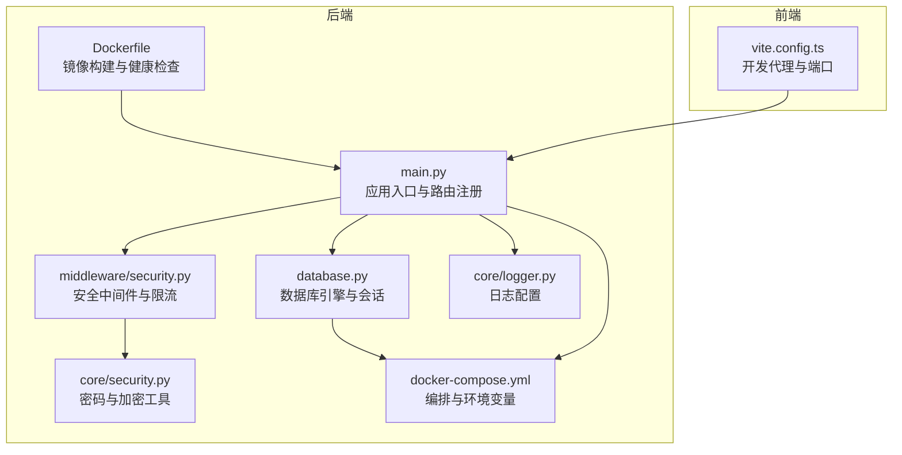
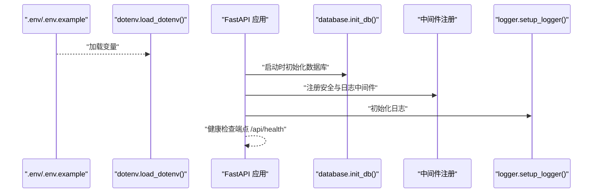
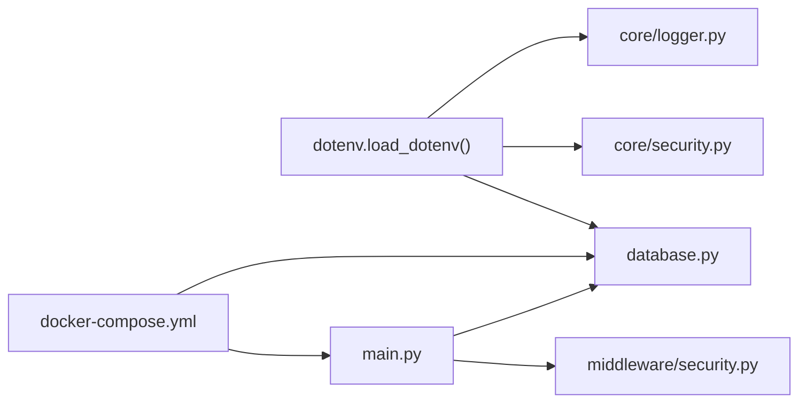
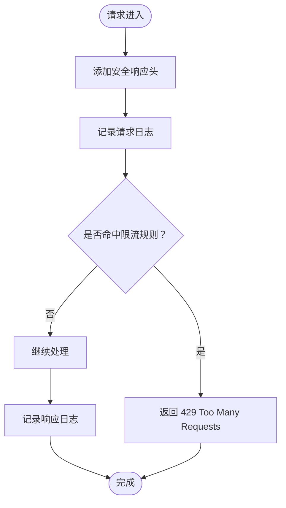

# 环境配置

<cite>
**本文引用的文件**
- [backend/.env.example](file://backend/.env.example)
- [backend/main.py](file://backend/main.py)
- [backend/database.py](file://backend/database.py)
- [backend/core/security.py](file://backend/core/security.py)
- [backend/middleware/security.py](file://backend/middleware/security.py)
- [backend/docker-compose.yml](file://backend/docker-compose.yml)
- [Dockerfile](file://Dockerfile)
- [backend/requirements.txt](file://backend/requirements.txt)
- [backend/core/logger.py](file://backend/core/logger.py)
- [.gitignore](file://.gitignore)
- [backend/api/auth.py](file://backend/api/auth.py)
</cite>

## 目录
1. [简介](#简介)
2. [项目结构](#项目结构)
3. [核心组件](#核心组件)
4. [架构总览](#架构总览)
5. [详细组件分析](#详细组件分析)
6. [依赖关系分析](#依赖关系分析)
7. [性能考虑](#性能考虑)
8. [故障排查指南](#故障排查指南)
9. [结论](#结论)
10. [附录](#附录)

## 简介
本文件面向 Skills Hub 的运维与开发团队，提供完整的环境配置说明。内容涵盖：
- 所有环境变量的作用与配置方法
- 开发与生产环境的差异（调试模式、日志级别、安全设置）
- .env.example 的逐项说明与最佳实践
- 数据库、缓存、邮件与第三方服务的配置要点
- 敏感信息的安全存储、密钥轮换与环境隔离策略

## 项目结构
后端采用 FastAPI + MySQL 异步架构，通过 Docker Compose 编排运行；前端通过 Vite 开发代理访问后端 API。

图表来源
- [backend/main.py](file://backend/main.py#L1-L137)
- [backend/database.py](file://backend/database.py#L1-L75)
- [backend/core/security.py](file://backend/core/security.py#L1-L64)
- [backend/middleware/security.py](file://backend/middleware/security.py#L1-L142)
- [backend/docker-compose.yml](file://backend/docker-compose.yml#L1-L56)
- [Dockerfile](file://Dockerfile#L1-L48)
- [backend/core/logger.py](file://backend/core/logger.py#L1-L95)

章节来源
- [backend/main.py](file://backend/main.py#L1-L137)
- [backend/docker-compose.yml](file://backend/docker-compose.yml#L1-L56)
- [Dockerfile](file://Dockerfile#L1-L48)

## 核心组件
- 环境变量加载：后端通过 dotenv 在启动时加载 .env 文件，供数据库、安全与日志模块使用。
- 数据库：使用 SQLAlchemy + aiomysql 实现异步连接，支持连接池与健康检查。
- 安全：Argon2 密码哈希、Fernet 对称加密、JWT 密钥、安全响应头与速率限制。
- 日志：控制台与文件轮转（大小与按日轮转），统一格式化输出。
- 编排：Docker Compose 提供数据库与应用容器，支持健康检查与卷挂载。

章节来源
- [backend/database.py](file://backend/database.py#L1-L75)
- [backend/core/security.py](file://backend/core/security.py#L1-L64)
- [backend/middleware/security.py](file://backend/middleware/security.py#L1-L142)
- [backend/core/logger.py](file://backend/core/logger.py#L1-L95)
- [backend/docker-compose.yml](file://backend/docker-compose.yml#L1-L56)

## 架构总览
下图展示应用启动时的关键流程：环境变量加载、数据库初始化、中间件注册与健康检查。

图表来源
- [backend/main.py](file://backend/main.py#L27-L54)
- [backend/database.py](file://backend/database.py#L58-L75)
- [backend/core/logger.py](file://backend/core/logger.py#L11-L71)
- [backend/.env.example](file://backend/.env.example#L1-L17)

章节来源
- [backend/main.py](file://backend/main.py#L27-L54)
- [backend/database.py](file://backend/database.py#L58-L75)
- [backend/core/logger.py](file://backend/core/logger.py#L11-L71)

## 详细组件分析

### 环境变量清单与用途
以下为 .env.example 中定义的全部变量及其作用说明：

- JWT_SECRET_KEY
  - 用途：JWT 签名密钥，用于签发与校验访问令牌。
  - 配置要求：生产环境必须替换为强随机字符串，长度建议至少 32 字节。
  - 安全建议：定期轮换，避免泄露；与 ENCRYPTION_KEY 分离存储。
  - 参考位置：[backend/.env.example](file://backend/.env.example#L1-L2)

- ENCRYPTION_KEY
  - 用途：对敏感数据进行对称加密（如第三方访问令牌）。
  - 配置要求：生产环境必须设置；若未设置，系统会自动生成并在启动时提示保存。
  - 安全建议：使用 Fernet 密钥格式，妥善保管并参与密钥轮换。
  - 参考位置：[backend/.env.example](file://backend/.env.example#L4-L5)

- DATABASE_URL
  - 用途：MySQL 异步连接字符串（aiomysql）。
  - 配置要求：包含用户名、密码、主机、端口与数据库名。
  - 参考位置：[backend/.env.example](file://backend/.env.example#L7-L8)
  - 默认值来源：[backend/database.py](file://backend/database.py#L15-L18)

- MYSQL_ROOT_PASSWORD
  - 用途：MySQL 初始化根密码（容器内使用）。
  - 配置要求：生产环境务必修改默认值。
  - 参考位置：[backend/.env.example](file://backend/.env.example#L9)

- ENVIRONMENT
  - 用途：环境标识（development/production）。
  - 配置要求：生产环境设为 production。
  - 参考位置：[backend/.env.example](file://backend/.env.example#L11-L12)
  - Compose 默认值：[backend/docker-compose.yml](file://backend/docker-compose.yml#L11)

- DEBUG
  - 用途：调试开关（True/False）。
  - 配置要求：开发环境可开启，生产环境关闭。
  - 参考位置：[backend/.env.example](file://backend/.env.example#L12-L13)

- PORT
  - 用途：应用监听端口。
  - 配置要求：与 Docker 映射一致或调整映射。
  - 参考位置：[backend/.env.example](file://backend/.env.example#L15-L16)
  - 默认端口来源：[Dockerfile](file://Dockerfile#L40-L47)

- JWT_SECRET_KEY（认证中间件）
  - 用途：JWT 密钥（认证中间件中也使用）。
  - 配置要求：与 .env 中保持一致。
  - 参考位置：[backend/middleware/auth.py](file://backend/middleware/auth.py#L17-L18)

章节来源
- [backend/.env.example](file://backend/.env.example#L1-L16)
- [backend/database.py](file://backend/database.py#L15-L18)
- [backend/docker-compose.yml](file://backend/docker-compose.yml#L7-L11)
- [Dockerfile](file://Dockerfile#L40-L47)
- [backend/middleware/auth.py](file://backend/middleware/auth.py#L17-L18)

### 开发环境 vs 生产环境配置差异
- 调试模式
  - 开发：DEBUG=True，便于本地调试与日志输出。
  - 生产：DEBUG=False，减少敏感信息泄露风险。
  - 参考位置：[backend/.env.example](file://backend/.env.example#L12-L13)

- 日志级别
  - 控制台：INFO 级别输出。
  - 文件：按大小轮转的普通日志与按日期轮转的错误日志。
  - 参考位置：[backend/core/logger.py](file://backend/core/logger.py#L11-L71)

- 安全设置
  - CORS：开发允许任意来源，生产应限制具体域名。
  - 安全响应头：生产环境启用严格安全头。
  - 速率限制：针对特定路径（如登录）进行限流。
  - 参考位置：
    - CORS：[backend/main.py](file://backend/main.py#L56-L63)
    - 安全头：[backend/middleware/security.py](file://backend/middleware/security.py#L11-L28)
    - 限流：[backend/middleware/security.py](file://backend/middleware/security.py#L107-L142)

- 数据库连接
  - 开发：本地 MySQL 或 Docker 内部网络地址。
  - 生产：使用容器内服务名或外部数据库地址，确保网络连通性。
  - 参考位置：[backend/docker-compose.yml](file://backend/docker-compose.yml#L8)

- 健康检查
  - 开发：通过 Uvicorn 启动，手动访问 /api/health。
  - 生产：Docker 健康检查自动执行。
  - 参考位置：
    - 应用端点：[backend/main.py](file://backend/main.py#L87-L104)
    - Docker 健康检查：[Dockerfile](file://Dockerfile#L42-L44)，[backend/docker-compose.yml](file://backend/docker-compose.yml#L20-L25)

章节来源
- [backend/.env.example](file://backend/.env.example#L11-L16)
- [backend/core/logger.py](file://backend/core/logger.py#L11-L71)
- [backend/main.py](file://backend/main.py#L56-L63)
- [backend/middleware/security.py](file://backend/middleware/security.py#L11-L28)
- [backend/middleware/security.py](file://backend/middleware/security.py#L107-L142)
- [backend/docker-compose.yml](file://backend/docker-compose.yml#L8)
- [Dockerfile](file://Dockerfile#L42-L44)

### .env.example 逐项说明与最佳实践
- JWT_SECRET_KEY
  - 说明：JWT 签名密钥，必须强随机且保密。
  - 最佳实践：使用安全随机源生成，长度≥32字节；与 ENCRYPTION_KEY 分离存储。
  - 参考位置：[backend/.env.example](file://backend/.env.example#L1-L2)

- ENCRYPTION_KEY
  - 说明：Fernet 对称密钥，用于加密敏感字段。
  - 最佳实践：首次部署时生成并保存，后续参与密钥轮换；避免硬编码在代码中。
  - 参考位置：[backend/.env.example](file://backend/.env.example#L4-L5)

- DATABASE_URL
  - 说明：MySQL 异步连接串。
  - 最佳实践：使用专用账号与最小权限；生产环境使用容器内服务名或外部地址。
  - 参考位置：[backend/.env.example](file://backend/.env.example#L7-L8)

- MYSQL_ROOT_PASSWORD
  - 说明：MySQL 初始化根密码。
  - 最佳实践：生产环境立即修改默认值，并限制其使用范围。
  - 参考位置：[backend/.env.example](file://backend/.env.example#L9)

- ENVIRONMENT
  - 说明：环境标识。
  - 最佳实践：生产固定为 production，避免误用开发配置。
  - 参考位置：[backend/.env.example](file://backend/.env.example#L11-L12)

- DEBUG
  - 说明：调试开关。
  - 最佳实践：开发开启，生产关闭。
  - 参考位置：[backend/.env.example](file://backend/.env.example#L12-L13)

- PORT
  - 说明：应用监听端口。
  - 最佳实践：与 Docker 映射一致；避免与宿主冲突。
  - 参考位置：[backend/.env.example](file://backend/.env.example#L15-L16)

章节来源
- [backend/.env.example](file://backend/.env.example#L1-L16)

### 数据库配置
- 连接字符串
  - 支持 MySQL 异步驱动，连接池参数可在数据库模块中调整。
  - 参考位置：[backend/database.py](file://backend/database.py#L15-L27)

- 连接池与健康检查
  - pool_pre_ping：启用连接健康检查。
  - pool_size/max_overflow：连接池容量与溢出数量。
  - 参考位置：[backend/database.py](file://backend/database.py#L21-L27)

- 初始化与关闭
  - 启动时测试连接；关闭时释放资源。
  - 参考位置：[backend/database.py](file://backend/database.py#L58-L75)

- Docker Compose 集成
  - 服务依赖与健康检查，卷挂载日志目录。
  - 参考位置：[backend/docker-compose.yml](file://backend/docker-compose.yml#L1-L56)

章节来源
- [backend/database.py](file://backend/database.py#L15-L75)
- [backend/docker-compose.yml](file://backend/docker-compose.yml#L1-L56)

### 缓存设置
- 当前实现未发现显式的缓存层（如 Redis/Memcached）配置。
- 若需引入缓存，建议新增环境变量（如 CACHE_URL、CACHE_TTL）并配套中间件或服务层。

[本节为概念性说明，不直接分析具体文件]

### 邮件服务配置
- 代码库未发现邮件发送相关实现或配置。
- 如需邮件功能，建议新增 SMTP 环境变量（如 SMTP_HOST、SMTP_PORT、SMTP_USER、SMTP_PASS）并实现对应服务模块。

[本节为概念性说明，不直接分析具体文件]

### 第三方服务集成
- GitLab/GitHub 集成
  - 仓库类型枚举与访问令牌字段存在于前端表单中，但未在后端看到专门的第三方服务模块或环境变量。
  - 建议新增环境变量以配置第三方服务的访问凭据与端点。
  - 参考位置：[backend/api/auth.py](file://backend/api/auth.py#L1-L65)

- Webhook
  - 存在 webhook 路由模块，但未见具体实现与环境变量。
  - 建议新增 webhook 相关配置（如签名密钥、回调地址等）。

[本节为概念性说明，不直接分析具体文件]

### 敏感信息的安全存储与管理
- 密钥生成与使用
  - ENCRYPTION_KEY 未设置时会自动生成并提示保存。
  - JWT_SECRET_KEY 必须在生产环境替换。
  - 参考位置：
    - [backend/core/security.py](file://backend/core/security.py#L34-L41)
    - [backend/.env.example](file://backend/.env.example#L1-L2)

- 密钥轮换策略
  - 新旧密钥并行过渡：先启用新密钥，再迁移旧数据，最后停用旧密钥。
  - 建议在 .env 中维护多组密钥并提供切换逻辑。

- 环境隔离
  - 不同环境使用不同 .env 文件，禁止将 .env 提交至版本库。
  - .gitignore 已忽略 .env 与日志文件。
  - 参考位置：[.gitignore](file://.gitignore#L36-L42)

- 传输与存储安全
  - 使用 HTTPS 与安全响应头，避免明文传输。
  - 将密钥存储于受控的密钥管理系统（如 KMS/Secrets Manager），而非明文文件。

章节来源
- [backend/core/security.py](file://backend/core/security.py#L34-L41)
- [backend/.env.example](file://backend/.env.example#L1-L2)
- [.gitignore](file://.gitignore#L36-L42)

## 依赖关系分析
- 环境变量加载链路
  - dotenv.load_dotenv() 从 .env 读取变量，供数据库、安全与日志模块使用。
  - 参考位置：
    - [backend/database.py](file://backend/database.py#L9-L12)
    - [backend/core/security.py](file://backend/core/security.py#L7-L9)
    - [backend/core/logger.py](file://backend/core/logger.py#L1-L9)

- 中间件与安全
  - 安全响应头与速率限制中间件在应用启动时注册。
  - 参考位置：[backend/main.py](file://backend/main.py#L65-L69)

- Docker 编排
  - skills 服务依赖 db 服务健康；环境变量通过 Compose 注入。
  - 参考位置：[backend/docker-compose.yml](file://backend/docker-compose.yml#L12-L11)

图表来源
- [backend/database.py](file://backend/database.py#L9-L12)
- [backend/core/security.py](file://backend/core/security.py#L7-L9)
- [backend/core/logger.py](file://backend/core/logger.py#L1-L9)
- [backend/main.py](file://backend/main.py#L65-L69)
- [backend/docker-compose.yml](file://backend/docker-compose.yml#L7-L11)

章节来源
- [backend/database.py](file://backend/database.py#L9-L12)
- [backend/core/security.py](file://backend/core/security.py#L7-L9)
- [backend/core/logger.py](file://backend/core/logger.py#L1-L9)
- [backend/main.py](file://backend/main.py#L65-L69)
- [backend/docker-compose.yml](file://backend/docker-compose.yml#L7-L11)

## 性能考虑
- 数据库连接池
  - pool_size 与 max_overflow 影响并发与资源占用，建议根据负载调优。
  - 参考位置：[backend/database.py](file://backend/database.py#L21-L27)

- 日志写入
  - 文件轮转避免单文件过大；生产环境建议降低 INFO 级别以减少 IO。
  - 参考位置：[backend/core/logger.py](file://backend/core/logger.py#L44-L64)

- 中间件开销
  - 安全头与日志中间件为轻量级操作；限流器为内存实现，适合中小规模流量。
  - 参考位置：[backend/middleware/security.py](file://backend/middleware/security.py#L11-L28)

[本节提供一般性指导，不直接分析具体文件]

## 故障排查指南
- 数据库连接失败
  - 检查 DATABASE_URL 是否正确，确认网络可达与凭据有效。
  - 参考位置：[backend/database.py](file://backend/database.py#L58-L75)

- JWT 无效或过期
  - 确认 JWT_SECRET_KEY 与 .env 一致，检查令牌有效期。
  - 参考位置：[backend/middleware/auth.py](file://backend/middleware/auth.py#L36-L45)

- 加密密钥问题
  - 若 ENCRYPTION_KEY 未设置，系统会自动生成并在启动日志中提示保存。
  - 参考位置：[backend/core/security.py](file://backend/core/security.py#L34-L41)

- 健康检查失败
  - 查看 /api/health 返回状态；检查数据库连接与容器健康检查配置。
  - 参考位置：
    - [backend/main.py](file://backend/main.py#L87-L104)
    - [Dockerfile](file://Dockerfile#L42-L44)
    - [backend/docker-compose.yml](file://backend/docker-compose.yml#L20-L25)

章节来源
- [backend/database.py](file://backend/database.py#L58-L75)
- [backend/middleware/auth.py](file://backend/middleware/auth.py#L36-L45)
- [backend/core/security.py](file://backend/core/security.py#L34-L41)
- [backend/main.py](file://backend/main.py#L87-L104)
- [Dockerfile](file://Dockerfile#L42-L44)
- [backend/docker-compose.yml](file://backend/docker-compose.yml#L20-L25)

## 结论
- 环境变量是 Skills Hub 的关键配置载体，务必在生产环境强制替换默认值并纳入密钥管理。
- 开发与生产环境在调试、日志、CORS、安全头与健康检查方面存在显著差异，需严格区分。
- 建议尽快补充缓存、邮件与第三方服务的配置项，并完善密钥轮换与环境隔离策略。

[本节为总结性内容，不直接分析具体文件]

## 附录

### .env.example 逐项对照表
- JWT_SECRET_KEY → 用于 JWT 签名
- ENCRYPTION_KEY → 用于敏感数据加密
- DATABASE_URL → MySQL 异步连接串
- MYSQL_ROOT_PASSWORD → MySQL 初始化根密码
- ENVIRONMENT → 环境标识（development/production）
- DEBUG → 调试开关
- PORT → 应用监听端口

章节来源
- [backend/.env.example](file://backend/.env.example#L1-L16)

### 安全中间件与限流流程

图表来源
- [backend/middleware/security.py](file://backend/middleware/security.py#L11-L28)
- [backend/middleware/security.py](file://backend/middleware/security.py#L107-L142)