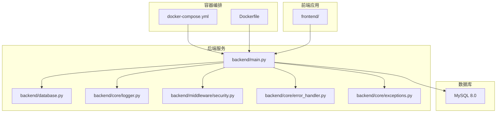
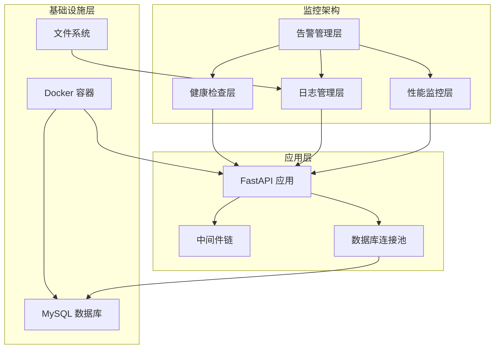
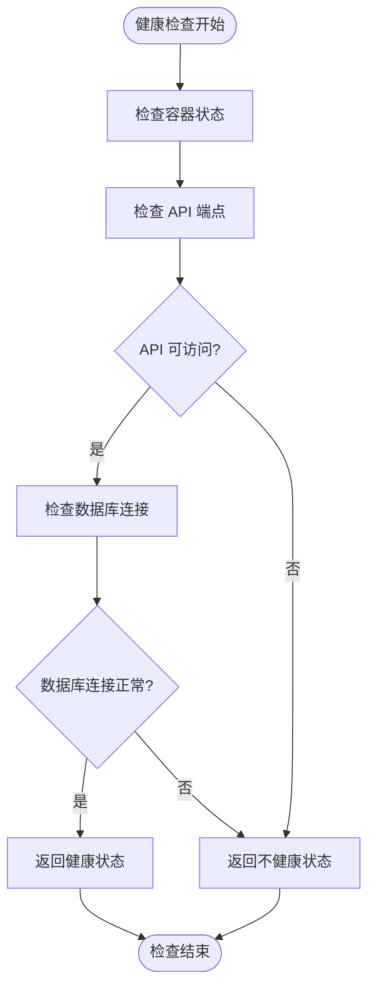
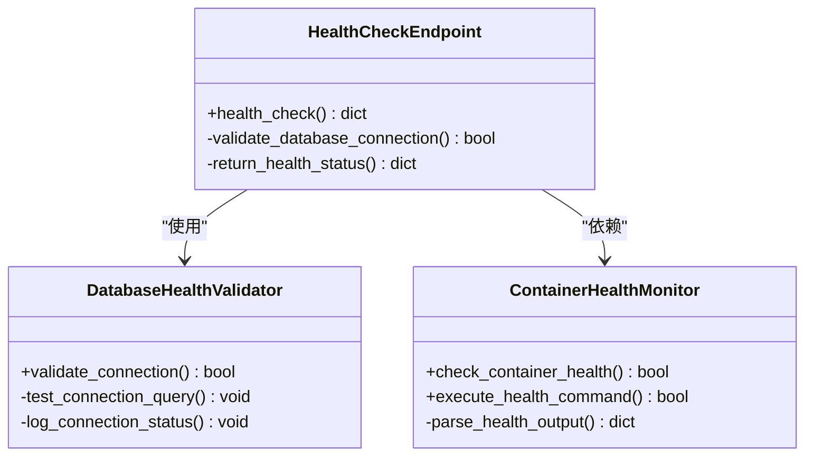
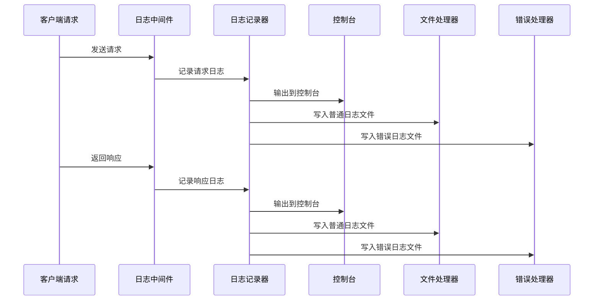
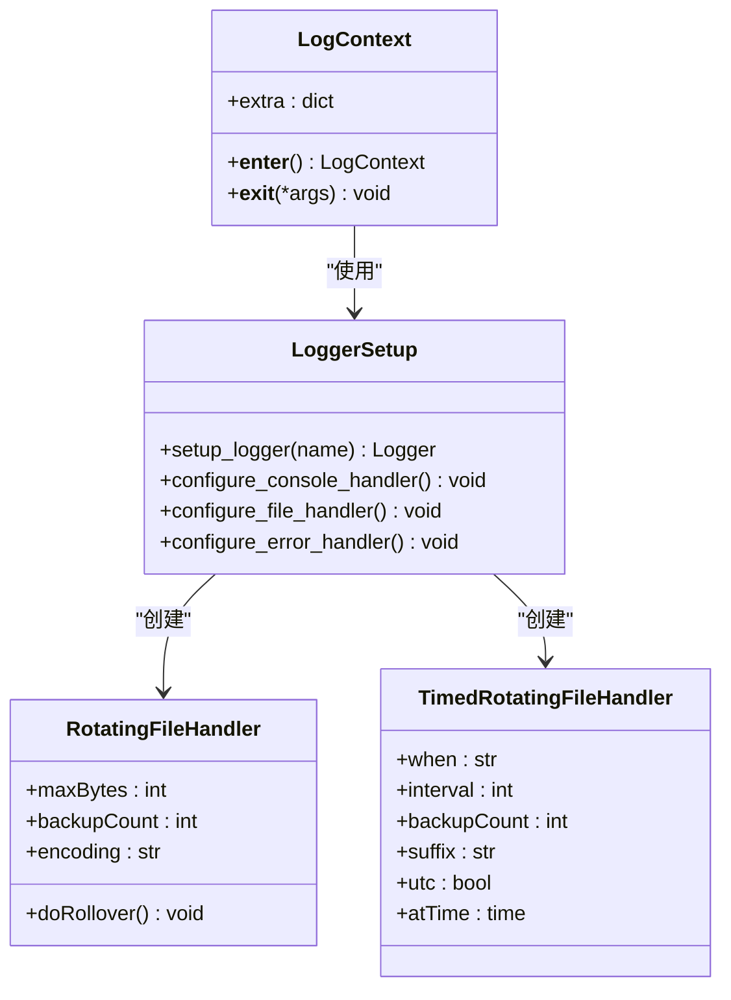
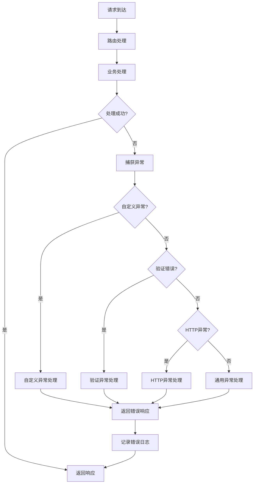
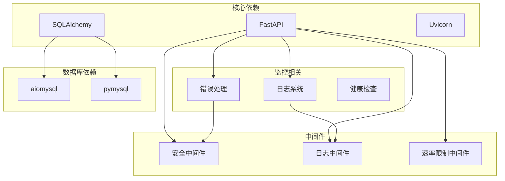

# 监控告警

<cite>
**本文档引用的文件**
- [Dockerfile](file://Dockerfile)
- [docker-compose.yml](file://docker-compose.yml)
- [backend/main.py](file://backend/main.py)
- [backend/database.py](file://backend/database.py)
- [backend/core/logger.py](file://backend/core/logger.py)
- [backend/middleware/security.py](file://backend/middleware/security.py)
- [backend/core/error_handler.py](file://backend/core/error_handler.py)
- [backend/core/exceptions.py](file://backend/core/exceptions.py)
- [backend/.env.example](file://backend/.env.example)
- [backend/requirements.txt](file://backend/requirements.txt)
</cite>

## 目录
1. [简介](#简介)
2. [项目结构](#项目结构)
3. [核心组件](#核心组件)
4. [架构概览](#架构概览)
5. [详细组件分析](#详细组件分析)
6. [依赖关系分析](#依赖关系分析)
7. [性能考虑](#性能考虑)
8. [故障排查指南](#故障排查指南)
9. [结论](#结论)

## 简介

Skills Hub 是一个基于 FastAPI 的技能管理发现平台，采用 Docker 容器化部署。本文件档专注于该系统的监控告警体系，涵盖应用健康检查、日志收集分析、性能监控指标以及告警规则配置等方面。

## 项目结构

Skills Hub 项目采用前后端分离的架构设计，主要包含以下关键组件：

**图表来源**
- [docker-compose.yml](file://docker-compose.yml#L1-L56)
- [Dockerfile](file://Dockerfile#L1-L48)
- [backend/main.py](file://backend/main.py#L1-L137)

**章节来源**
- [docker-compose.yml](file://docker-compose.yml#L1-L56)
- [Dockerfile](file://Dockerfile#L1-L48)

## 核心组件

### 健康检查系统

系统实现了多层次的健康检查机制，确保服务的可用性和稳定性：

#### Docker 层级健康检查
- **容器健康检查**：使用 `HEALTHCHECK` 指令定期检查应用状态
- **检查间隔**：每30秒执行一次
- **超时设置**：每次检查最多10秒
- **重试机制**：最多重试3次
- **启动等待**：初始等待40秒

#### 应用层级健康检查
- **API 健康端点**：`/api/health` 提供详细的健康状态报告
- **数据库连接验证**：实时检查数据库连接状态
- **状态返回**：包含服务状态和数据库连接信息

**章节来源**
- [Dockerfile](file://Dockerfile#L42-L44)
- [docker-compose.yml](file://docker-compose.yml#L20-L25)
- [backend/main.py](file://backend/main.py#L87-L104)

### 日志管理系统

系统采用多层日志记录策略，确保完整的可观测性：

#### 日志分类策略
- **控制台日志**：标准输出，INFO 级别及以上
- **文件轮转日志**：按大小轮转，最大10MB，保留5个备份
- **错误日志**：按时间轮转，每日生成新文件，保留30天

#### 日志中间件
- **请求日志**：记录请求方法、路径和客户端信息
- **响应日志**：记录状态码和处理时间
- **性能监控**：自动计算请求处理耗时

**章节来源**
- [backend/core/logger.py](file://backend/core/logger.py#L11-L66)
- [backend/middleware/security.py](file://backend/middleware/security.py#L31-L59)

### 数据库监控

系统集成了数据库连接池监控和健康检查：

#### 连接池配置
- **连接池大小**：默认10个连接
- **最大溢出连接**：20个额外连接
- **连接预检查**：启用 `pool_pre_ping` 进行健康检查
- **自动回收**：连接池自动管理连接生命周期

#### 数据库初始化监控
- **启动时连接测试**：应用启动时验证数据库连接
- **连接状态反馈**：提供详细的连接状态信息

**章节来源**
- [backend/database.py](file://backend/database.py#L20-L36)
- [backend/database.py](file://backend/database.py#L58-L74)

## 架构概览

**图表来源**
- [backend/main.py](file://backend/main.py#L27-L43)
- [backend/core/logger.py](file://backend/core/logger.py#L39-L64)
- [backend/database.py](file://backend/database.py#L20-L36)

## 详细组件分析

### 健康检查组件分析

#### 健康检查流程图

**图表来源**
- [backend/main.py](file://backend/main.py#L87-L104)
- [Dockerfile](file://Dockerfile#L42-L44)

#### 健康检查类图

**图表来源**
- [backend/main.py](file://backend/main.py#L87-L104)
- [backend/database.py](file://backend/database.py#L58-L74)

**章节来源**
- [backend/main.py](file://backend/main.py#L87-L104)
- [Dockerfile](file://Dockerfile#L42-L44)

### 日志收集组件分析

#### 日志处理流程

**图表来源**
- [backend/middleware/security.py](file://backend/middleware/security.py#L31-L59)
- [backend/core/logger.py](file://backend/core/logger.py#L33-L64)

#### 日志配置类图

**图表来源**
- [backend/core/logger.py](file://backend/core/logger.py#L11-L66)

**章节来源**
- [backend/core/logger.py](file://backend/core/logger.py#L11-L95)
- [backend/middleware/security.py](file://backend/middleware/security.py#L31-L59)

### 错误处理与监控

#### 错误处理流程

**图表来源**
- [backend/core/error_handler.py](file://backend/core/error_handler.py#L14-L101)
- [backend/core/exceptions.py](file://backend/core/exceptions.py#L7-L101)

**章节来源**
- [backend/core/error_handler.py](file://backend/core/error_handler.py#L1-L102)
- [backend/core/exceptions.py](file://backend/core/exceptions.py#L1-L101)

## 依赖关系分析

### 组件依赖图

**图表来源**
- [backend/requirements.txt](file://backend/requirements.txt#L1-L34)
- [backend/main.py](file://backend/main.py#L10-L24)

### 性能监控指标

#### 当前实现的性能指标

基于现有代码分析，系统已具备以下性能监控能力：

| 指标类型 | 实现方式 | 数据来源 | 监控价值 |
|---------|---------|---------|---------|
| 请求处理时间 | 日志中间件计算 | LoggingMiddleware | 识别慢请求 |
| 请求状态分布 | 错误处理器统计 | error_handler | 监控错误率 |
| 数据库连接状态 | 健康检查端点 | health_check | 连接池健康 |
| 日志级别分布 | 日志系统分类 | logger | 性能趋势分析 |

**章节来源**
- [backend/middleware/security.py](file://backend/middleware/security.py#L31-L59)
- [backend/core/error_handler.py](file://backend/core/error_handler.py#L14-L101)
- [backend/main.py](file://backend/main.py#L87-L104)

## 性能考虑

### 现有性能特性

#### 连接池优化
- **连接池大小**：10个基础连接，支持20个溢出连接
- **连接预检查**：启用 `pool_pre_ping` 确保连接有效性
- **自动回收**：连接池自动管理连接生命周期

#### 日志性能
- **异步写入**：文件处理器支持异步日志写入
- **轮转策略**：避免单个日志文件过大影响性能
- **级别过滤**：不同级别使用不同的处理策略

#### 健康检查性能
- **轻量级检查**：使用简单的 SELECT 1 查询
- **缓存结果**：Docker 健康检查会缓存结果
- **合理间隔**：30秒检查间隔平衡准确性与性能

**章节来源**
- [backend/database.py](file://backend/database.py#L20-L36)
- [backend/core/logger.py](file://backend/core/logger.py#L43-L64)
- [Dockerfile](file://Dockerfile#L42-L44)

## 故障排查指南

### 常见问题诊断

#### 健康检查失败

**症状**：容器显示不健康状态
**可能原因**：
1. 应用无法启动或崩溃
2. 数据库连接失败
3. 端口被占用
4. 环境变量配置错误

**排查步骤**：
1. 检查容器日志：`docker logs skills-platform`
2. 验证数据库连接：`docker exec skills-platform curl http://localhost:8000/api/health`
3. 检查端口映射：`docker port skills-platform`
4. 验证环境变量：`docker inspect skills-platform | grep ENVIRONMENT`

#### 日志问题

**症状**：日志文件缺失或无法写入
**可能原因**：
1. 权限问题
2. 磁盘空间不足
3. 文件路径不存在
4. 日志轮转配置错误

**排查步骤**：
1. 检查日志目录权限：`ls -la logs/`
2. 验证磁盘空间：`df -h`
3. 查看日志文件：`find logs/ -name "*.log"`
4. 检查应用启动日志

#### 数据库连接问题

**症状**：健康检查返回数据库断开
**可能原因**：
1. 数据库服务未启动
2. 网络连接问题
3. 凭据错误
4. 连接池耗尽

**排查步骤**：
1. 检查数据库容器状态：`docker ps | grep db`
2. 测试数据库连接：`docker exec skills-platform mysql -h db -u skills -p`
3. 查看连接池状态：`docker logs skills-platform`
4. 验证网络配置：`docker network ls`

**章节来源**
- [backend/main.py](file://backend/main.py#L87-L104)
- [backend/core/logger.py](file://backend/core/logger.py#L39-L64)
- [backend/database.py](file://backend/database.py#L58-L74)

### 监控配置建议

#### 告警规则配置

基于现有监控能力，建议配置以下告警规则：

**服务可用性告警**
- **规则**：容器健康检查连续失败超过3次
- **阈值**：3次
- **持续时间**：5分钟
- **严重级别**：警告

**错误率告警**
- **规则**：HTTP 5xx错误率超过1%
- **阈值**：1%
- **持续时间**：10分钟
- **严重级别**：严重

**数据库连接告警**
- **规则**：数据库连接失败率超过5%
- **阈值**：5%
- **持续时间**：5分钟
- **严重级别**：警告

**资源使用告警**
- **CPU使用率**：超过80%持续15分钟
- **内存使用率**：超过85%持续10分钟
- **磁盘空间**：剩余空间低于1GB

#### 日志分析策略

**访问日志分析**
- **指标**：请求量、响应时间、状态码分布
- **工具**：ELK Stack 或类似解决方案
- **频率**：实时分析

**错误日志分析**
- **指标**：错误数量、错误类型分布、错误趋势
- **工具**：专门的日志分析工具
- **频率**：实时监控

**业务日志分析**
- **指标**：用户行为、功能使用情况、异常操作
- **工具**：业务智能分析工具
- **频率**：定期报告

## 结论

Skills Hub 项目已经建立了完善的监控告警基础架构，包括：

### 已实现的功能
- **多层次健康检查**：容器级和应用级双重健康检查
- **完整的日志系统**：多层日志记录和分类管理
- **数据库监控**：连接池管理和健康检查
- **错误处理机制**：统一的异常处理和日志记录

### 建议的改进方向
1. **集成专业监控工具**：添加 Prometheus 和 Grafana 支持
2. **扩展性能指标**：实现更详细的性能监控指标
3. **增强告警系统**：配置更精细的告警规则和通知机制
4. **自动化运维**：实现故障自动恢复和重启机制

### 最佳实践建议
- **生产环境配置**：确保正确的环境变量和安全配置
- **监控覆盖率**：确保所有关键组件都有相应的监控
- **告警优先级**：合理设置告警级别和通知渠道
- **日志管理**：建立长期的日志存储和清理策略

通过实施这些监控告警措施，Skills Hub 将能够提供更稳定可靠的服务，并能够快速响应和解决潜在问题。