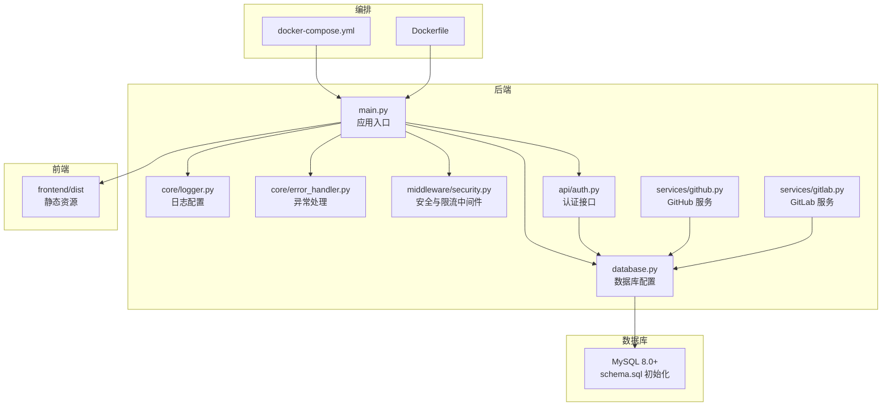
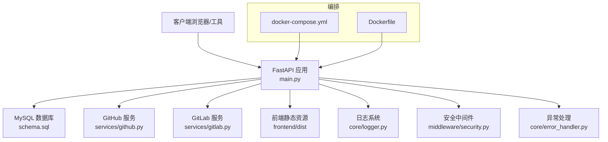
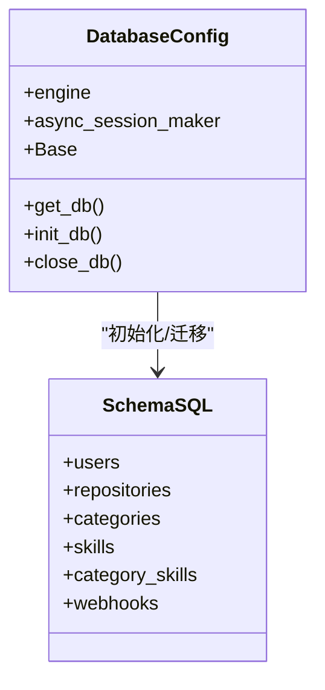
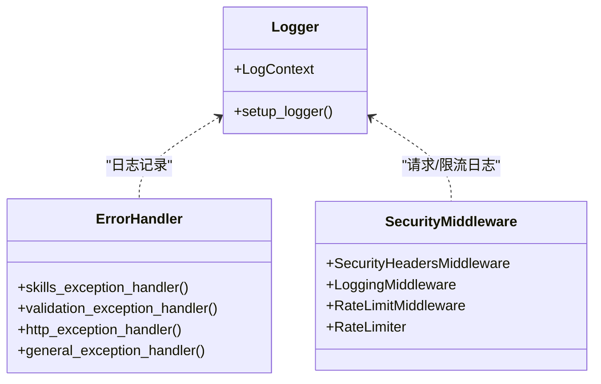
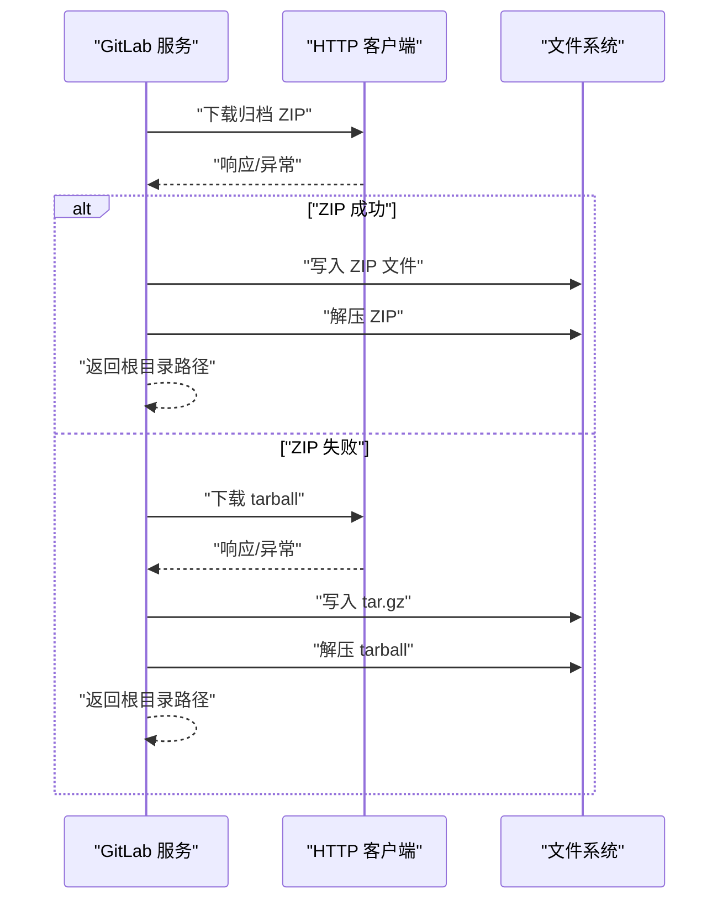
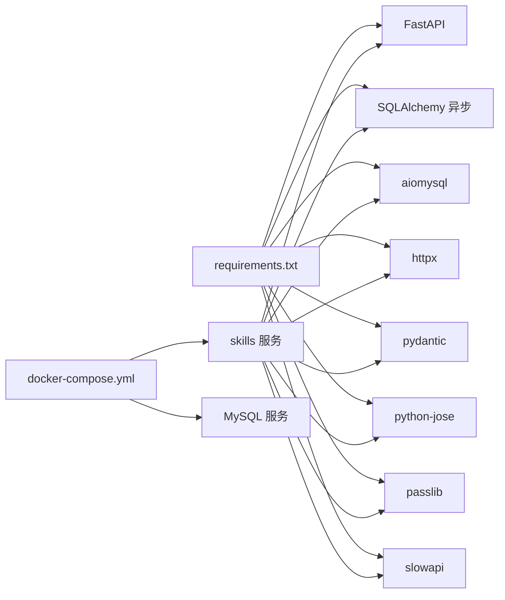

# 维护故障排除

<cite>
**本文引用的文件**
- [README.md](file://README.md)
- [docker-compose.yml](file://docker-compose.yml)
- [Dockerfile](file://Dockerfile)
- [backend/main.py](file://backend/main.py)
- [backend/database.py](file://backend/database.py)
- [backend/.env.example](file://backend/.env.example)
- [backend/core/logger.py](file://backend/core/logger.py)
- [backend/core/error_handler.py](file://backend/core/error_handler.py)
- [backend/middleware/security.py](file://backend/middleware/security.py)
- [backend/schema.sql](file://backend/schema.sql)
- [backend/requirements.txt](file://backend/requirements.txt)
- [backend/api/auth.py](file://backend/api/auth.py)
- [backend/services/github.py](file://backend/services/github.py)
- [backend/services/gitlab.py](file://backend/services/gitlab.py)
</cite>

## 目录
1. [简介](#简介)
2. [项目结构](#项目结构)
3. [核心组件](#核心组件)
4. [架构总览](#架构总览)
5. [详细组件分析](#详细组件分析)
6. [依赖关系分析](#依赖关系分析)
7. [性能考虑](#性能考虑)
8. [故障排除指南](#故障排除指南)
9. [结论](#结论)
10. [附录](#附录)

## 简介
本文件面向 Skills Hub 平台的运维与开发人员，提供系统维护与故障排除的完整指南。内容涵盖日常维护任务（数据库备份、日志清理、缓存清理、系统更新）、常见故障诊断与解决、日志分析技巧、数据库维护操作（备份恢复、索引优化、表结构升级）、系统性能调优建议（资源配置、连接池优化、缓存策略），以及紧急情况下的应急响应与灾难恢复流程。

## 项目结构
Skills Hub 采用前后端分离架构，后端基于 FastAPI 提供 API 与服务，前端基于 Vue 3 + TypeScript，数据库为 MySQL 8.0+，通过 Docker Compose 进行编排部署。核心目录与职责如下：
- backend：后端服务，包含 API 路由、数据库配置、核心模块、中间件、服务层等
- frontend：前端资源，构建产物在生产环境挂载为静态文件
- docker-compose.yml：服务编排，包含 skills 应用与 MySQL 数据库
- Dockerfile：多阶段构建，同时打包前端与后端产物
- schema.sql：数据库初始化脚本，包含表结构与索引设计
- .env.example：环境变量示例，包含数据库、JWT、加密密钥等

图表来源
- [backend/main.py](file://backend/main.py#L1-L137)
- [backend/database.py](file://backend/database.py#L1-L75)
- [backend/core/logger.py](file://backend/core/logger.py#L1-L95)
- [backend/core/error_handler.py](file://backend/core/error_handler.py#L1-L102)
- [backend/middleware/security.py](file://backend/middleware/security.py#L1-L142)
- [backend/api/auth.py](file://backend/api/auth.py#L1-L65)
- [backend/services/github.py](file://backend/services/github.py#L1-L105)
- [backend/services/gitlab.py](file://backend/services/gitlab.py#L1-L170)
- [docker-compose.yml](file://docker-compose.yml#L1-L56)
- [Dockerfile](file://Dockerfile#L1-L48)
- [backend/schema.sql](file://backend/schema.sql#L1-L106)

章节来源
- [README.md](file://README.md#L1-L173)
- [docker-compose.yml](file://docker-compose.yml#L1-L56)
- [Dockerfile](file://Dockerfile#L1-L48)
- [backend/schema.sql](file://backend/schema.sql#L1-L106)

## 核心组件
- 应用入口与生命周期：负责应用启动、数据库初始化、异常处理注册、CORS 与安全中间件、健康检查端点、SPA 回退与静态文件挂载。
- 数据库配置：使用 SQLAlchemy 异步引擎与连接池，支持连接健康检查与溢出连接数控制。
- 日志系统：控制台与文件轮转（按大小与按时间），支持结构化日志与上下文扩展。
- 异常处理：统一错误响应格式，区分业务异常、参数校验异常、HTTP 异常与未捕获异常。
- 安全中间件：安全响应头、请求日志、简单内存限流。
- 外部服务集成：GitHub 与 GitLab 归档下载、解压与错误封装。
- 编排与部署：Docker 多阶段构建，MySQL 初始化脚本挂载，健康检查与重启策略。

章节来源
- [backend/main.py](file://backend/main.py#L1-L137)
- [backend/database.py](file://backend/database.py#L1-L75)
- [backend/core/logger.py](file://backend/core/logger.py#L1-L95)
- [backend/core/error_handler.py](file://backend/core/error_handler.py#L1-L102)
- [backend/middleware/security.py](file://backend/middleware/security.py#L1-L142)
- [backend/services/github.py](file://backend/services/github.py#L1-L105)
- [backend/services/gitlab.py](file://backend/services/gitlab.py#L1-L170)
- [docker-compose.yml](file://docker-compose.yml#L1-L56)
- [Dockerfile](file://Dockerfile#L1-L48)

## 架构总览
系统采用“容器化 + 异步后端 + 前端静态资源”的架构。skills 服务通过健康检查与数据库依赖关系启动，MySQL 通过初始化脚本完成表结构与管理员账户创建。外部服务（GitHub/GitLab）通过异步 HTTP 客户端进行归档下载与解压。

图表来源
- [backend/main.py](file://backend/main.py#L1-L137)
- [backend/database.py](file://backend/database.py#L1-L75)
- [backend/services/github.py](file://backend/services/github.py#L1-L105)
- [backend/services/gitlab.py](file://backend/services/gitlab.py#L1-L170)
- [backend/core/logger.py](file://backend/core/logger.py#L1-L95)
- [backend/middleware/security.py](file://backend/middleware/security.py#L1-L142)
- [backend/core/error_handler.py](file://backend/core/error_handler.py#L1-L102)
- [docker-compose.yml](file://docker-compose.yml#L1-L56)
- [Dockerfile](file://Dockerfile#L1-L48)

## 详细组件分析

### 数据库组件分析
- 连接池与健康检查：启用 pre_ping，连接池大小与溢出连接数可调；应用启动时进行连接测试。
- 会话管理：异步会话工厂，提交/回滚/关闭在依赖注入中自动处理。
- 初始化脚本：包含用户、仓库、分类、技能、关联表与 Webhook 日志表，含全文索引与多处二级索引。

图表来源
- [backend/database.py](file://backend/database.py#L1-L75)
- [backend/schema.sql](file://backend/schema.sql#L1-L106)

章节来源
- [backend/database.py](file://backend/database.py#L1-L75)
- [backend/schema.sql](file://backend/schema.sql#L1-L106)

### 日志与异常处理组件分析
- 日志：控制台 INFO、文件按大小轮转、错误按时间轮转；支持结构化字段与上下文扩展。
- 异常：业务异常、参数校验异常、HTTP 异常、通用异常，统一 JSON 响应格式与日志记录。
- 中间件：安全响应头、请求日志（含耗时）、简单内存限流。

图表来源
- [backend/core/logger.py](file://backend/core/logger.py#L1-L95)
- [backend/core/error_handler.py](file://backend/core/error_handler.py#L1-L102)
- [backend/middleware/security.py](file://backend/middleware/security.py#L1-L142)

章节来源
- [backend/core/logger.py](file://backend/core/logger.py#L1-L95)
- [backend/core/error_handler.py](file://backend/core/error_handler.py#L1-L102)
- [backend/middleware/security.py](file://backend/middleware/security.py#L1-L142)

### 外部服务组件分析
- GitHub/GitLab 服务：支持归档下载（ZIP/TAR.GZ）、解压、错误封装（ExternalServiceError）。
- 超时与重试：异步 HTTP 客户端超时设置，GitLab 支持 ZIP 失败回退到 tarball。

图表来源
- [backend/services/gitlab.py](file://backend/services/gitlab.py#L1-L170)

章节来源
- [backend/services/github.py](file://backend/services/github.py#L1-L105)
- [backend/services/gitlab.py](file://backend/services/gitlab.py#L1-L170)

## 依赖关系分析
- 后端依赖：FastAPI、SQLAlchemy 异步、aiomysql、httpx、pydantic、python-jose、passlib、slowapi 等。
- 运行时依赖：MySQL 8.0+，Docker 环境。
- 编排依赖：skills 服务依赖 db 健康，MySQL 挂载 schema.sql 初始化数据库。

图表来源
- [backend/requirements.txt](file://backend/requirements.txt#L1-L34)
- [docker-compose.yml](file://docker-compose.yml#L1-L56)

章节来源
- [backend/requirements.txt](file://backend/requirements.txt#L1-L34)
- [docker-compose.yml](file://docker-compose.yml#L1-L56)

## 性能考虑
- 连接池优化
  - 当前连接池大小与溢出连接数可在数据库配置中调整，建议根据并发请求数与数据库承载能力评估。
  - 启用连接健康检查（pre_ping）有助于在连接复用场景下避免失效连接。
- 资源配置
  - Docker 环境可通过 docker-compose 调整 CPU/内存限制与重启策略，确保服务稳定性。
  - 前端静态资源在生产环境挂载，减少后端静态文件处理开销。
- 缓存策略
  - 当前未见专用缓存层实现；可结合业务热点数据与查询结果进行缓存优化（需评估一致性与失效策略）。
- 外部服务超时
  - GitHub/GitLab 下载设置超时，建议结合重试与降级策略，避免阻塞主流程。

章节来源
- [backend/database.py](file://backend/database.py#L1-L75)
- [backend/middleware/security.py](file://backend/middleware/security.py#L1-L142)
- [backend/services/github.py](file://backend/services/github.py#L1-L105)
- [backend/services/gitlab.py](file://backend/services/gitlab.py#L1-L170)
- [docker-compose.yml](file://docker-compose.yml#L1-L56)

## 故障排除指南

### 日常维护任务清单
- 数据库备份
  - 使用 MySQL 官方工具进行逻辑备份与物理备份，结合增量备份策略与保留周期。
  - 备份位置与卷映射参考 MySQL 卷配置，确保备份数据持久化。
- 日志清理
  - 利用日志轮转策略（按大小与按时间）自动清理旧日志；定期归档重要日志。
  - Docker 环境下可通过日志目录挂载与外部归档策略管理空间。
- 缓存清理
  - 当前未检测到专用缓存层；若引入缓存，需制定清理与失效策略。
- 系统更新
  - 通过 Docker 镜像重建与依赖升级流程进行更新，确保兼容性与安全性。

章节来源
- [backend/core/logger.py](file://backend/core/logger.py#L1-L95)
- [docker-compose.yml](file://docker-compose.yml#L1-L56)

### 常见故障诊断与解决
- 数据库连接失败
  - 现象：应用启动时数据库连接失败告警；健康检查返回数据库断开。
  - 诊断：检查环境变量 DATABASE_URL、网络连通性、MySQL 服务健康状态、初始化脚本执行情况。
  - 解决：修正连接串、确认 MySQL 健康检查通过、确保 schema.sql 已执行。
- API 服务异常
  - 现象：统一异常处理返回错误响应，日志记录异常堆栈。
  - 诊断：查看错误日志、请求路径与时间戳，区分业务异常与未捕获异常。
  - 解决：修复业务逻辑、完善输入校验、增强异常处理与监控。
- 容器启动问题
  - 现象：skills 服务无法启动或频繁重启。
  - 诊断：查看容器日志、健康检查失败原因、依赖 db 是否健康。
  - 解决：修复依赖链、调整重启策略、检查端口占用与资源限制。
- 性能瓶颈
  - 现象：响应时间增长、数据库压力增大。
  - 诊断：结合请求日志耗时、数据库慢查询、连接池使用率与外部服务超时。
  - 解决：优化连接池、增加索引、缓存热点数据、限流与降级。

章节来源
- [backend/main.py](file://backend/main.py#L88-L104)
- [backend/core/error_handler.py](file://backend/core/error_handler.py#L1-L102)
- [backend/middleware/security.py](file://backend/middleware/security.py#L31-L59)
- [backend/database.py](file://backend/database.py#L58-L75)
- [docker-compose.yml](file://docker-compose.yml#L1-L56)

### 日志分析技巧
- 错误日志解读
  - 使用错误日志文件按日期轮转，定位错误发生时间与上下文字段。
  - 结合统一异常处理中的错误码与消息，快速定位问题类型。
- 性能日志分析
  - 请求日志包含方法、路径、客户端 IP、状态码与处理耗时，可用于性能分析与慢请求识别。
  - 结合限流中间件日志，排查是否存在频繁触发限流导致的异常。
- 调试信息提取
  - 在关键服务（外部服务下载）记录详细调试信息，便于追踪下载失败与解压异常。

章节来源
- [backend/core/logger.py](file://backend/core/logger.py#L1-L95)
- [backend/core/error_handler.py](file://backend/core/error_handler.py#L1-L102)
- [backend/middleware/security.py](file://backend/middleware/security.py#L31-L59)
- [backend/services/github.py](file://backend/services/github.py#L1-L105)
- [backend/services/gitlab.py](file://backend/services/gitlab.py#L1-L170)

### 数据库维护操作指南
- 数据备份与恢复
  - 备份：使用逻辑备份（mysqldump）与物理备份（xtrabackup）相结合，制定保留周期与异地备份。
  - 恢复：在隔离环境中验证备份完整性，逐步恢复至目标环境。
- 索引优化
  - 基于查询模式与 EXPLAIN 分析，评估现有索引（如全文索引、二级索引）覆盖度。
  - 针对高频搜索与关联查询，考虑复合索引与覆盖索引。
- 表结构升级
  - 通过迁移脚本或 DDL 变更，确保变更前的备份与灰度验证。
  - 参考 schema.sql 的表结构与索引设计，保持一致性。

章节来源
- [backend/schema.sql](file://backend/schema.sql#L1-L106)
- [backend/database.py](file://backend/database.py#L1-L75)

### 系统性能调优建议
- 资源配置调整
  - Docker 环境中合理设置 CPU/内存限制与重启策略，避免资源争用。
- 连接池优化
  - 根据并发与数据库承载能力调整连接池大小与溢出连接数，启用健康检查。
- 缓存策略改进
  - 对热点数据与查询结果引入缓存，结合失效策略与一致性保障。

章节来源
- [backend/database.py](file://backend/database.py#L1-L75)
- [docker-compose.yml](file://docker-compose.yml#L1-L56)

### 紧急响应与灾难恢复
- 应急响应流程
  - 快速定位故障根因（日志、健康检查、依赖链）；隔离问题服务；回滚最近变更。
  - 通过限流与降级保护系统，优先保障核心功能可用。
- 灾难恢复计划
  - 建立定期备份与异地容灾策略；制定恢复演练流程；明确恢复时间目标与恢复点目标。

章节来源
- [backend/core/error_handler.py](file://backend/core/error_handler.py#L1-L102)
- [backend/middleware/security.py](file://backend/middleware/security.py#L1-L142)
- [docker-compose.yml](file://docker-compose.yml#L1-L56)

## 结论
本指南提供了 Skills Hub 平台的维护与故障排除实践路径，涵盖日常运维、故障诊断、日志分析、数据库维护与性能调优，并给出了应急响应与灾难恢复建议。建议结合实际运行环境持续优化配置与流程，确保系统稳定与高可用。

## 附录
- 快速参考
  - 健康检查端点：/api/health
  - API 文档：/api/docs
  - 默认管理员账号：admin / Admin@123（首次部署后必须修改）
- 环境变量
  - DATABASE_URL、JWT_SECRET_KEY、ENCRYPTION_KEY、ENVIRONMENT、DEBUG、PORT 等

章节来源
- [README.md](file://README.md#L105-L118)
- [backend/.env.example](file://backend/.env.example#L1-L17)
- [backend/main.py](file://backend/main.py#L88-L104)