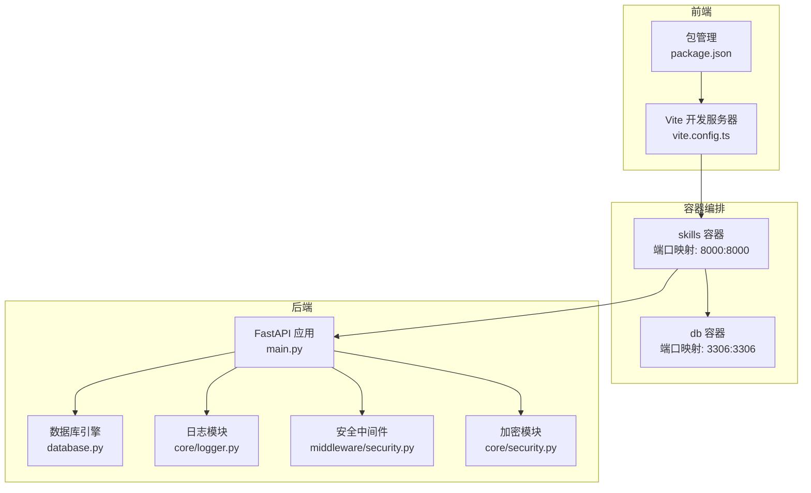
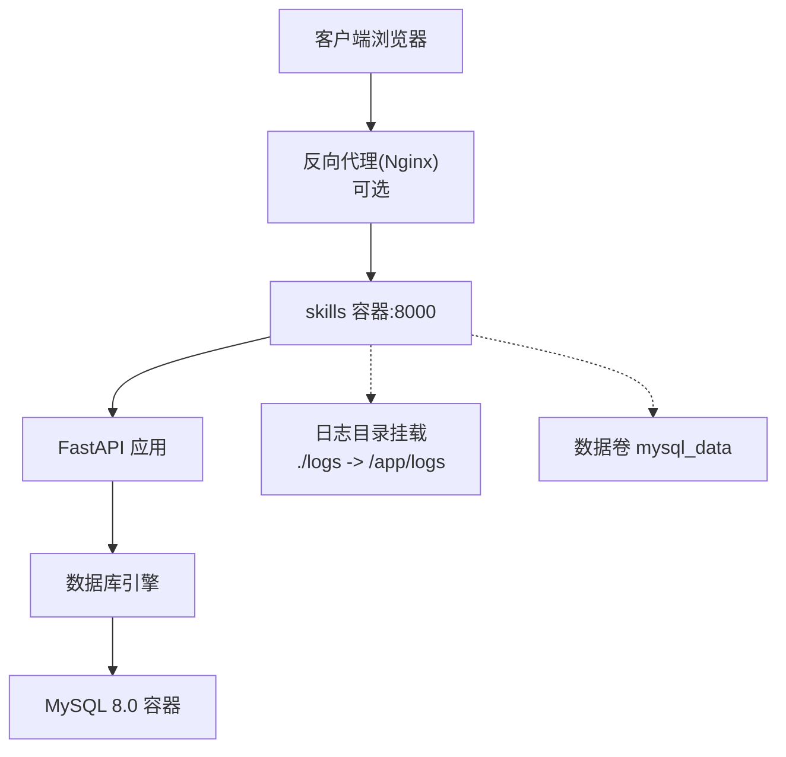
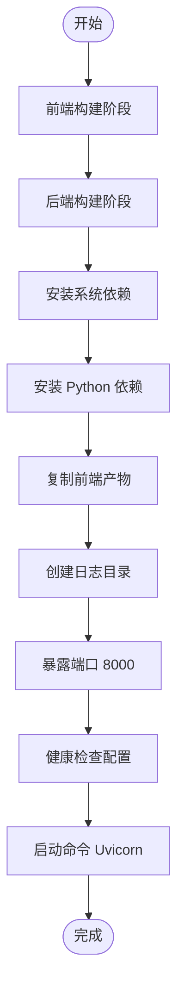
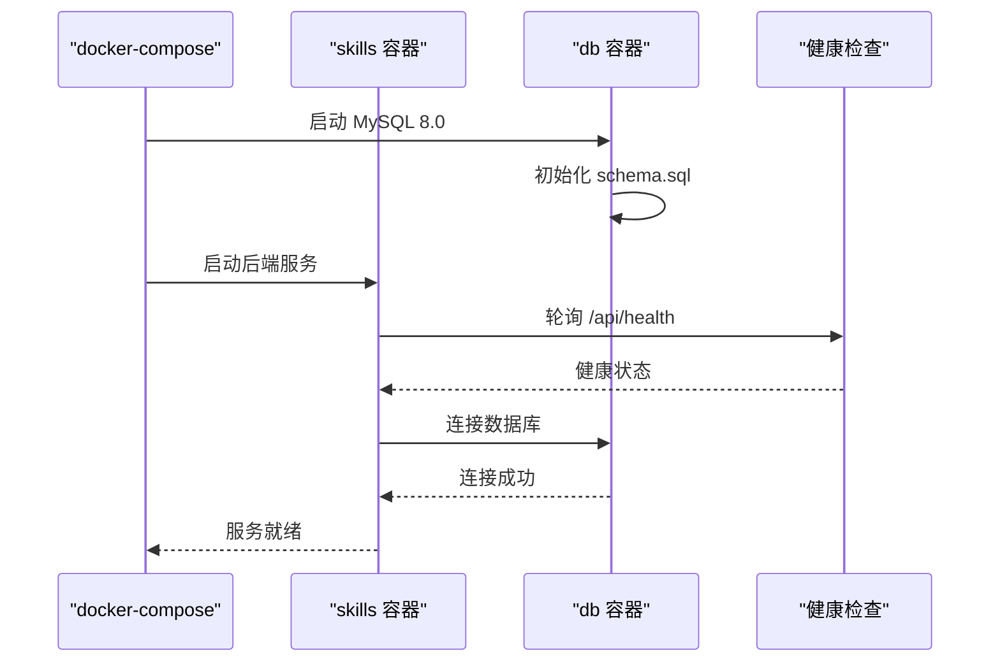
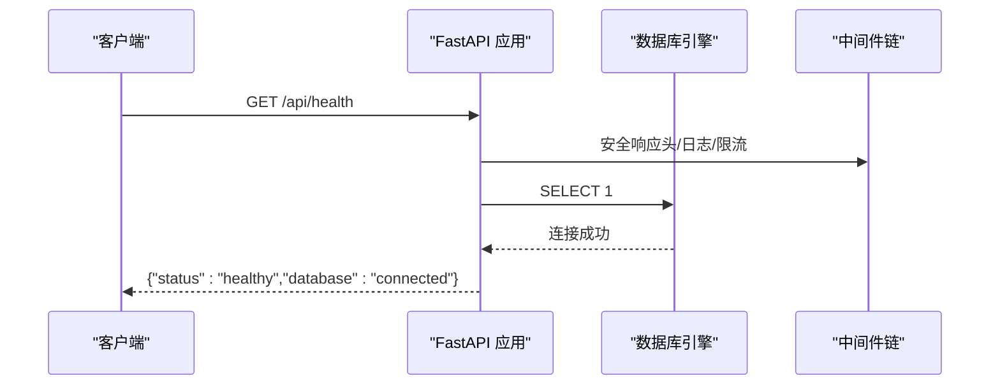
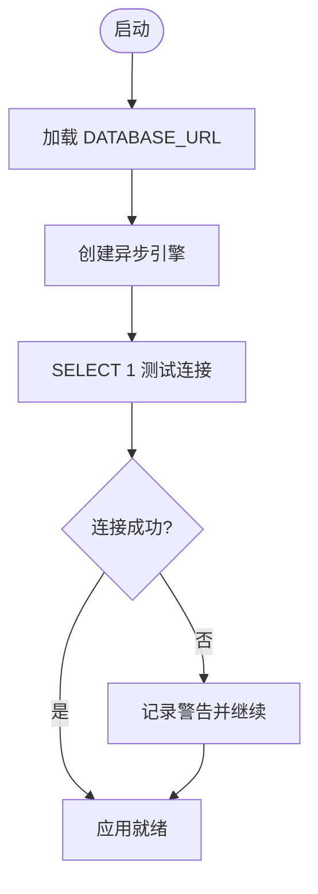
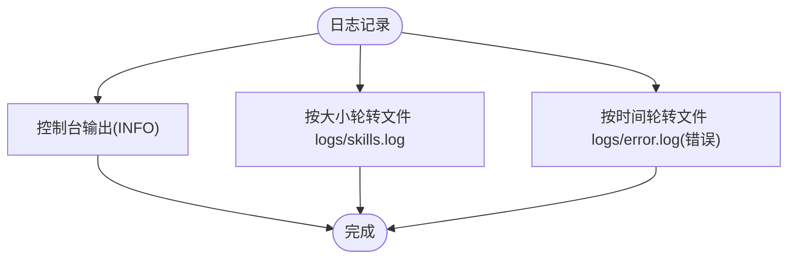
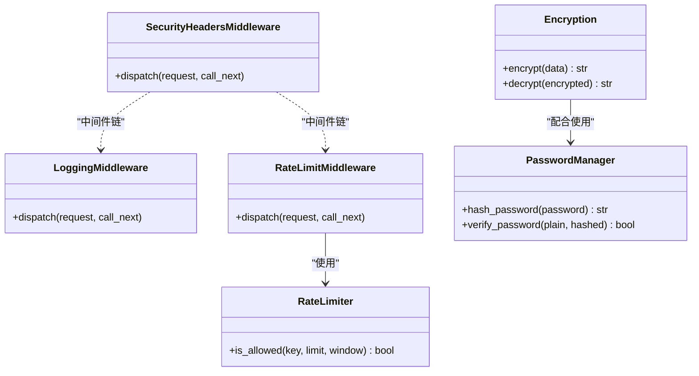
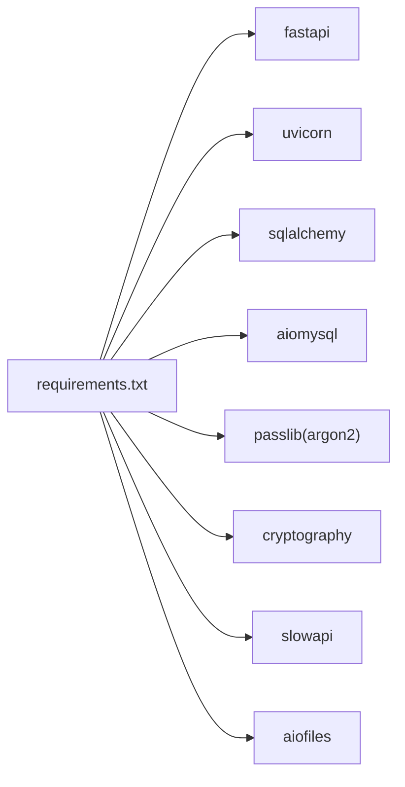

# 部署运维

<cite>
**本文引用的文件**
- [Dockerfile](file://Dockerfile)
- [docker-compose.yml](file://docker-compose.yml)
- [backend/.env.example](file://backend/.env.example)
- [backend/main.py](file://backend/main.py)
- [backend/database.py](file://backend/database.py)
- [backend/schema.sql](file://backend/schema.sql)
- [backend/requirements.txt](file://backend/requirements.txt)
- [backend/core/logger.py](file://backend/core/logger.py)
- [backend/middleware/security.py](file://backend/middleware/security.py)
- [backend/core/security.py](file://backend/core/security.py)
- [frontend/vite.config.ts](file://frontend/vite.config.ts)
- [frontend/package.json](file://frontend/package.json)
- [CLAUDE.md](file://CLAUDE.md)
- [FIXES_SUMMARY.md](file://FIXES_SUMMARY.md)
</cite>

## 目录
1. [简介](#简介)
2. [项目结构](#项目结构)
3. [核心组件](#核心组件)
4. [架构总览](#架构总览)
5. [详细组件分析](#详细组件分析)
6. [依赖关系分析](#依赖关系分析)
7. [性能考虑](#性能考虑)
8. [故障排除指南](#故障排除指南)
9. [结论](#结论)
10. [附录](#附录)

## 简介
本部署运维文档面向运维工程师，围绕 Skills Hub 的单服务 Docker 部署进行系统化说明，涵盖镜像构建、容器编排、服务配置、生产部署流程、监控告警、日志管理、性能调优、备份恢复、安全加固、CI/CD 与自动化部署、版本管理以及故障处理手册。文档以仓库现有实现为依据，确保可操作性与可追溯性。

## 项目结构
Skills Hub 采用前后端分离的单镜像部署模式：后端基于 Python 3.13 + FastAPI + MySQL 8.0，前端基于 Vue 3 + Vite；通过多阶段 Dockerfile 构建，将前端产物打包进后端镜像，并通过 docker-compose 编排运行。

图表来源
- [docker-compose.yml](file://docker-compose.yml#L1-L56)
- [backend/main.py](file://backend/main.py#L46-L137)
- [backend/database.py](file://backend/database.py#L20-L36)
- [backend/core/logger.py](file://backend/core/logger.py#L11-L70)
- [backend/middleware/security.py](file://backend/middleware/security.py#L11-L142)
- [backend/core/security.py](file://backend/core/security.py#L31-L58)
- [frontend/vite.config.ts](file://frontend/vite.config.ts#L4-L23)
- [frontend/package.json](file://frontend/package.json#L1-L20)

章节来源
- [docker-compose.yml](file://docker-compose.yml#L1-L56)
- [Dockerfile](file://Dockerfile#L1-L48)
- [backend/main.py](file://backend/main.py#L46-L137)
- [frontend/vite.config.ts](file://frontend/vite.config.ts#L4-L23)

## 核心组件
- 镜像构建：多阶段构建，前端在独立阶段构建，后端阶段安装系统依赖与 Python 依赖，复制前端产物，暴露端口并配置健康检查。
- 容器编排：skills 服务依赖 db 健康，挂载日志目录，暴露端口，设置重启策略；db 服务使用 MySQL 8.0，初始化 schema.sql 并持久化数据卷。
- 应用入口：FastAPI 应用注册中间件、异常处理器、路由，提供健康检查端点，挂载前端静态资源。
- 数据库：异步 SQLAlchemy + aiomysql，连接池配置，启动时连接测试。
- 日志：控制台 + 按大小轮转 + 按时间轮转的错误日志，统一格式。
- 安全：安全响应头、速率限制、密码加密、敏感数据加密。
- 前端：开发代理指向后端 8000 端口，构建输出 dist。

章节来源
- [Dockerfile](file://Dockerfile#L1-L48)
- [docker-compose.yml](file://docker-compose.yml#L1-L56)
- [backend/main.py](file://backend/main.py#L46-L137)
- [backend/database.py](file://backend/database.py#L20-L36)
- [backend/core/logger.py](file://backend/core/logger.py#L11-L70)
- [backend/middleware/security.py](file://backend/middleware/security.py#L11-L142)
- [backend/core/security.py](file://backend/core/security.py#L31-L58)
- [frontend/vite.config.ts](file://frontend/vite.config.ts#L4-L23)

## 架构总览
下图展示生产环境单服务部署的关键交互：skills 容器承载后端与前端静态资源，db 容器提供 MySQL 服务，容器通过自定义网络通信，健康检查保障可用性。

图表来源
- [docker-compose.yml](file://docker-compose.yml#L1-L56)
- [backend/main.py](file://backend/main.py#L87-L104)
- [backend/database.py](file://backend/database.py#L20-L36)

## 详细组件分析

### 镜像构建与健康检查
- 多阶段构建：前端阶段使用 node:20-slim，安装依赖并执行构建；后端阶段基于 python:3.13-slim，安装系统依赖（gcc、mysql 客户端、curl），安装 Python 依赖，复制后端代码与前端构建产物，创建日志目录，暴露 8000 端口，配置健康检查，CMD 启动 Uvicorn。
- 健康检查：容器内对 /api/health 发起 HTTP 探测，失败则重试直至判定不健康。

图表来源
- [Dockerfile](file://Dockerfile#L1-L48)

章节来源
- [Dockerfile](file://Dockerfile#L1-L48)

### 容器编排与服务配置
- skills 服务：构建当前目录，端口映射 8000:8000，依赖 db 健康，环境变量包含数据库连接串、JWT 密钥、加密密钥、环境标识，挂载日志目录，健康检查，重启策略 unless-stopped。
- db 服务：MySQL 8.0，设置 root、数据库名、用户与密码，端口映射 3306:3306，持久化数据卷 mysql_data，初始化 schema.sql，健康检查 ping 根用户，重启策略 unless-stopped。
- 网络：skills-network 桥接网络供服务通信。

图表来源
- [docker-compose.yml](file://docker-compose.yml#L1-L56)
- [backend/main.py](file://backend/main.py#L87-L104)
- [backend/database.py](file://backend/database.py#L63-L69)

章节来源
- [docker-compose.yml](file://docker-compose.yml#L1-L56)

### 应用入口与路由
- 生命周期：启动时初始化数据库连接，关闭时释放连接。
- 中间件：CORS、安全响应头、请求日志、速率限制。
- 异常处理：统一异常处理器。
- 路由：认证、用户、公开分类、仓库、分类、技能、Webhook、同步等。
- 健康检查：/api/health 返回状态与数据库连接情况。
- SPA 回退：非 API 路由回退至前端 index.html，生产环境挂载前端静态资源。

图表来源
- [backend/main.py](file://backend/main.py#L87-L104)
- [backend/database.py](file://backend/database.py#L63-L69)
- [backend/middleware/security.py](file://backend/middleware/security.py#L11-L142)

章节来源
- [backend/main.py](file://backend/main.py#L27-L125)

### 数据库初始化与连接
- 初始化脚本：schema.sql 包含数据库、表、索引与初始管理员账号插入。
- 连接配置：从 DATABASE_URL 环境变量读取，启用 pool_pre_ping，连接池大小与溢出配置。
- 运行时连接测试：启动时执行 SELECT 1，失败记录日志但应用继续运行。

图表来源
- [backend/database.py](file://backend/database.py#L14-L69)
- [backend/schema.sql](file://backend/schema.sql#L1-L106)

章节来源
- [backend/database.py](file://backend/database.py#L14-L75)
- [backend/schema.sql](file://backend/schema.sql#L1-L106)

### 日志管理
- 输出目标：控制台 INFO、按大小轮转的日志文件、按时间轮转的错误日志。
- 格式：包含时间戳、级别、模块、行号与消息。
- 目录：/app/logs（容器内），通过卷映射到宿主机 ./logs。

图表来源
- [backend/core/logger.py](file://backend/core/logger.py#L11-L70)

章节来源
- [backend/core/logger.py](file://backend/core/logger.py#L11-L70)
- [docker-compose.yml](file://docker-compose.yml#L16-L18)

### 安全加固与速率限制
- 安全响应头：X-Content-Type-Options、X-Frame-Options、X-XSS-Protection、Strict-Transport-Security、Content-Security-Policy，移除 Server 头。
- 速率限制：针对特定路径（如登录）基于客户端 IP 的简单内存限流。
- 密码与加密：argon2 密码哈希、Fernet 对称加密存储敏感数据（如访问令牌）。

图表来源
- [backend/middleware/security.py](file://backend/middleware/security.py#L11-L142)
- [backend/core/security.py](file://backend/core/security.py#L12-L58)

章节来源
- [backend/middleware/security.py](file://backend/middleware/security.py#L11-L142)
- [backend/core/security.py](file://backend/core/security.py#L12-L58)

### 前端开发与构建
- 开发代理：本地 5173 端口，将 /api 与 /webhooks 代理到后端 8000 端口。
- 构建输出：dist 目录，生产环境由后端挂载为静态资源。

章节来源
- [frontend/vite.config.ts](file://frontend/vite.config.ts#L4-L23)
- [frontend/package.json](file://frontend/package.json#L1-L20)
- [backend/main.py](file://backend/main.py#L119-L125)

## 依赖关系分析
- 后端依赖：FastAPI、Uvicorn、SQLAlchemy、aiomysql、argon2、cryptography、slowapi、aiofiles 等。
- 健康检查依赖：curl（Dockerfile）、后端 /api/health（main.py）。
- 数据库依赖：MySQL 8.0，schema.sql 初始化。
- 前端依赖：Vue 3、Vite、插件等。

图表来源
- [backend/requirements.txt](file://backend/requirements.txt#L1-L34)

章节来源
- [backend/requirements.txt](file://backend/requirements.txt#L1-L34)

## 性能考虑
- 连接池：pool_pre_ping、pool_size、max_overflow 已配置，建议根据并发与数据库性能调优。
- 健康检查：容器与服务层面均配置健康检查，缩短探测间隔与超时可提升故障感知速度。
- 前端静态资源：生产环境挂载 dist，减少后端 I/O 压力。
- 速率限制：默认对登录接口限流，可根据业务调整策略与阈值。
- 日志轮转：按大小与时间轮转，避免单文件过大影响 IO。

章节来源
- [backend/database.py](file://backend/database.py#L20-L36)
- [backend/core/logger.py](file://backend/core/logger.py#L43-L64)
- [backend/middleware/security.py](file://backend/middleware/security.py#L107-L142)

## 故障排除指南
- 健康检查失败
  - 现象：容器或服务被标记为不健康。
  - 排查：查看 /api/health 返回内容，确认数据库连接；检查后端日志。
- 数据库连接失败
  - 现象：启动时连接测试失败。
  - 排查：核对 DATABASE_URL、网络连通性、db 容器健康状态；确认 schema.sql 已执行。
- 前端无法访问
  - 现象：静态资源 404 或 SPA 路由回退无效。
  - 排查：确认 dist 已构建并挂载；路由回退逻辑在生产环境挂载静态文件之后。
- 速率限制触发
  - 现象：登录接口频繁请求被拒绝。
  - 排查：检查客户端 IP 与限流阈值，必要时调整限流策略。
- 日志未落盘
  - 现象：容器内无日志文件。
  - 排查：确认卷映射 ./logs -> /app/logs 是否正确；检查权限。

章节来源
- [backend/main.py](file://backend/main.py#L87-L104)
- [backend/database.py](file://backend/database.py#L63-L69)
- [backend/core/logger.py](file://backend/core/logger.py#L39-L41)
- [docker-compose.yml](file://docker-compose.yml#L16-L18)

## 结论
本部署方案以单镜像 + 单服务编排为核心，结合健康检查、日志轮转与安全中间件，满足中小型团队的快速上线与稳定运行需求。建议在生产环境中补充 Nginx 反向代理、完善的监控告警、定期备份与演练，以及严格的密钥与访问控制策略。

## 附录

### 生产环境部署流程
- 准备工作
  - 生成并设置环境变量：JWT_SECRET_KEY、ENCRYPTION_KEY、DATABASE_URL、ENVIRONMENT=production。
  - 准备日志与数据卷目录映射。
- 启动服务
  - 使用 docker-compose 启动，等待 db 健康后启动 skills。
  - 初次启动会执行 schema.sql 初始化数据库。
- 验证
  - 访问 /api/health 检查服务与数据库状态。
  - 登录后台，初始管理员账号已在 schema.sql 中创建。

章节来源
- [docker-compose.yml](file://docker-compose.yml#L7-L11)
- [backend/schema.sql](file://backend/schema.sql#L101-L106)

### 环境变量配置清单
- JWT_SECRET_KEY：用于签发与校验 JWT。
- ENCRYPTION_KEY：用于对敏感数据（如访问令牌）进行对称加密。
- DATABASE_URL：数据库连接串，示例见 .env.example。
- ENVIRONMENT：开发/生产环境标识。
- PORT：服务监听端口（默认 8000）。

章节来源
- [backend/.env.example](file://backend/.env.example#L1-L17)
- [backend/core/security.py](file://backend/core/security.py#L34-L41)

### 数据库初始化与迁移
- 初次部署：db 容器启动时自动执行 /docker-entrypoint-initdb.d/schema.sql。
- 后续变更：建议通过版本化迁移脚本管理结构变更，保持与 schema.sql 的一致性。

章节来源
- [docker-compose.yml](file://docker-compose.yml#L39-L39)
- [backend/schema.sql](file://backend/schema.sql#L1-L106)

### Nginx 反向代理设置（建议）
- 作用：统一入口、TLS 终止、静态资源缓存、压缩与限流。
- 建议配置项：监听 443，转发 /api 与 /webhooks 至 skills:8000，缓存静态资源，开启 gzip/br，配置 HSTS 与安全头。

[本节为概念性说明，不直接对应具体源文件]

### 监控告警配置（建议）
- 指标采集：容器 CPU/内存/磁盘、MySQL 指标、应用健康检查成功率。
- 日志采集：集中化收集 /app/logs，设置错误率阈值告警。
- 告警渠道：邮件/IM/电话，分级处理。

[本节为概念性说明，不直接对应具体源文件]

### 日志管理最佳实践
- 保留周期：按业务需求设定轮转备份保留天数。
- 分类存储：错误日志独立轮转，便于检索。
- 宿主机落盘：确保卷映射正确，避免容器重建导致日志丢失。

章节来源
- [backend/core/logger.py](file://backend/core/logger.py#L43-L64)
- [docker-compose.yml](file://docker-compose.yml#L16-L18)

### 性能调优建议
- 连接池：根据 QPS 与延迟调整 pool_size 与 max_overflow。
- 健康检查：缩短探测间隔，降低误判概率。
- 前端：使用 CDN 缓存静态资源，减少后端压力。
- 限流：针对热点接口细化限流策略，避免误伤正常流量。

章节来源
- [backend/database.py](file://backend/database.py#L20-L36)
- [backend/middleware/security.py](file://backend/middleware/security.py#L107-L142)

### 备份恢复策略
- 数据库备份：定时快照 mysql_data 卷，导出 schema 与增量数据。
- 配置备份：备份 .env、docker-compose.yml、Nginx 配置。
- 恢复流程：停止服务 -> 恢复卷与配置 -> 启动 db -> 启动 skills -> 验证 /api/health。

章节来源
- [docker-compose.yml](file://docker-compose.yml#L38-L51)

### 安全加固措施
- 密钥管理：使用强随机密钥，定期轮换；避免硬编码在镜像中。
- 网络隔离：使用自定义桥接网络，限制暴露端口。
- 访问控制：生产环境收紧 CORS 与安全头，启用速率限制与 WAF。
- 更新策略：定期更新基础镜像与依赖，关注 CVE。

章节来源
- [backend/middleware/security.py](file://backend/middleware/security.py#L11-L28)
- [backend/core/security.py](file://backend/core/security.py#L34-L41)

### CI/CD 流程与自动化部署
- 构建：在 CI 中执行 docker build，产出镜像并推送制品库。
- 测试：在流水线中运行后端单元测试与数据库连通性检查。
- 部署：拉取最新镜像，执行 docker-compose up -d，滚动更新或蓝绿发布。
- 回滚：记录版本标签，一键回滚到上一版本。

章节来源
- [CLAUDE.md](file://CLAUDE.md#L56-L67)

### 版本管理
- 语义化版本：以主版本.次版本.修订号管理发布。
- 标签规范：v1.2.3，与镜像标签一致。
- 变更记录：在变更日志中记录数据库结构变更与依赖升级。

章节来源
- [FIXES_SUMMARY.md](file://FIXES_SUMMARY.md#L160-L170)