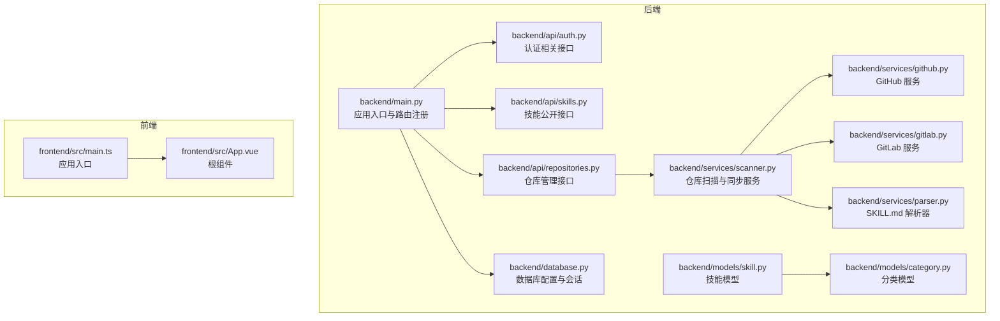
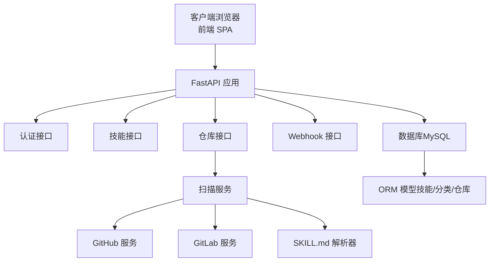
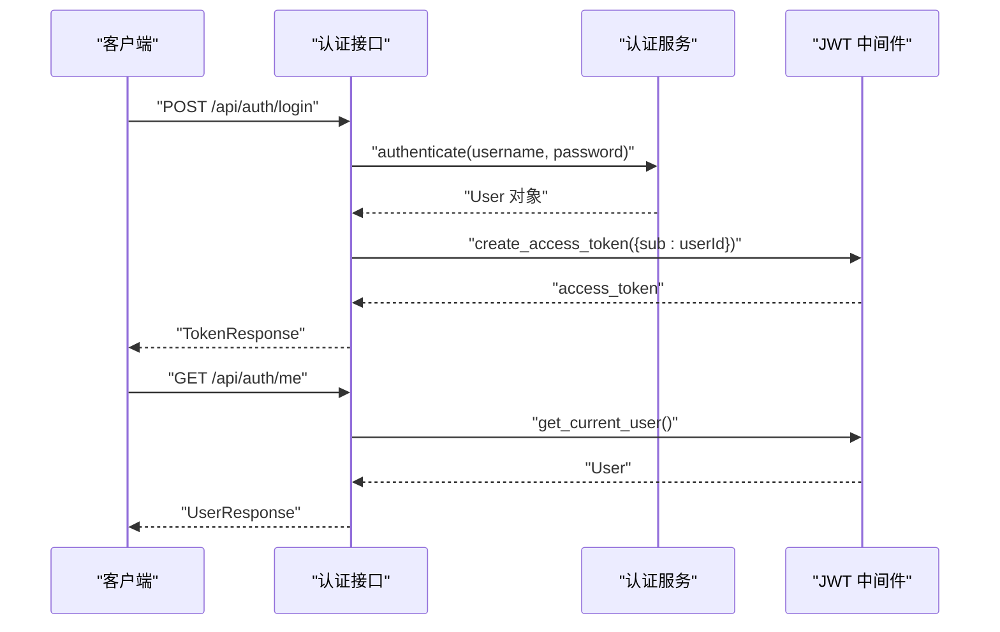
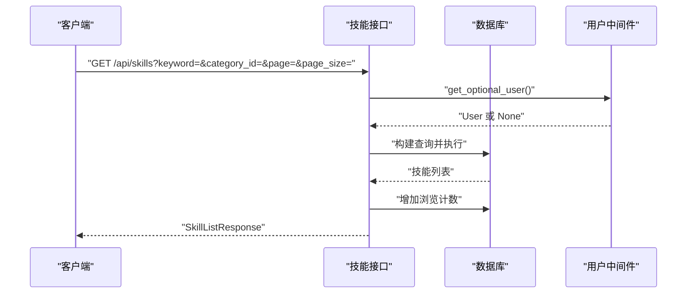
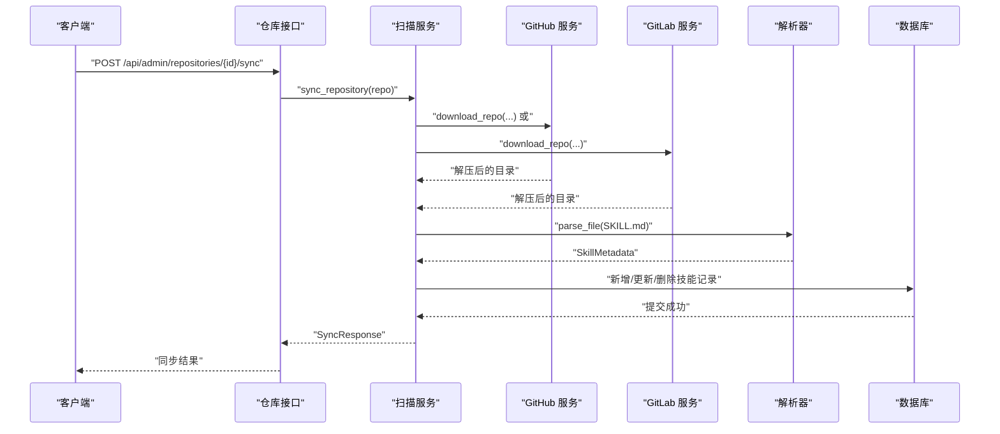
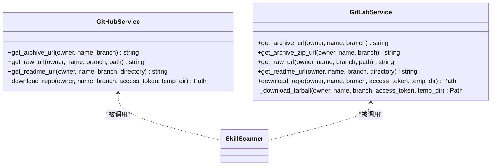
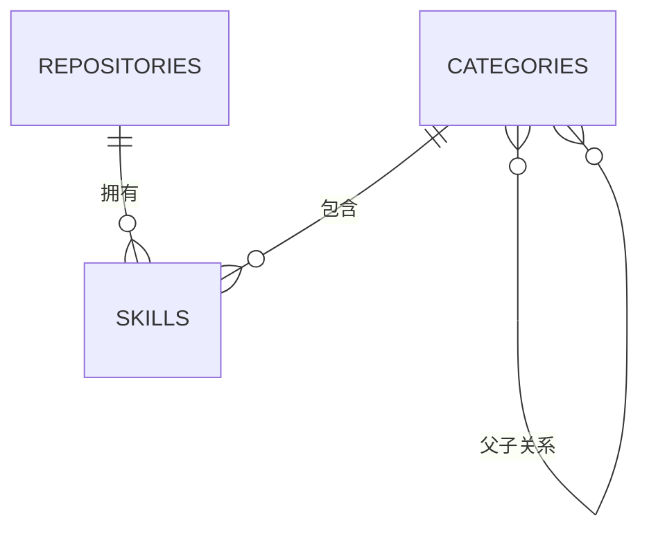
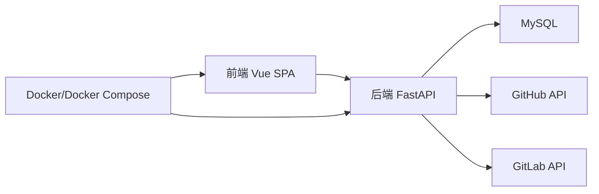

# 项目概述

<cite>
**本文档引用的文件**
- [README.md](file://README.md)
- [backend/main.py](file://backend/main.py)
- [backend/database.py](file://backend/database.py)
- [backend/api/auth.py](file://backend/api/auth.py)
- [backend/api/skills.py](file://backend/api/skills.py)
- [backend/api/repositories.py](file://backend/api/repositories.py)
- [backend/services/scanner.py](file://backend/services/scanner.py)
- [backend/services/github.py](file://backend/services/github.py)
- [backend/services/gitlab.py](file://backend/services/gitlab.py)
- [backend/services/parser.py](file://backend/services/parser.py)
- [backend/models/skill.py](file://backend/models/skill.py)
- [backend/models/category.py](file://backend/models/category.py)
- [frontend/src/main.ts](file://frontend/src/main.ts)
- [frontend/src/App.vue](file://frontend/src/App.vue)
</cite>

## 目录
1. [引言](#引言)
2. [项目结构](#项目结构)
3. [核心组件](#核心组件)
4. [架构总览](#架构总览)
5. [详细组件分析](#详细组件分析)
6. [依赖分析](#依赖分析)
7. [性能考虑](#性能考虑)
8. [故障排除指南](#故障排除指南)
9. [结论](#结论)

## 引言
Skills Hub 是一个内部技能发现与管理平台，旨在通过自动化方式从 GitHub/GitLab 仓库中发现和同步技能资源，帮助团队高效地组织、检索和分享知识资产。项目采用前后端分离架构，后端基于 FastAPI 提供高性能 API，前端基于 Vue 3 + TypeScript 构建现代化的单页应用（SPA）。平台支持多级分类管理、用户认证与权限控制、Webhook 自动同步以及 CLI 风格的仿终端界面设计，具备良好的扩展性与可维护性。

## 项目结构
项目采用按层分层的组织方式，后端以 API、服务、模型、中间件为核心模块；前端以组件、路由、API 客户端为主。整体结构清晰，职责明确，便于协作与演进。

**图表来源**
- [backend/main.py](file://backend/main.py#L47-L84)
- [backend/database.py](file://backend/database.py#L20-L36)
- [backend/api/auth.py](file://backend/api/auth.py#L21-L48)
- [backend/api/skills.py](file://backend/api/skills.py#L15-L95)
- [backend/api/repositories.py](file://backend/api/repositories.py#L23-L88)
- [backend/services/scanner.py](file://backend/services/scanner.py#L21-L68)
- [backend/services/github.py](file://backend/services/github.py#L14-L104)
- [backend/services/gitlab.py](file://backend/services/gitlab.py#L15-L169)
- [backend/services/parser.py](file://backend/services/parser.py#L13-L85)
- [backend/models/skill.py](file://backend/models/skill.py#L11-L39)
- [backend/models/category.py](file://backend/models/category.py#L19-L46)
- [frontend/src/main.ts](file://frontend/src/main.ts#L1-L12)
- [frontend/src/App.vue](file://frontend/src/App.vue#L1-L31)

**章节来源**
- [README.md](file://README.md#L20-L47)
- [backend/main.py](file://backend/main.py#L47-L84)

## 核心组件
- 应用入口与路由注册：负责创建 FastAPI 应用、注册中间件、异常处理、健康检查、SPA 回退与静态文件挂载。
- 数据库模块：基于 SQLAlchemy + aiomysql 实现异步 MySQL 连接，提供会话依赖注入与连接池配置。
- 认证与权限：提供登录、获取当前用户、修改密码等接口，并结合中间件实现 JWT 权限控制。
- 技能管理：提供技能搜索、详情查看、浏览计数、待分配分类查询等公开接口。
- 仓库管理：支持仓库增删改查、手动同步、Webhook 配置，包含敏感信息加密存储。
- 扫描与同步：统一的扫描器负责下载仓库、遍历目录、解析 SKILL.md 并与数据库进行增量同步。
- 外部服务集成：分别封装 GitHub 与 GitLab 的归档下载、URL 构造与错误处理。
- 前端应用：基于 Vue 3 + TypeScript 的 SPA，采用 Pinia 状态管理与路由导航。

**章节来源**
- [backend/main.py](file://backend/main.py#L27-L125)
- [backend/database.py](file://backend/database.py#L42-L75)
- [backend/api/auth.py](file://backend/api/auth.py#L24-L64)
- [backend/api/skills.py](file://backend/api/skills.py#L18-L160)
- [backend/api/repositories.py](file://backend/api/repositories.py#L49-L205)
- [backend/services/scanner.py](file://backend/services/scanner.py#L70-L156)
- [backend/services/github.py](file://backend/services/github.py#L36-L104)
- [backend/services/gitlab.py](file://backend/services/gitlab.py#L46-L165)
- [frontend/src/main.ts](file://frontend/src/main.ts#L1-L12)

## 架构总览
系统采用“API 层 + 业务服务层 + 数据访问层 + 外部服务层”的分层架构，后端通过 FastAPI 提供 RESTful API，前端通过 SPA 与 API 交互。数据库采用异步 ORM，确保高并发场景下的稳定性。Webhook 机制实现 GitLab Push 事件驱动的自动同步，提升数据一致性与实时性。

**图表来源**
- [backend/main.py](file://backend/main.py#L77-L84)
- [backend/api/repositories.py](file://backend/api/repositories.py#L161-L176)
- [backend/services/scanner.py](file://backend/services/scanner.py#L21-L68)
- [backend/services/github.py](file://backend/services/github.py#L14-L20)
- [backend/services/gitlab.py](file://backend/services/gitlab.py#L15-L26)
- [backend/services/parser.py](file://backend/services/parser.py#L13-L27)
- [backend/database.py](file://backend/database.py#L20-L39)

## 详细组件分析

### 认证与权限组件
- 设计理念：基于 JWT 的无状态认证，支持管理员权限控制与密码修改。
- 关键流程：登录时校验凭据并签发访问令牌；获取当前用户信息；修改密码需提供旧密码验证。
- 安全要点：密码修改前进行旧密码校验，异常统一由全局异常处理器处理。

**图表来源**
- [backend/api/auth.py](file://backend/api/auth.py#L24-L48)
- [backend/middleware/auth.py](file://backend/middleware/auth.py#L1-L200)

**章节来源**
- [backend/api/auth.py](file://backend/api/auth.py#L24-L64)

### 技能管理组件
- 设计理念：提供公开的技能浏览与搜索能力，支持关键词、分类、仓库筛选与排序分页。
- 关键流程：搜索接口构建复合查询，计算总数并分页返回；详情接口加载关联的分类与仓库信息；浏览计数自动递增。
- 性能优化：使用 selectinload 预加载关联对象，避免 N+1 查询问题。

**图表来源**
- [backend/api/skills.py](file://backend/api/skills.py#L18-L95)

**章节来源**
- [backend/api/skills.py](file://backend/api/skills.py#L18-L160)

### 仓库管理与同步组件
- 设计理念：支持 GitHub/GitLab 仓库的增删改查、手动同步与 Webhook 配置，敏感信息加密存储。
- 关键流程：手动同步调用扫描器，扫描仓库中的 SKILL.md，解析元数据并与数据库进行增量同步；Webhook 配置支持启用/禁用与密钥加密。
- 错误处理：外部服务异常统一包装为外部服务错误，保证系统稳定性。

**图表来源**
- [backend/api/repositories.py](file://backend/api/repositories.py#L161-L176)
- [backend/services/scanner.py](file://backend/services/scanner.py#L70-L156)
- [backend/services/github.py](file://backend/services/github.py#L36-L104)
- [backend/services/gitlab.py](file://backend/services/gitlab.py#L46-L165)
- [backend/services/parser.py](file://backend/services/parser.py#L18-L69)

**章节来源**
- [backend/api/repositories.py](file://backend/api/repositories.py#L49-L205)
- [backend/services/scanner.py](file://backend/services/scanner.py#L27-L156)

### 外部服务集成组件
- GitHub 服务：提供归档下载、原始文件与 README URL 构造，支持访问令牌鉴权。
- GitLab 服务：支持 ZIP 与 tar.gz 归档下载，优先尝试 ZIP，失败则回退 tar.gz，同样支持访问令牌鉴权。
- 统一错误处理：对外部服务异常进行捕获并转换为统一的外部服务错误类型。

**图表来源**
- [backend/services/github.py](file://backend/services/github.py#L14-L104)
- [backend/services/gitlab.py](file://backend/services/gitlab.py#L15-L169)
- [backend/services/scanner.py](file://backend/services/scanner.py#L158-L181)

**章节来源**
- [backend/services/github.py](file://backend/services/github.py#L14-L104)
- [backend/services/gitlab.py](file://backend/services/gitlab.py#L15-L169)

### 数据模型组件
- 技能模型：包含仓库关联、多分类关联、浏览计数、星标数量等字段，提供序列化方法与唯一键生成。
- 分类模型：支持多级父子关系与技能集合，提供祖先/后代查询辅助方法，便于层级展示与过滤。

**图表来源**
- [backend/models/skill.py](file://backend/models/skill.py#L11-L39)
- [backend/models/category.py](file://backend/models/category.py#L19-L46)

**章节来源**
- [backend/models/skill.py](file://backend/models/skill.py#L11-L90)
- [backend/models/category.py](file://backend/models/category.py#L19-L94)

### 前端组件与设计理念
- 应用入口：创建 Vue 应用，注册 Pinia 状态管理与路由插件。
- 根组件：提供基础样式与主题色，作为页面容器。
- CLI 风格界面：前端通过仿终端风格的 UI 设计，增强用户体验与品牌一致性（例如背景色与链接颜色的搭配）。

**章节来源**
- [frontend/src/main.ts](file://frontend/src/main.ts#L1-L12)
- [frontend/src/App.vue](file://frontend/src/App.vue#L1-L31)

## 依赖分析
- 后端依赖：FastAPI、SQLAlchemy（异步）、aiomysql、httpx、aiofiles、PyYAML、python-dotenv 等。
- 前端依赖：Vue 3、TypeScript、Pinia、路由等。
- 部署依赖：Docker 与 docker-compose，支持单服务部署。

**图表来源**
- [backend/main.py](file://backend/main.py#L1-L20)
- [backend/database.py](file://backend/database.py#L1-L10)
- [README.md](file://README.md#L13-L18)

**章节来源**
- [README.md](file://README.md#L13-L18)

## 性能考虑
- 异步数据库访问：使用 SQLAlchemy 异步引擎与会话工厂，减少阻塞，提升并发吞吐。
- 预加载策略：在技能查询中使用 selectinload 预加载关联对象，避免 N+1 查询。
- 连接池配置：合理设置连接池大小与溢出数量，平衡内存占用与并发性能。
- 外部服务超时与重试：对 GitHub/GitLab 下载设置超时，ZIP 失败时回退到 tar.gz，提高成功率。
- 前端静态资源：生产环境挂载前端静态文件，避免 API 路由覆盖。

[本节为通用性能建议，不直接分析具体文件，故无“章节来源”]

## 故障排除指南
- 数据库连接失败：检查 DATABASE_URL 环境变量与网络连通性；应用启动时会进行连接测试。
- 外部服务错误：当 GitHub/GitLab 下载失败时，系统抛出外部服务错误，检查仓库访问令牌与网络代理。
- Webhook 同步失败：确认 GitLab 项目 Webhook 配置正确，Secret Token 与仓库配置一致，触发事件为 Push events。
- 密码修改失败：确保提供正确的旧密码，异常将由全局异常处理器统一处理。

**章节来源**
- [backend/main.py](file://backend/main.py#L88-L104)
- [backend/database.py](file://backend/database.py#L58-L69)
- [backend/services/github.py](file://backend/services/github.py#L73-L97)
- [backend/services/gitlab.py](file://backend/services/gitlab.py#L86-L91)
- [README.md](file://README.md#L148-L154)

## 结论
Skills Hub 通过清晰的分层架构与模块化设计，实现了从 GitHub/GitLab 自动发现与同步技能资源的能力，配合多级分类管理、用户认证与 Webhook 集成，构建了完整的技能发现与管理体系。前端采用仿终端界面风格，提升了用户体验的一致性与专业感。项目在技术选型上兼顾性能与可维护性，适合在企业内部快速落地与持续演进。