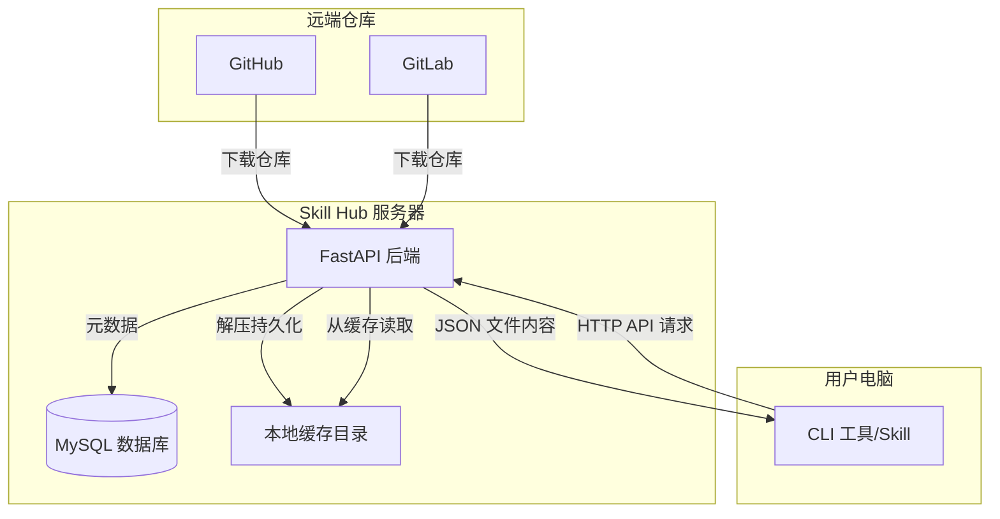
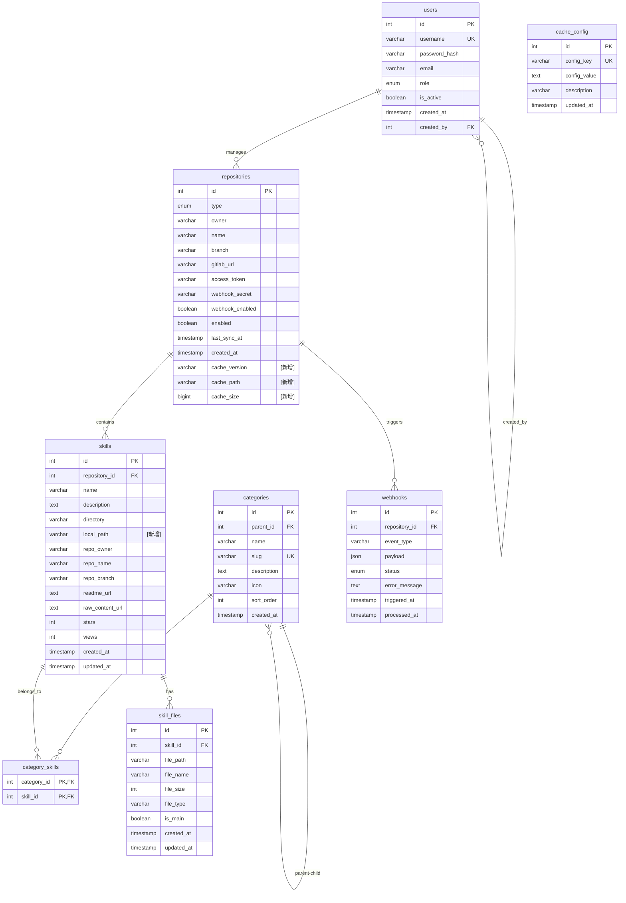
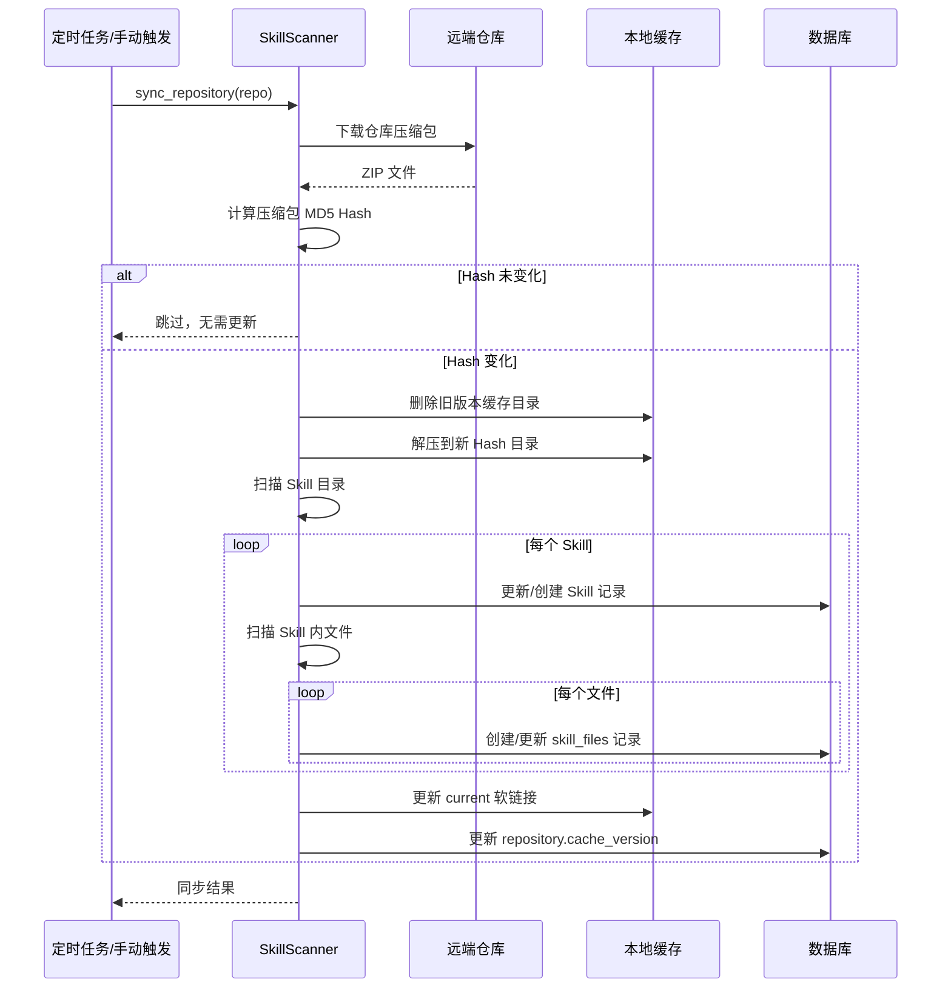
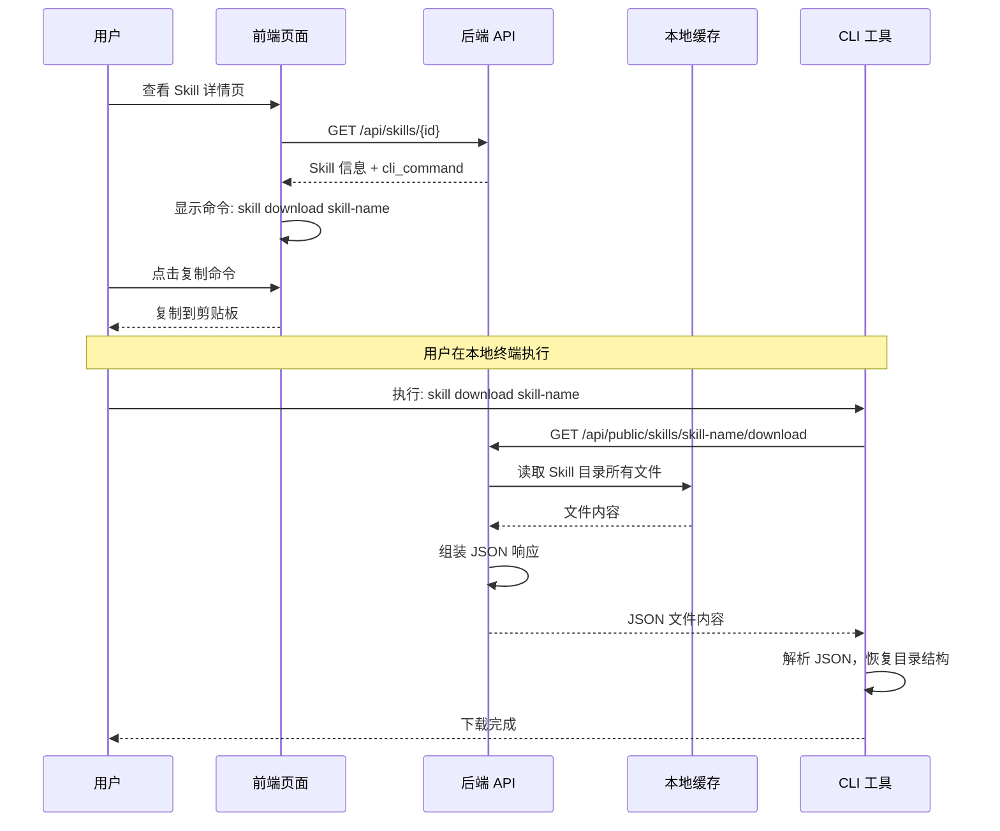

# Skill Hub 本地缓存与分发机制设计文档

## 1. 背景与问题

### 1.1 现状
- 应用从远端仓库（GitHub/GitLab）拉取压缩包
- 解压到临时目录，扫描提取 Skill 信息
- 处理完后删除临时目录

### 1.2 新增需求
- 前端增加"复制下载命令"按钮
- 生成 CLI 命令：`skill download <skill_name>`
- 用户在本地执行命令，通过 API 下载单个 Skill

### 1.3 核心痛点
- 直接从远端下载单个 Skill 需要拉取整个仓库
- 仓库可能包含数十个 Skill，浪费带宽和时间

## 2. 架构设计

### 2.1 整体架构



### 2.2 架构评估

**优势：**
1. **避免重复下载**：仓库只需下载一次，所有 Skill 从缓存分发
2. **快速响应**：本地文件读取，响应速度快
3. **降低远端压力**：减少对 GitHub/GitLab API 的调用
4. **一致性保证**：所有用户获取同一版本的 Skill

**风险与应对：**
| 风险 | 应对措施 |
|------|----------|
| 缓存占用磁盘空间 | 配置最大缓存大小，LRU 清理策略 |
| 仓库更新时缓存不一致 | 同步时全量覆盖，记录版本 Hash |
| 单个 Skill 文件过大 | 设置单次下载大小限制 |

### 2.3 仓库更新策略

采用 **全量覆盖 + 版本追踪** 策略：

1. **同步时**：
   - 下载最新仓库压缩包
   - 计算压缩包内容的 Hash（MD5 或 SHA256）
   - 如果 Hash 变化，删除旧缓存，解压新版本
   - 更新数据库中的版本信息

2. **版本 Hash 生成方式**：
   - **方式一（推荐）**：计算下载的压缩包文件的 Hash
   - **方式二**：通过 GitHub/GitLab API 获取最新 commit SHA（需要额外 API 调用）
   - **方式三**：解压后计算所有文件的聚合 Hash

   > **说明**：由于下载压缩包时无法直接获取 commit SHA，建议使用方式一（压缩包 Hash），简单高效。

3. **文件组织**：
```
cache/
├── repos/
│   ├── github_owner_repo_branch/     # GitHub 仓库
│   │   ├── a1b2c3d4e5f6/             # 版本 Hash（前12位）
│   │   │   ├── skill-a/
│   │   │   │   ├── SKILL.md
│   │   │   │   └── prompts/
│   │   │   │       └── system.txt
│   │   │   └── skill-b/
│   │   │       └── SKILL.md
│   │   └── current -> a1b2c3d4e5f6/  # 软链接指向当前版本
│   └── gitlab_owner_repo_branch/     # GitLab 仓库
│       └── ...
└── config.json                       # 缓存配置
```

## 3. 数据库结构审查报告

### 3.1 现有表结构概览

| 表名 | 用途 | 字段数 |
|------|------|--------|
| users | 用户管理 | 8 |
| repositories | 仓库配置 | 11 |
| categories | 多级分类 | 8 |
| skills | Skill 信息 | 13 |
| category_skills | 分类与 Skill 关联 | 2 |
| webhooks | Webhook 日志 | 8 |

### 3.2 变更影响分析

#### 3.2.1 repositories 表 [修改]

**现有字段：**
```
id, type, owner, name, branch, gitlab_url, access_token, 
webhook_secret, webhook_enabled, enabled, last_sync_at, created_at
```

**新增字段：**
| 字段 | 类型 | 说明 | 冲突检查 |
|------|------|------|----------|
| cache_version | VARCHAR(64) | 缓存版本标识 | ✅ 无冲突 |
| cache_path | VARCHAR(500) | 本地缓存绝对路径 | ✅ 无冲突 |
| cache_size | BIGINT | 缓存占用空间（字节） | ✅ 无冲突 |

**结论**：✅ 无冲突，可直接通过 ALTER TABLE 添加

#### 3.2.2 skills 表 [修改]

**现有字段：**
```
id, repository_id, name, description, directory, repo_owner, 
repo_name, repo_branch, readme_url, raw_content_url, stars, 
views, created_at, updated_at
```

**新增字段：**
| 字段 | 类型 | 说明 | 冲突检查 |
|------|------|------|----------|
| local_path | VARCHAR(500) | 本地缓存中的绝对路径 | ✅ 无冲突 |

**结论**：✅ 无冲突，可直接通过 ALTER TABLE 添加

#### 3.2.3 skill_files 表 [新增]

**结论**：✅ 新表，无冲突

#### 3.2.4 cache_config 表 [新增]

**结论**：✅ 新表，无冲突

### 3.3 完整变更 SQL

```sql
-- ============================================
-- Skill Hub 缓存功能 - 数据库变更脚本
-- 版本: v1.0
-- 日期: 2026-02-15
-- ============================================

-- 1. 修改 repositories 表 [修改]
ALTER TABLE repositories 
    ADD COLUMN cache_version VARCHAR(64) COMMENT '缓存版本标识（压缩包Hash）' AFTER last_sync_at,
    ADD COLUMN cache_path VARCHAR(500) COMMENT '本地缓存绝对路径' AFTER cache_version,
    ADD COLUMN cache_size BIGINT DEFAULT 0 COMMENT '缓存占用空间（字节）' AFTER cache_path;

-- 2. 修改 skills 表 [修改]
ALTER TABLE skills 
    ADD COLUMN local_path VARCHAR(500) COMMENT '本地缓存中的绝对路径' AFTER directory;

-- 3. 创建 skill_files 表 [新增]
CREATE TABLE IF NOT EXISTS skill_files (
    id INT AUTO_INCREMENT PRIMARY KEY,
    skill_id INT NOT NULL,
    file_path VARCHAR(500) NOT NULL COMMENT '相对于 Skill 目录的文件路径',
    file_name VARCHAR(255) NOT NULL COMMENT '文件名',
    file_size INT DEFAULT 0 COMMENT '文件大小（字节）',
    file_type VARCHAR(50) DEFAULT 'text' COMMENT '文件类型',
    is_main BOOLEAN DEFAULT FALSE COMMENT '是否为主文件 SKILL.md',
    created_at TIMESTAMP DEFAULT CURRENT_TIMESTAMP,
    updated_at TIMESTAMP DEFAULT CURRENT_TIMESTAMP ON UPDATE CURRENT_TIMESTAMP,
    FOREIGN KEY (skill_id) REFERENCES skills(id) ON DELETE CASCADE,
    INDEX idx_skill_id (skill_id),
    INDEX idx_file_path (file_path(100))
) ENGINE=InnoDB DEFAULT CHARSET=utf8mb4 COLLATE=utf8mb4_unicode_ci;

-- 4. 创建 cache_config 表 [新增]
CREATE TABLE IF NOT EXISTS cache_config (
    id INT AUTO_INCREMENT PRIMARY KEY,
    config_key VARCHAR(100) NOT NULL UNIQUE,
    config_value TEXT NOT NULL,
    description VARCHAR(500),
    updated_at TIMESTAMP DEFAULT CURRENT_TIMESTAMP ON UPDATE CURRENT_TIMESTAMP,
    INDEX idx_config_key (config_key)
) ENGINE=InnoDB DEFAULT CHARSET=utf8mb4 COLLATE=utf8mb4_unicode_ci;

-- 5. 初始化缓存配置 [新增]
INSERT INTO cache_config (config_key, config_value, description) VALUES
('cache_base_path', './cache', '缓存根目录'),
('max_cache_size_gb', '10', '最大缓存大小 GB'),
('max_file_size_mb', '10', '单个文件最大大小 MB'),
('max_skill_size_mb', '50', '单个 Skill 最大总大小 MB'),
('cleanup_strategy', 'lru', '缓存清理策略'),
('skill_hub_url', 'http://localhost:8000', 'Skill Hub 服务器地址（用于 CLI）'),
('skill_download_dir', './skills', 'CLI 默认下载目录')
ON DUPLICATE KEY UPDATE config_key=config_key;
```

### 3.4 全量 ER 图



### 3.5 表变更汇总

| 表名 | 变更类型 | 变更内容 |
|------|----------|----------|
| users | [现有] 无变更 | - |
| repositories | [修改] | +3 字段：cache_version, cache_path, cache_size |
| categories | [现有] 无变更 | - |
| skills | [修改] | +1 字段：local_path |
| category_skills | [现有] 无变更 | - |
| webhooks | [现有] 无变更 | - |
| skill_files | [新增] | 新表，8 字段 |
| cache_config | [新增] | 新表，5 字段 |

## 4. API 接口设计

### 4.1 新增接口

#### GET /api/public/skills/{skill_identifier}/download

下载单个 Skill 的所有文件（公开接口，无需认证）

**请求参数：**
| 参数 | 类型 | 位置 | 必填 | 说明 |
|------|------|------|------|------|
| skill_identifier | string | path | 是 | Skill ID 或 Skill name |
| format | string | query | 否 | 返回格式：json（默认） |

**认证**：无需认证（公开访问）

**响应 - JSON 格式：**
```json
{
  "name": "skill-download",
  "description": "Skill 下载工具 - 从 Skill Hub 下载指定的 Skill",
  "version": "a1b2c3d4e5f6",
  "repository": {
    "type": "GITHUB",
    "owner": "skills-org",
    "name": "skills-repo",
    "branch": "main"
  },
  "files": [
    {
      "path": "SKILL.md",
      "content": "# Skill 下载工具\n\n这是一个用于下载其他 Skill 的工具...",
      "size": 256,
      "is_main": true
    },
    {
      "path": "prompts/system.txt",
      "content": "你是一个 Skill 下载助手...",
      "size": 512,
      "is_main": false
    }
  ],
  "total_files": 2,
  "total_size": 768,
  "downloaded_at": "2026-02-15T10:00:00Z"
}
```

**响应字段说明：**
| 字段 | 类型 | 说明 |
|------|------|------|
| name | string | Skill 名称 |
| description | string | Skill 描述 |
| version | string | 缓存版本 Hash |
| repository | object | 所属仓库信息 |
| files | array | 文件列表 |
| files[].path | string | 相对于 Skill 目录的文件路径（保留嵌套结构） |
| files[].content | string | 文件完整内容（UTF-8 文本） |
| files[].size | int | 文件大小（字节） |
| files[].is_main | bool | 是否为主文件 SKILL.md |
| total_files | int | 文件总数 |
| total_size | int | 总大小（字节） |
| downloaded_at | string | 下载时间（ISO 8601） |

#### GET /api/skills/{skill_id}/cli-command

获取 CLI 下载命令（需管理员认证）

**响应：**
```json
{
  "command": "skill download skill-name",
  "skill_name": "skill-name",
  "api_endpoint": "http://hub.example.com/api/public/skills/skill-name/download"
}
```

#### GET /api/public/config

获取公开配置信息（供 CLI 工具使用）

**响应：**
```json
{
  "skill_hub_url": "http://localhost:8000",
  "skill_download_dir": "./skills",
  "max_file_size_mb": 10,
  "max_skill_size_mb": 50
}
```

### 4.2 修改现有接口

#### GET /api/skills/{skill_id}

在 Skill 详情中增加 CLI 命令和本地路径信息

**响应新增字段：**
```json
{
  "id": 123,
  "name": "skill-name",
  "...": "...",
  "local_path": "/var/lib/skills-hub/cache/repos/github_org_repo_main/current/skill-name",
  "cli_command": "skill download skill-name",
  "is_cached": true
}
```

## 5. 数据流设计

### 5.1 同步流程（解压文件持久化）



### 5.2 下载流程（前端生成命令到 CLI 下载）



## 6. 下载 Skill（提示词）设计

### 6.1 配置化说明

**所有路径和 URL 均为可配置项**，存储在 `cache_config` 表中：

| 配置项 | 默认值 | 说明 |
|--------|--------|------|
| skill_hub_url | http://localhost:8000 | Skill Hub 服务器地址 |
| skill_download_dir | ./skills | CLI 默认下载目录 |

用户可以在 SKILL.md 中引用这些配置，或通过环境变量覆盖：

```env
SKILL_HUB_URL=http://your-hub-server.com
SKILL_DOWNLOAD_DIR=/path/to/your/skills
```

### 6.2 Skill 目录结构示例

```
skill-download/
├── SKILL.md                 # 主文档
├── prompts/
│   ├── system.txt          # 系统提示词
│   └── user.txt            # 用户提示词模板
└── examples/
    └── usage.json          # 使用示例
```

### 6.3 SKILL.md 示例

```markdown
# Skill 下载工具

## 功能描述

这是一个用于从 Skill Hub 下载其他 Skill 的工具。当用户执行 `skill download <skill-name>` 命令时，该工具会：

1. 通过 HTTP API 获取 Skill 文件信息
2. 解析返回的 JSON 数据
3. 根据 JSON 结构恢复 Skill 的目录结构
4. 将文件保存到用户指定位置

## 使用方法

```bash
skill download <skill-name> [--dir <directory>]
```

### 参数说明

- `<skill-name>`: 要下载的 Skill 名称（必填）
- `--dir <directory>`: 下载目录（可选，默认使用配置中的 skill_download_dir）

### 示例

```bash
# 下载名为 "code-review" 的 Skill
skill download code-review

# 下载到指定目录
skill download code-review --dir /my/custom/path

# 下载名为 "api-docs" 的 Skill
skill download api-docs
```

## 配置

工具使用以下配置（可通过环境变量覆盖）：

| 配置项 | 环境变量 | 默认值 | 说明 |
|--------|----------|--------|------|
| Skill Hub URL | SKILL_HUB_URL | {skill_hub_url} | Skill Hub 服务器地址 |
| 下载目录 | SKILL_DOWNLOAD_DIR | {skill_download_dir} | Skill 保存目录 |

> 注：{skill_hub_url} 和 {skill_download_dir} 会在同步时从 cache_config 表中获取并替换

## 输出

下载成功后，会在下载目录下创建与 Skill 同名的目录，包含完整的文件结构。
```

### 6.4 prompts/system.txt 示例

```text
你是一个 Skill 下载助手。你的任务是帮助用户从 Skill Hub 下载指定的 Skill。

## 配置

使用以下配置（可通过环境变量覆盖）：

- **SKILL_HUB_URL**: Skill Hub 服务器地址（默认: {skill_hub_url}）
- **SKILL_DOWNLOAD_DIR**: 下载目录（默认: {skill_download_dir}）

## 工作流程

当用户执行 `skill download <skill-name>` 命令时，你需要按以下步骤操作：

### 步骤 1：确定配置

优先使用环境变量，如果未设置则使用默认值：
- hub_url = $SKILL_HUB_URL 或 {skill_hub_url}
- download_dir = $SKILL_DOWNLOAD_DIR 或 {skill_download_dir}

如果用户指定了 --dir 参数，则使用用户指定的目录。

### 步骤 2：构造 API 请求

```
GET {hub_url}/api/public/skills/{skill-name}/download
```

### 步骤 3：发送 HTTP 请求

使用 HTTP GET 方法请求上述 URL，预期返回 JSON 格式数据。

### 步骤 4：解析 JSON 响应

响应格式如下：
```json
{
  "name": "skill-name",
  "files": [
    {
      "path": "SKILL.md",
      "content": "文件内容...",
      "size": 1024
    },
    {
      "path": "prompts/system.txt",
      "content": "提示词内容...",
      "size": 512
    }
  ],
  "total_files": 2,
  "total_size": 1536
}
```

### 步骤 5：恢复目录结构

对于 `files` 数组中的每个文件：

1. **构建完整路径**：`{download_dir}/{skill-name}/{file.path}`
2. **创建目录**：根据路径创建必要的父目录
3. **写入文件**：将 `content` 字段的内容写入文件（UTF-8 编码）

### 步骤 6：完成提示

下载完成后，向用户报告：
- 下载的 Skill 名称
- 保存位置
- 文件总数
- 总大小

## 错误处理

- 如果 API 返回 404，提示用户 "Skill not found: {skill-name}"
- 如果 API 返回 500，提示用户 "Server error, please try again later"
- 如果网络超时，提示用户 "Connection timeout, please check network"
- 如果目录创建失败，提示用户 "Failed to create directory: {path}"
- 如果文件写入失败，提示用户 "Failed to write file: {path}"

## 示例输出

```
Downloading skill: code-review
API: {skill_hub_url}/api/public/skills/code-review/download

Creating directory: {skill_download_dir}/code-review/
Creating file: {skill_download_dir}/code-review/SKILL.md
Creating directory: {skill_download_dir}/code-review/prompts/
Creating file: {skill_download_dir}/code-review/prompts/system.txt

Download complete!
- Skill: code-review
- Location: {skill_download_dir}/code-review/
- Files: 2
- Size: 1.5 KB
```
```

### 6.5 CLI 工具执行逻辑伪代码

```python
# CLI 工具的核心执行逻辑（伪代码，供提示词参考）

import os
from pathlib import Path
import httpx

def download_skill(skill_name: str, custom_dir: str = None):
    """下载指定的 Skill"""
    
    # 1. 确定配置（优先使用环境变量）
    hub_url = os.environ.get("SKILL_HUB_URL", "{skill_hub_url}")
    download_dir = custom_dir or os.environ.get("SKILL_DOWNLOAD_DIR", "{skill_download_dir}")
    
    # 2. 构造 API URL
    api_url = f"{hub_url}/api/public/skills/{skill_name}/download"
    print(f"Downloading skill: {skill_name}")
    print(f"API: {api_url}")
    
    # 3. 发送 HTTP 请求
    response = httpx.get(api_url, timeout=30.0)
    if response.status_code == 404:
        print(f"Error: Skill not found: {skill_name}")
        return
    if response.status_code != 200:
        print(f"Error: Server returned {response.status_code}")
        return
    
    # 4. 解析 JSON
    data = response.json()
    skill_name = data["name"]
    files = data["files"]
    
    # 5. 创建 Skill 目录
    skill_dir = Path(download_dir) / skill_name
    skill_dir.mkdir(parents=True, exist_ok=True)
    print(f"Creating directory: {skill_dir}/")
    
    # 6. 遍历文件，恢复目录结构
    for file_info in files:
        file_path = skill_dir / file_info["path"]
        file_content = file_info["content"]
        
        # 创建父目录
        file_path.parent.mkdir(parents=True, exist_ok=True)
        
        # 写入文件
        file_path.write_text(file_content, encoding="utf-8")
        print(f"Creating file: {file_path}")
    
    # 7. 完成提示
    print(f"\nDownload complete!")
    print(f"- Skill: {skill_name}")
    print(f"- Location: {skill_dir}/")
    print(f"- Files: {data['total_files']}")
    print(f"- Size: {data['total_size']} bytes")

# 使用示例
if __name__ == "__main__":
    # skill download code-review
    download_skill("code-review")
    
    # skill download code-review --dir /custom/path
    download_skill("code-review", custom_dir="/custom/path")
```

## 7. 配置设计

### 7.1 环境变量

在 `.env` 中新增：

```env
# 缓存配置
CACHE_BASE_PATH=./cache
MAX_CACHE_SIZE_GB=10
MAX_FILE_SIZE_MB=10
MAX_SKILL_SIZE_MB=50

# CLI 配置（用于下载 Skill 提示词中的默认值）
SKILL_HUB_URL=http://localhost:8000
SKILL_DOWNLOAD_DIR=./skills
```

### 7.2 配置优先级

1. 环境变量（最高优先级）
2. 数据库 cache_config 表
3. 代码默认值（最低优先级）

### 7.3 cache_config 表完整配置项

| 配置项 | 默认值 | 说明 |
|--------|--------|------|
| cache_base_path | ./cache | 缓存根目录 |
| max_cache_size_gb | 10 | 最大缓存大小 GB |
| max_file_size_mb | 10 | 单个文件最大大小 MB |
| max_skill_size_mb | 50 | 单个 Skill 最大总大小 MB |
| cleanup_strategy | lru | 缓存清理策略 |
| skill_hub_url | http://localhost:8000 | Skill Hub 服务器地址 |
| skill_download_dir | ./skills | CLI 默认下载目录 |

## 8. 实现任务清单

### 8.1 后端任务

- [ ] **数据库变更**
  - [ ] 创建 skill_files 表
  - [ ] 创建 cache_config 表
  - [ ] 修改 repositories 表添加缓存字段
  - [ ] 修改 skills 表添加 local_path 字段

- [ ] **缓存服务**
  - [ ] 创建 `services/cache.py` 缓存管理服务
  - [ ] 实现缓存目录初始化
  - [ ] 实现缓存清理策略（LRU）
  - [ ] 实现配置加载逻辑

- [ ] **修改同步逻辑**
  - [ ] 修改 `services/scanner.py` 不删除解压目录
  - [ ] 实现压缩包 Hash 计算
  - [ ] 实现增量文件索引
  - [ ] 更新 repository 缓存信息

- [ ] **新增 API**
  - [ ] `GET /api/public/skills/{name}/download` 公开下载接口
  - [ ] `GET /api/public/config` 公开配置接口
  - [ ] `GET /api/skills/{id}/cli-command` 命令生成接口
  - [ ] 修改 Skill 详情接口返回缓存信息

- [ ] **模型更新**
  - [ ] 添加 SkillFile 模型
  - [ ] 添加 CacheConfig 模型
  - [ ] 修改 Repository 模型
  - [ ] 修改 Skill 模型

### 8.2 前端任务

- [ ] **Skill 详情页**
  - [ ] 添加"复制下载命令"按钮
  - [ ] 显示缓存状态
  - [ ] 实现命令复制到剪贴板

### 8.3 测试任务

- [ ] 单元测试：缓存服务
- [ ] 单元测试：下载 API
- [ ] 集成测试：完整同步-下载流程
- [ ] 性能测试：大文件下载

## 9. 安全考虑

1. **路径遍历防护**：验证请求的 Skill 名称，防止 `../` 攻击
2. **文件大小限制**：限制单次下载的最大文件大小
3. **速率限制**：防止滥用下载接口

## 10. 监控与运维

1. **监控指标**：
   - 缓存总大小
   - 缓存命中率
   - 下载请求次数
   - 平均下载时间

2. **运维操作**：
   - 手动清理缓存 API
   - 查看缓存状态 API
   - 重新同步指定仓库

---

**文档版本**: v1.2  
**创建日期**: 2026-02-15  
**更新日期**: 2026-02-15  
**作者**: Architect Mode
