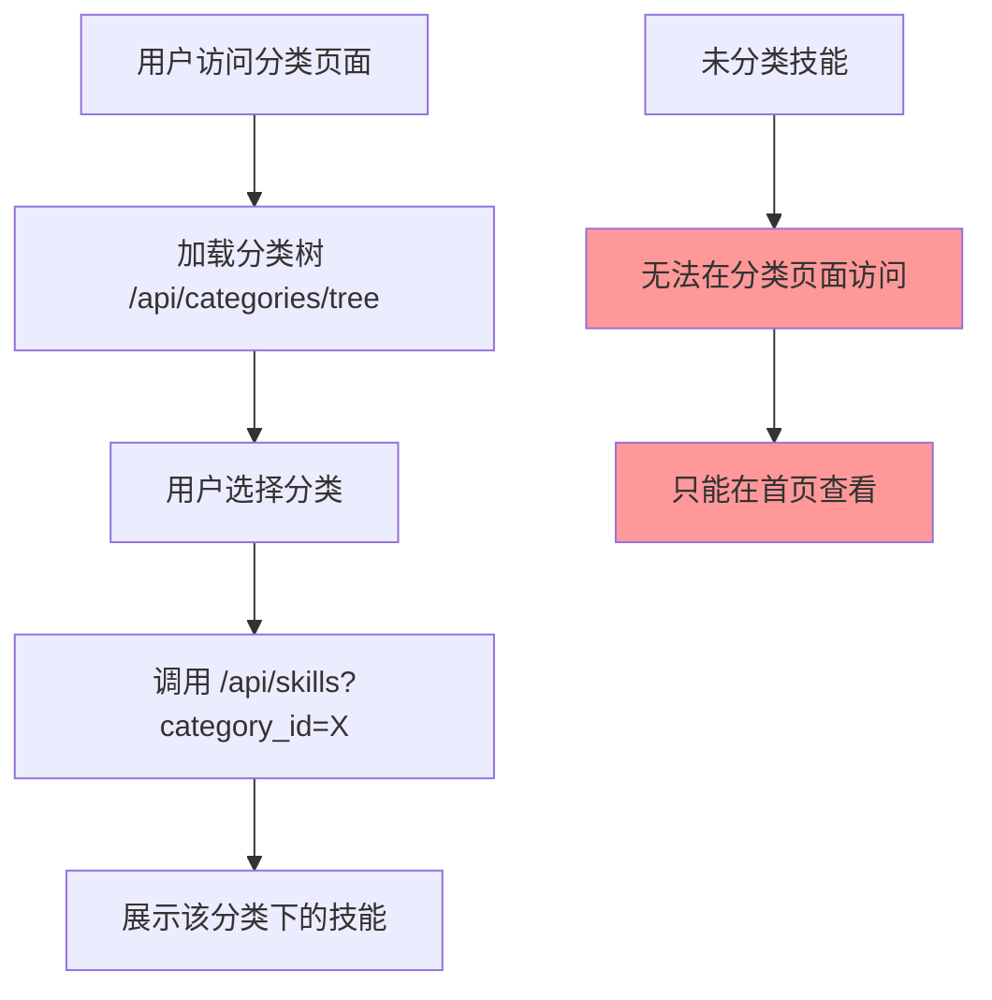
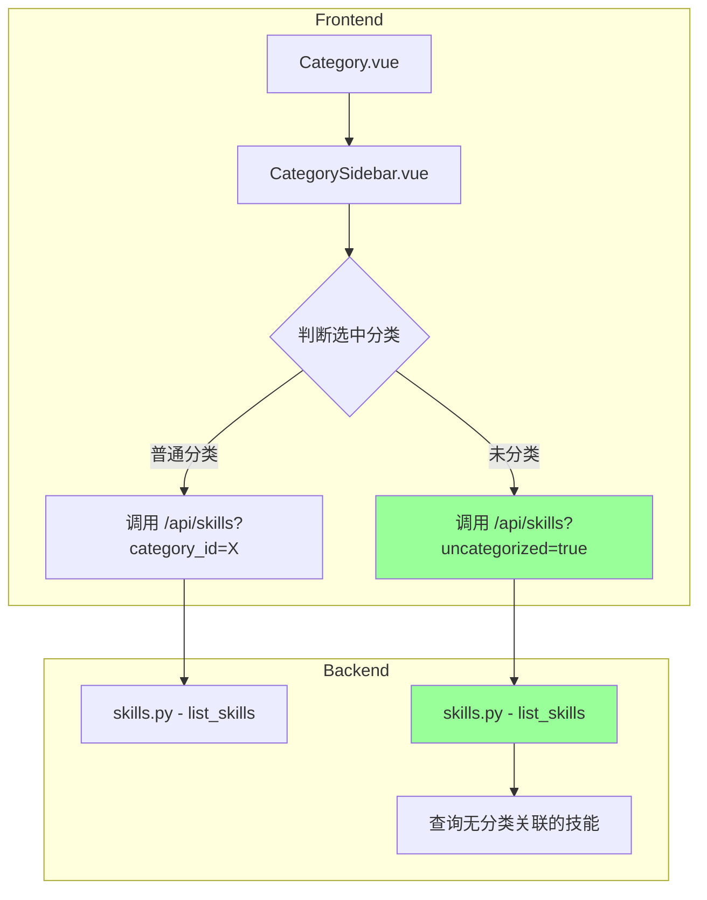

# 技能分类页面未分类技能展示修复方案

## 问题描述

当前分类页面（Category.vue）的数据过滤逻辑缺失对"未分类"状态的处理，导致未归类技能仅能通过首页访问。需要更新分类页面的查询与渲染逻辑，增加一个显式的"未分类"类目，确保所有未分配到特定分类的技能均能在该页面被正确检索和展示。

## 问题分析

### 当前实现

1. **前端 Category.vue 页面**：
   - 从 `/api/categories/tree` 获取分类树结构
   - 选择分类时调用 `/api/skills?category_id=${categoryId}` 获取技能
   - **问题**：没有处理"未分类"技能的逻辑

2. **后端 API**：
   - `/api/categories/tree` - 返回分类树结构（仅包含有分类的技能统计）
   - `/api/skills` - 支持 `category_id` 参数过滤
   - **问题**：没有专门获取"未分类"技能的公开 API

3. **首页 Home.vue**：
   - 可以显示所有技能，包括未分类的（显示"未分类"标签）
   - 首页能正常展示未分类技能

### 数据流分析



## 解决方案

### 方案概述

在分类树中添加一个虚拟的"未分类"分类项，使用特殊的 slug 标识，前端检测到该标识时调用专门的 API 获取未分类技能。

### 架构设计



## 实现步骤

### 1. 后端修改 - 扩展技能查询 API

**文件**: `backend/api/skills.py`

修改 `list_skills` 函数，添加 `uncategorized` 参数支持：

```python
@router.get("", response_model=SkillListResponse)
async def list_skills(
    keyword: str | None = None,
    category_id: int | None = None,
    repository_id: int | None = None,
    uncategorized: bool = False,  # 新增参数
    page: int = 1,
    page_size: int = 20,
    ...
):
    # 当 uncategorized=True 时，查询没有关联任何分类的技能
    if uncategorized:
        query = query.where(~Skill.categories.any())
    elif category_id:
        query = query.join(Skill.categories).where(Category.id == category_id)
```

### 2. 前端修改 - CategorySidebar 组件

**文件**: `frontend/src/components/CategorySidebar.vue`

添加"未分类"选项的显示支持：

```vue
<!-- 在分类列表开头添加未分类选项 -->
<button
  v-if="showUncategorized"
  class="category-item root uncategorized"
  :class="{ active: isSelected('uncategorized') }"
  @click="handleSelect('uncategorized')"
>
  <span>未分类</span>
  <span class="count">{{ uncategorizedCount }}</span>
</button>
```

新增 Props：
- `showUncategorized: boolean` - 是否显示未分类选项
- `uncategorizedCount: number` - 未分类技能数量

### 3. 前端修改 - Category.vue 页面

**文件**: `frontend/src/views/Category.vue`

1. 添加获取未分类技能数量的逻辑
2. 处理"未分类"选项的选择事件
3. 调用正确的 API 获取未分类技能

```typescript
// 处理分类选择
async function handleCategorySelect(slug: string) {
  if (slug === 'uncategorized') {
    selectedCategory.value = {
      id: -1,
      name: '未分类',
      slug: 'uncategorized',
      skill_count: uncategorizedCount.value
    } as CategoryItem
    await loadUncategorizedSkills()
  } else {
    // 原有逻辑...
  }
}

// 加载未分类技能
async function loadUncategorizedSkills() {
  const data = await api.get('/skills?uncategorized=true&page_size=100')
  skills.value = data.items
}
```

## API 变更

### GET /api/skills

新增查询参数：

| 参数 | 类型 | 默认值 | 说明 |
|------|------|--------|------|
| uncategorized | boolean | false | 为 true 时返回未分类的技能 |

**注意**: `uncategorized=true` 与 `category_id` 互斥，同时使用时 `uncategorized` 优先。

## 文件修改清单

| 文件 | 修改类型 | 说明 |
|------|----------|------|
| `backend/api/skills.py` | 修改 | 添加 uncategorized 参数支持 |
| `frontend/src/components/CategorySidebar.vue` | 修改 | 添加未分类选项显示 |
| `frontend/src/views/Category.vue` | 修改 | 处理未分类选项逻辑 |

## 测试要点

1. **功能测试**：
   - 分类页面侧边栏显示"未分类"选项
   - 点击"未分类"能正确展示未分类技能列表
   - 未分类技能数量显示正确
   - 未分类技能可以正常点击查看详情

2. **兼容性测试**：
   - 原有分类功能不受影响
   - 首页功能不受影响
   - 管理后台功能不受影响

3. **边界测试**：
   - 无未分类技能时的展示
   - 未分类技能数量较多时的分页

## 风险评估

- **低风险**：修改范围小，仅涉及分类展示逻辑
- **向后兼容**：API 新增参数，不影响现有调用
- **回滚方案**：如有问题可快速回滚前端修改
